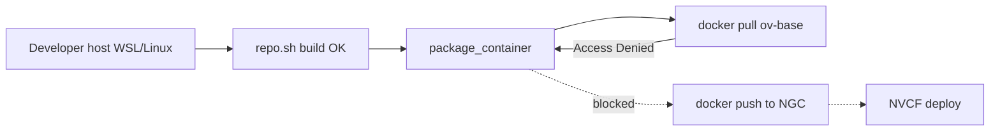

# Docker Access Denied on ov-base

## Summary

[`./repo.sh package_container`](https://github.com/NVIDIA-Omniverse/kit-app-template) (Kit 109+) or `./repo.sh package --container` (older Kit) builds a Docker image on top of the Omniverse base image **`nvcr.io/nvidia/omniverse/ov-base-*`**. When Docker tries to pull that base layer, the build stops with **`Access Denied`** (or similar registry auth errors).

This is an **NGC Private Registry authentication** problem on the machine running Docker. It happens **after** `./repo.sh build` succeeds and **before** you have a local image to tag and push. Fixing it does not require NVCF deploy or portal skills.

The [OV on DGXC documentation](https://docs.omniverse.nvidia.com/omniverse-dgxc/latest/index.html) guide documents the failure explicitly during packaging and the fix in **Publish a Kit-based container on NGC** (docker login with your NGC Personal API Key).

---

## Symptom

Typical terminal output during `./repo.sh package_container` or `./repo.sh package --container`:

```text
Access Denied
```

or:

```text
pull access denied for nvcr.io/nvidia/omniverse/ov-base-ubuntu-22, repository does not exist or may require 'docker login'
```

The Kit guide example base image tag (version varies by Kit release):

```text
nvcr.io/nvidia/omniverse/ov-base-ubuntu-22:2025.2.0
```

| Command | When it fails |
|---------|----------------|
| `./repo.sh package_container` | Kit 109+ — Docker build pulls `ov-base` |
| `./repo.sh package --container` | Kit before 109 |
| Manual `docker pull nvcr.io/nvidia/omniverse/ov-base-...` | Same auth requirement |

`./repo.sh build` may already have succeeded. You do **not** yet have a pushed NGC image or NVCF function until packaging completes.

---

## When you see this

| Pattern | What it suggests |
|---------|------------------|
| **First `package_container` on a new machine** | Never logged in to `nvcr.io`, or Docker installed but NGC key not configured |
| **Worked before; fails after weeks/months** | Expired or rotated Personal API Key still stored in Docker credential helper |
| **After `docker login` with a different NGC account** | Stale or conflicting credentials for `nvcr.io` |
| **Login succeeds but pull still denied** | API key missing **NVIDIA Private Registry** scope, or account not in required NGC org |
| **Fails in PowerShell, not in Ubuntu** | Docker commands must run where the Docker daemon runs — **WSL2 Ubuntu** for Windows developers |
| **Pull fails; pip errors follow** | Registry auth first — see [package-container-dns-pip.md](package-container-dns-pip.md) only if `ov-base` pull already succeeds |

Collect before diagnosing: OS (WSL2 vs native Linux), whether `./repo.sh build` passed, exact `ov-base` image tag in the log, whether `docker login nvcr.io` was run in the **same shell/session**, and whether `NVCF_TOKEN` is set to a current Personal API Key.

---

## Where it fails (diagnostic layer)



| Layer | This issue? |
|-------|-------------|
| **Build / package (Docker registry auth)** | **Yes** — `docker login nvcr.io` with valid NGC key |
| NGC / registry (wrong `NCA_NUMBER` on **push**) | Related later — tag must use `nvcr.io/$NCA_NUMBER/...` when publishing |
| NVCF function | No |
| Portal / WebRTC | No |

See [STREAMING-REFERENCE.md](../STREAMING-REFERENCE.md) (build / package). This is fixed in **Phase 0** (local container build), not in NVCF History or portal stream-start logs.

---

## Root causes

| Cause | How it happens |
|-------|----------------|
| **No `docker login nvcr.io`** | Fresh Docker install; packaging is first pull from NGC |
| **Stale credentials in Docker config** | Old Personal API Key revoked or replaced; credential helper still sends it |
| **Wrong username** | NGC requires username **`$oauthtoken`**, not your email or NGC username |
| **API key missing scopes** | Key created without **NVIDIA Private Registry** (and typically **NVIDIA Cloud Functions** for later NVCF steps) |
| **Empty or unset `NVCF_TOKEN`** | Login command runs with no password on stdin |
| **Logged in as wrong NGC identity** | Personal key from account without Omniverse/`ov-base` pull entitlement |
| **Docker context mismatch (Windows)** | Login in PowerShell while `./repo.sh` runs in WSL (or vice versa) |

Pulling **`nvcr.io/nvidia/omniverse/ov-base-*`** uses the same NGC Container Registry auth as pushing your app image. The Kit guide treats **`NVCF_TOKEN`** as the Personal API Key for both docker login and NVCF API calls.

---

## Diagnosis

### 1. Confirm the failing step

| Step | Typical failure |
|------|-----------------|
| `./repo.sh build` | Host toolchain — see [missing-make.md](missing-make.md) |
| **`docker pull` / `ov-base` during packaging** | **This guide** |
| pip / `pypi.org` during same command | Network — see [package-container-dns-pip.md](package-container-dns-pip.md) |

### 2. Confirm environment (Windows developers)

Run all Docker and `./repo.sh` commands in **WSL2 Ubuntu**, not PowerShell. Docker Engine setup: [Installing & configuring Docker for WSL](https://docs.docker.com/desktop/wsl/) (post-configuration includes `docker login nvcr.io`).

Verify Docker works:

```bash
docker run hello-world
```

### 3. Check current registry auth

```bash
cat ~/.docker/config.json
```

Look for an `auths` entry for `nvcr.io`. If present but pull fails, credentials are likely **expired or wrong** — proceed with logout and fresh login.

Optional explicit pull (use the tag from your build log):

```bash
docker pull nvcr.io/nvidia/omniverse/ov-base-ubuntu-22:2025.2.0
```

| Result | Meaning |
|--------|---------|
| **Access Denied** | Re-login with valid Personal API Key (fix below) |
| **manifest unknown** / tag not found | Different issue — Kit version / tag mismatch; confirm Kit App Template branch |
| **Pull succeeds** | Auth OK; retry `./repo.sh package_container` |

### 4. Verify NGC Personal API Key

From the Kit guide **Join the NGC organization** section:

1. Generate a key at [NGC API keys](https://org.ngc.nvidia.com/setup/api-keys) → **Generate Personal Key**.
2. Include scopes: **NVIDIA Cloud Functions** and **NVIDIA Private Registry** (Docker WSL doc also lists NGC Catalog and Secrets Manager for broader workflows).
3. Copy the key once — it is not shown again after you leave the page.

Set in the **same terminal** where you build:

```bash
export NVCF_TOKEN="paste your NGC Personal API Key here"
export NCA_NUMBER="<your-ngc-org-namespace-id>"  # NGC UI → Organization → Settings
```

For portal/NVCF work you must also be in **your NGC organization** (or your team org). Request NGC org access through your administrator or the Kit on DGXC onboarding process if you lack org access.

### 5. Confirm login command syntax

Kit guide **Publish a Kit-based container on NGC**, step 1:

```bash
echo $NVCF_TOKEN | docker login nvcr.io -u '$oauthtoken' --password-stdin
```

Use the literal username **`$oauthtoken`**. For staging NGC:

```bash
echo $NVCF_TOKEN | docker login stg.nvcr.io -u '$oauthtoken' --password-stdin
```

Interactive equivalent (from Docker WSL doc): `docker login nvcr.io`, username `$oauthtoken`, password = Personal API Key.

---

## Fix

Apply in **WSL Ubuntu** or native Linux where Docker runs.

### A. Clear stale nvcr.io session (Kit guide NOTE on Access Denied)

The Kit guide **Build a Kit-based app to run on NVCF** packaging NOTE:

> If you receive "Access Denied" error during the build when Docker tries to pull the base image (`nvcr.io/nvidia/omniverse/ov-base-ubuntu-22:...`), try to log out from the nvcr.io Docker registry with `docker logout nvcr.io` command.

```bash
docker logout nvcr.io
docker logout stg.nvcr.io # if you previously used staging
```

### B. Log in with a fresh Personal API Key (primary fix)

1. Generate or rotate a Personal API Key with **NVIDIA Private Registry** scope.
2. Export it:

```bash
export NVCF_TOKEN="your-new-personal-api-key"
```

3. Log in:

```bash
echo $NVCF_TOKEN | docker login nvcr.io -u '$oauthtoken' --password-stdin
```

Expect: `Login Succeeded`.

4. Retry packaging:

```bash
./repo.sh package_container # Kit 109+
# or
./repo.sh package --container # Kit <109
```

Select the application ending in `_nvcf.kit` (108+) or `_ovc.kit` (107) when prompted.

### C. Continue publish flow after packaging succeeds

From **Publish a Kit-based container on NGC**:

```bash
export STREAMING_CONTAINER_IMAGE="nvcr.io/$NCA_NUMBER/my-app:0.0.1"
```

Do not use `latest` as the only tag — the Kit guide warns this causes NGC caching issues and can overwrite other developers' images.

Tag and push (image name depends on Kit version):

```bash
# Kit 109+ — name matches template wizard (example)
docker tag my_company-my_usd_composer:latest $STREAMING_CONTAINER_IMAGE
docker push $STREAMING_CONTAINER_IMAGE

# Kit 108 and below
docker tag kit_app_template:latest $STREAMING_CONTAINER_IMAGE
docker push $STREAMING_CONTAINER_IMAGE
```

Use `docker image ls` (sorted by date) if unsure of the local image name after `package_container`.

### D. remote Linux build host (slow network or repeated auth issues)

The Kit guide notes that building and publishing can exceed 15 minutes; use a **remote Linux build host** (Ubuntu 22.04) if local WSL or network is unreliable. Configure `NVCF_TOKEN`, `docker login`, and packaging on the VM. Escalation: contact your Omniverse Cloud / NVCF platform owner.

---

## Verification

1. `echo $NVCF_TOKEN | docker login nvcr.io -u '$oauthtoken' --password-stdin` prints **Login Succeeded**.
2. `docker pull nvcr.io/nvidia/omniverse/ov-base-ubuntu-22:<tag>` succeeds (tag from your Kit branch).
3. `./repo.sh package_container` (or `package --container`) completes without Access Denied.
4. Local image exists (`docker image ls` — e.g. `my_company-my_usd_composer:latest` or `kit_app_template:latest`).
5. Optional: `docker push $STREAMING_CONTAINER_IMAGE` succeeds (same `NVCF_TOKEN` auth).

No NVCF **RTX Ready** or portal stream test is required to confirm this fix.

---

## Distinguish from similar errors

| Symptom / message | Layer | What to do |
|-------------------|-------|------------|
| **`Access Denied`** pulling **`nvcr.io/.../ov-base`** | NGC registry auth | This guide — logout, login with `NVCF_TOKEN` |
| **`Temporary failure in name resolution`** / pip / PyPI | Network during packaging | [package-container-dns-pip.md](package-container-dns-pip.md) |
| **`make: command not found`** | Host toolchain | [missing-make.md](missing-make.md) |
| **Push denied to `nvcr.io/$NCA_NUMBER/...`** | Wrong org or `NCA_NUMBER` | Kit guide **Join the NGC organization** — copy org ID from NGC UI |
| **`manifest unknown`** for `ov-base` tag | Image tag / Kit version mismatch | Align Kit App Template branch with guide |
| **No peer info found** (portal) | Stream runtime | [../portal-ui/no-peer-info-found.md](../portal-ui/no-peer-info-found.md) |
| **DEPLOYING >15 min** | NVCF health/runtime | [../nvcf-deployment/deploying-over-15-minutes.md](../nvcf-deployment/deploying-over-15-minutes.md) |

---

## Quick checks (agent)

1. Confirm failure is during **`package_container`** / **`package --container`**, on **`docker pull ov-base`**, not pip/DNS.
2. Ask whether the user is on **Windows** → all Docker and `./repo.sh` commands run in **WSL2 Ubuntu**.
3. Run `docker logout nvcr.io`, then `echo $NVCF_TOKEN | docker login nvcr.io -u '$oauthtoken' --password-stdin` with a key that has **NVIDIA Private Registry** scope.
4. Retry `./repo.sh package_container` before investigating NVCF or portal symptoms.
5. If pull works but push fails, verify **`NCA_NUMBER`** and `STREAMING_CONTAINER_IMAGE` path (`nvcr.io/$NCA_NUMBER/...`).
6. Do not run `check-nvcf-function` or portal stream diagnostics until a container image is built and optionally pushed.

---

## Related documentation

| Resource | Relevance |
|----------|-----------|
| [STREAMING-REFERENCE.md](../STREAMING-REFERENCE.md) | Symptom row: Access Denied on `ov-base` → stale nvcr login |
| [OV on DGXC documentation](https://docs.omniverse.nvidia.com/omniverse-dgxc/latest/index.html) | Access Denied NOTE during packaging; **Publish** docker login; `NVCF_TOKEN`, `NCA_NUMBER`, push tags |
| [Docker Desktop WSL documentation](https://docs.docker.com/desktop/wsl/) | Docker install; interactive `docker login nvcr.io` with `$oauthtoken` |
| [NGC API keys](https://org.ngc.nvidia.com/setup/api-keys) | Generate Personal Key with Private Registry scope |
| [Kit App Template](https://github.com/NVIDIA-Omniverse/kit-app-template) | `package_container` and base image pull |
| [missing-make.md](missing-make.md) | Earlier build-step failure |
| [package-container-dns-pip.md](package-container-dns-pip.md) | pip/DNS failure during same packaging phase |

---

## Agent notes

- Classify as **build-package** / pre-NVCF. Same **`NVCF_TOKEN`** is reused for NVCF API ([scripts/create_function.sh](../../../scripts/create_function.sh)) after publish.
- The Kit guide documents logout as the fix for **Access Denied on ov-base pull**; fresh login is required before retry — logout alone is not sufficient if no valid key is configured.
- **`$oauthtoken`** is the Docker username string, not an environment variable expansion.
- After packaging and push, continue deploy with Kit guide NVCF UI or API; link [forgot-nvcf-streaming-layer.md](forgot-nvcf-streaming-layer.md) if streaming layers were skipped during `template new`.
- Escalation: contact your NVCF/NGC administrator for org access and your portal administrator for dev portal onboarding.
