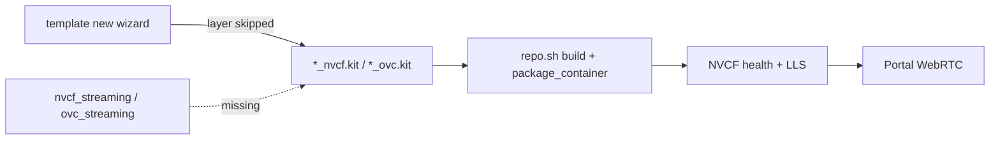

# Forgot NVCF streaming layer

## Summary

During [Kit App Template](https://github.com/NVIDIA-Omniverse/kit-app-template) **`./repo.sh template new`**, the wizard asks whether to add **layers**. For Omniverse Cloud / NVCF streaming you must enable the version-specific streaming layer:

| Kit | Layer (template wizard) | Packaged app kit file |
|-----|-------------------------|------------------------|
| **108+** | `[nvcf_streaming]` | `source/apps/<app>/*_nvcf.kit` |
| **107.x** | `[ovc_streaming]` | `source/apps/<app>/*_ovc.kit` |
| **106.x** | No layer name — configure `_ovc.kit` manually | Use `omni.services.livestream.nvcf`, not `omni.kit.livestream.webrtc` alone |

If you answer **No** to layers, skip the streaming layer in the list, or pick only a base template layer, the app builds as a **desktop Kit app**. The resulting container is **not NVCF-ready**: livestream service extensions are missing or incomplete, health/signaling endpoints may never register, and NVCF health checks can fail or hang.

This is a **build-time configuration** mistake. It is fixed by adding the layer (or recreating the template), then **rebuild → repackage → push image → deploy new function version**. Portal registration alone cannot compensate.

---

## Symptom

You rarely see an error at `template new` time. Failure surfaces **after** container deploy or when starting a stream:

| When | What you notice |
|------|-----------------|
| **After `./repo.sh package` / `package_container`** | Only `*_editor.kit` or base app under `source/apps/` — no `*_nvcf.kit` or `*_ovc.kit` |
| **NVCF deploy** | Stuck **DEPLOYING** >15 min; no **RTX Ready** or health never passes — see [deploying-over-15-minutes.md](../nvcf-deployment/deploying-over-15-minutes.md) |
| **Portal stream start** | **Failed to load the stream — No peer info found** — see [no-peer-info-found.md](../portal-ui/no-peer-info-found.md) |
| **Portal app status** | **ERROR** or **UNKNOWN** if the function cannot stay healthy — see [portal-status-error.md](../portal-registration/portal-status-error.md) |
| **NVCF History logs** | No `livestream` extension version lines, or missing `omni.services.livestream.*` / `omni.kit.livestream.*` |

The frontmatter symptom string (**Streaming layer not added during template new**) is the root cause label agents use when tracing back from deploy or portal failures.

---

## When you see this

| Pattern | What it suggests |
|---------|------------------|
| **First NVCF deploy of a new KAT app** | Layer skipped in wizard; built from Composer/Explorer template without streaming |
| **`template new` → “Add layers?” → No** | Explicit opt-out — most common user error ([STREAMING-REFERENCE.md](../STREAMING-REFERENCE.md)) |
| **Wrong Kit branch** | Kit **108** app on **107** branch (needs `ovc_streaming`) or vice versa |
| **106.x custom app** | No `nvcf_streaming`/`ovc_streaming` concept — wrong extension set in `_ovc.kit` instead |
| **Desktop build works; cloud fails** | Expected if only editor kit exists locally; cloud image lacks streaming stack |
| **Extensions present but wrong versions** | Layer applied but KAT vs NGC PB mismatch — see [missing-livestream-extensions.md](missing-livestream-extensions.md) |

Collect: Kit version / KAT branch, whether `*_nvcf.kit` or `*_ovc.kit` exists under `source/apps/`, `function_id` / `function_version_id` after deploy, and exact portal or NVCF symptom.

---

## Where it fails (diagnostic layer)



| Layer | This issue? |
|-------|-------------|
| **Build / package (KAT)** | **Yes** — add streaming layer, rebuild image |
| NGC / registry | No (unless image never pushed) |
| NVCF function config | Secondary — wrong health port can mimic stuck deploy |
| Portal / WebRTC | Symptom only — fix the container first |

Phase **A** (NVCF healthy) in [STREAMING-REFERENCE.md](../STREAMING-REFERENCE.md) fails when the container was built without the streaming layer. Use **`check-nvcf-function`** after you have IDs to confirm runtime config; use **kit file inspection** to confirm build-time cause.

---

## Kit version → streaming setup

From [STREAMING-REFERENCE.md](../STREAMING-REFERENCE.md) (build time):

| Kit | Streaming layer / extension | Package target |
|-----|------------------------------|----------------|
| **108+** | `[nvcf_streaming]` in `template new` | `*_nvcf.kit` |
| **107.x** | `[ovc_streaming]` in `template new` | `*_ovc.kit` |
| **106.x** | In `_ovc.kit`: `omni.services.livestream.nvcf` | Not `omni.kit.livestream.webrtc` alone |

### Required livestream plugins (verify in NVCF logs: search `livestream`)

| Kit | Minimum extensions |
|-----|-------------------|
| **106.x / 107.x** | `omni.services.livestream.nvcf` ≥7.2.0; `omni.kit.livestream.webrtc` ≥7.0.0; `omni.kit.livestream.core` ≥7.5.1 |
| **108.x** | `omni.services.livestream.session` ≥8.0.2; `omni.kit.livestream.webrtc` ≥8.0.7; `omni.kit.livestream.core` ≥8.0.2; `omni.kit.livestream.app` ≥8.0.4 |

The streaming layer pulls these (or compatible) dependencies into the packaged kit. Without the layer, logs often show none of the above or wrong major versions.

### NVDA_KIT_ARGS (portal compatibility)

Set on the NVCF function (see [scripts/create_function.sh](../../../scripts/create_function.sh)):

| Kit | Value |
|-----|--------|
| **106–107** | `--/app/livestream/nvcf/sessionResumeTimeoutSeconds=300` |
| **108+** | `--/exts/omni.services.livestream.session/resumeTimeoutSeconds=300` |

Wrong or missing args rarely cause “forgot layer” but should be updated after a 108 rebuild.

### NVCF endpoints (after layer fix)

| Purpose | Port | Path |
|---------|------|------|
| Health | **8011** (Kit ≥107.3.3); 8111/8311 for older Composer/Explorer | `/v1/streaming/ready` |
| Inference / sign-in | **49100** | `/sign_in` |
| Function type | **STREAMING** + Low Latency Streaming | |

---

## Root causes

| Cause | How it happens |
|-------|----------------|
| **Skipped layer prompt** | Answered **No** to “Add layers?” or did not select `[nvcf_streaming]` / `[ovc_streaming]` |
| **Wrong template type** | Created **Application** without streaming-oriented template (e.g. base only) |
| **Kit version mismatch** | 108 layer on 107 branch or packaged `_ovc.kit` while targeting NVCF 108 stack |
| **Manual kit edit** | Removed streaming dependencies from `*.kit` after template creation |
| **106.x** | Never added `omni.services.livestream.nvcf` to `_ovc.kit` |
| **Confused with extension-only fix** | Enabled webrtc locally but did not use streaming layer for container — see [missing-livestream-extensions.md](missing-livestream-extensions.md) |

---

## Diagnosis

### 1. Inspect Kit App Template output (definitive)

In your KAT clone, under `source/apps/<your_app>/`:

| Check | Layer present | Layer missing |
|-------|---------------|---------------|
| **108+** | `<app>_nvcf.kit` (and often editor + nvcf variants) | Only `<app>.kit` or `<app>_editor.kit` |
| **107.x** | `<app>_ovc.kit` | Same as left — no `_ovc` suffix file |

Open the streaming kit file and confirm dependencies include livestream service extensions (names vary by Kit; see plugin table above).

```bash
ls -la source/apps/*/
grep -E 'livestream|nvcf|ovc' source/apps/*/*.kit
```

### 2. Template wizard audit

Re-run mentally or check project docs:

1. `./repo.sh template new`
2. Application type (e.g. **USD Composer** for 107 streaming guide)
3. **Add layers?** → **Yes**
4. Select **`[nvcf_streaming]`** (108+) or **`[ovc_streaming]`** (107.x)

Kit guide reference: **Build a Kit-based app to run on NVCF**, step 3 — [OV on DGXC documentation](https://docs.omniverse.nvidia.com/omniverse-dgxc/latest/index.html).

### 3. NVCF History / Live Tail

[NVCF functions](https://nvcf.ngc.nvidia.com/functions) → function → **Logs**:

| Log signal | Interpretation |
|------------|----------------|
| No **`livestream`** version lines | Strong indicator of missing streaming stack |
| No **RTX Ready** | May be crash or missing GPU stack — scroll up |
| **RTX Ready** but deploy stuck | Health port/URI or incomplete livestream service — layer may be present but misconfigured |
| **RTX Ready** + livestream versions OK | Layer likely present — look at [deploying-over-15-minutes.md](../nvcf-deployment/deploying-over-15-minutes.md) or [missing-livestream-extensions.md](missing-livestream-extensions.md) |

### 4. NVCF function configuration — `check-nvcf-function`

Use after deploy when you have `function_id` and `function_version_id`. The skill validates **runtime** NVCF wiring (not whether KAT had the layer), but catches common post-build gaps:

| Check | Expected for Kit streaming |
|-------|---------------------------|
| Control-plane status | `ACTIVE` (not endless `DEPLOYING`, `ERROR`) |
| `functionType` | **STREAMING** with Low Latency Streaming |
| Inference | Port **49100**, path **`/sign_in`** |
| Health | **`/v1/streaming/ready`**, port **8011** (≥107.3.3) or template-specific 8111/8311 |
| Container image | Tag matches the image you rebuilt **after** adding the layer |

If config is correct but logs still lack livestream plugins, the image was built without the layer — rebuild the container, push a new tag, deploy a **new function version**.

---

## Fix

Change one variable at a time. Full path: **layer → build → package → push → NVCF version → portal `function_version_id`**.

### A. Add the layer to an existing app — `template modify`

From the Kit App Template root:

```bash
./repo.sh template modify
```

Follow prompts to add **`nvcf_streaming`** (Kit 108+) or **`ovc_streaming`** (107.x). This regenerates or updates app kits under `source/apps/`.

If `template modify` cannot attach the layer cleanly, create a new app with `template new` and migrate custom code.

### B. Recreate with `template new` (cleanest)

```bash
./repo.sh template new
```

| Step | Action |
|------|--------|
| Template | e.g. **USD Composer** (per Kit guide) |
| Layers | **Yes** → select **`[nvcf_streaming]`** or **`[ovc_streaming]`** |
| Name | New app name if replacing an old broken app |

### C. Rebuild and package

```bash
./repo.sh build
```

Kit **<109**:

```bash
./repo.sh package --container
```

Kit **109+**:

```bash
./repo.sh package_container
```

Requires Docker and valid `nvcr.io` login — see [docker-access-denied-ov-base.md](docker-access-denied-ov-base.md). Host `make` — see [missing-make.md](missing-make.md).

### D. Publish image and redeploy NVCF

1. Push the new container tag to your NGC registry (Kit guide **Publish** section).
2. Create a **new NVCF function version** with the new image (or update deployment per your workflow).
3. Update portal app **`function_version_id`** if the version UUID changed (`publish-streaming-app` skill).

Align health port with Kit version when creating the function ([scripts/create_function.sh](../../../scripts/create_function.sh): default `CONTROL_SERVER_PORT` **8111** — use **8011** for Kit ≥107.3.3).

### E. Kit 106.x

There is no `[nvcf_streaming]` layer. Edit `_ovc.kit` to depend on **`omni.services.livestream.nvcf`** and required `omni.kit.livestream.*` versions, then rebuild.

---

## Verification

### Build-time

1. `source/apps/<app>/` contains **`*_nvcf.kit`** (108+) or **`*_ovc.kit`** (107.x).
2. Streaming kit dependencies include the livestream extensions for your Kit major version.
3. `./repo.sh build` reports **BUILD (RELEASE) SUCCEEDED**.

### NVCF runtime — `check-nvcf-function`

1. Control-plane status **`ACTIVE`**.
2. `functionType` **STREAMING**; inference **49100** + **`/sign_in`**; health **`/v1/streaming/ready`** on correct port.
3. History logs: **RTX Ready** and **`livestream`** lines with expected plugin versions.

### Portal (if registered)

1. Start a **new** streaming session (not reconnect).
2. Stream loads without **No peer info found** — [no-peer-info-found.md](../portal-ui/no-peer-info-found.md).

---

## Distinguish from similar issues

| Symptom / doc | Layer missing? | What differs |
|---------------|----------------|--------------|
| **This guide** | Yes — no `_nvcf` / `_ovc` or layer never selected | Fix with `template modify` / `template new` + rebuild |
| [missing-livestream-extensions.md](missing-livestream-extensions.md) | Layer may exist | KAT vs NGC PB resolves wrong extension versions |
| [deploying-over-15-minutes.md](../nvcf-deployment/deploying-over-15-minutes.md) | Often | Wrong **health port** can also cause stuck deploy |
| [no-peer-info-found.md](../portal-ui/no-peer-info-found.md) | Often | Portal symptom; verify build first |
| [nvcf-kit-crashes-locally.md](nvcf-kit-crashes-locally.md) | N/A | Local desktop crash without cloud GPU — not proof layer exists |
| [http-501-streaming-session.md](../portal-ui/http-501-streaming-session.md) | No | NVCF function not **STREAMING** / LLS off |

---

## Quick checks (agent)

1. Ask **Kit version** and whether **`template new`** included the streaming layer.
2. List `source/apps/*/*.kit` — confirm `*_nvcf.kit` or `*_ovc.kit` exists.
3. If already deployed: NVCF logs → search **`livestream`** and **RTX Ready**.
4. Run **`check-nvcf-function`** — confirm ACTIVE + STREAMING + ports; image tag matches post-fix build.
5. If layer is present but plugins wrong → [missing-livestream-extensions.md](missing-livestream-extensions.md).
6. After fix, user must **rebuild image and new function version** — editing portal metadata alone is insufficient.

---

## Related documentation

| Resource | Relevance |
|----------|-----------|
| [STREAMING-REFERENCE.md](../STREAMING-REFERENCE.md) | Kit matrix, “Forgot nvcf_streaming layer” row |
| [check-nvcf-function SKILL.md](../../skills/check-nvcf-function/SKILL.md) | Post-deploy NVCF verification workflow |
| [OV on DGXC documentation](https://docs.omniverse.nvidia.com/omniverse-dgxc/latest/index.html) | `template new` step 3, build, publish |
| [NVCF debuggability](https://docs.nvidia.com/cloud-functions/user-guide/latest/cloud-function/debuggability.html) | History vs Live Tail |
| [scripts/create_function.sh](../../../scripts/create_function.sh) | Expected STREAMING health/inference defaults |

---

## Agent notes

- Classify as **build-package** root cause even when the user reports a **portal** or **DEPLOYING** symptom.
- **`check-nvcf-function`** confirms NVCF wiring and status; **kit file listing** confirms whether the streaming layer was ever applied.
- Do not echo API keys when running the check skill.
- After the user adds the layer, insist on **full rebuild and new container tag** before closing the incident.
- Link [missing-make.md](missing-make.md) for host toolchain failures during rebuild.
- Escalation: contact your Omniverse Kit program or template owner for guide and branch questions.
