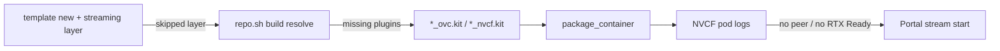

# Missing livestream extensions

## Summary

After `./repo.sh build` and `package_container`, the packaged Kit app resolves a **different set of livestream extensions** than you expect — often compared to another Kit source (Kit App Template on GitHub/GitLab vs NGC Production Branch SDK). The resulting `*_ovc.kit` or `*_nvcf.kit` may omit `omni.kit.livestream.*`, `omni.services.livestream.*`, or transitive deps such as `omni.kit.streamsdk.plugins`, so NVCF cannot expose health, sign-in, or WebRTC peers.

This is a **build-time extension resolution** problem (Phase 0 / build-package), not a portal cookie or browser issue. Downstream symptoms include **no RTX Ready**, **DEPLOYING** stuck past ~15 minutes, portal **No peer info found**, or HTTP **501** — but the fix starts in the Kit app and container image, not in NVCF UI alone.

 documented the mismatch between KAT **106.5.0** and NGC PB **106.5.2** when the same `_ovc.kit` declared `omni.services.livestream.nvcf`; the fix landed in **Kit 106.5.4** (explicit `streamsdk.plugins` dependency). Newer Kit majors use different extension names and minimum versions (see tables below).

---

## Symptom

You discover the gap during or after build — not always as a single error string.

| What you notice | Typical cause |
|-----------------|---------------|
| **`_ovc.kit` / `_nvcf.kit` lacks livestream entries** after build | Streaming layer not applied, or only partial deps declared |
| **Build log lists fewer `omni.*.livestream*` packages** than a reference build | KAT vs NGC PB Kit SDK; local SDK prefers older bundled `streamsdk.plugins` |
| **NVCF History: no `livestream` plugin lines** | Extensions never packaged into the image |
| **NVCF: no RTX Ready** or health never passes | Kit failed to load streaming stack |
| **Portal: No peer info found** (every launch) | Container misbuilt — see [../portal-ui/no-peer-info-found.md](../portal-ui/no-peer-info-found.md) |
| **Compared two machines: “same” `.kit` file, different resolved extensions** | Different Kit SDK root (PB vs public KAT) — classic |

Collect: Kit version (106 / 107 / 108+), template name, whether `[ovc_streaming]` / `[nvcf_streaming]` was selected, Kit SDK source (KAT clone vs NGC PB tarball), path to built `source/apps/*_ovc.kit` or `*_nvcf.kit`, and container image tag deployed to NVCF.

---

## When you see this

| Pattern | What it suggests |
|---------|------------------|
| **First NVCF deploy of a new KAT app** | `template new` without streaming layer, or manual `.kit` edit missing service extension |
| **Same `.kit` on KAT vs NGC PB, different `repo.sh build` output** | SDK / registry resolution difference |
| **106.x app: only `omni.kit.livestream.webrtc` in deps** | Need `omni.services.livestream.nvcf` (or equivalent) — webrtc alone is insufficient |
| **108+ app: old 107 extension names** | Use `omni.services.livestream.session` and 8.x livestream stack |
| **Build “succeeds”, stream fails in cloud** | Inspect **resolved** extensions in built kit file and NVCF logs, not only `dependencies` block in source |
| **After Kit SDK upgrade** | Stale pinned versions — rebuild with update flags (see Fix) |

---

## Where it fails (diagnostic layer)



| Layer | This issue? |
|-------|-------------|
| **Build / package (Kit resolve)** | **Yes** — fix extensions and rebuild image |
| NGC registry push | No (unless wrong image tag deployed) |
| NVCF function ports | Secondary — verify after build is correct |
| Portal / WebRTC client | No — until container is fixed |

See [STREAMING-REFERENCE.md](../STREAMING-REFERENCE.md) (build / package) and (Kit version → streaming setup).

---

## Required livestream stack (by Kit version)

### Streaming layer at template time

| Kit | Layer in `./repo.sh template new` | Packaged app file |
|-----|-------------------------------------|-------------------|
| **108+** | `[nvcf_streaming]` | `*_nvcf.kit` |
| **107.x** | `[ovc_streaming]` | `*_ovc.kit` |
| **106.x** | `[ovc_streaming]` (or manual deps in `_ovc.kit`) | `*_ovc.kit` |

If the layer was skipped, see [forgot-nvcf-streaming-layer.md](forgot-nvcf-streaming-layer.md) before chasing individual extension versions.

### Minimum extensions (log and kit verification)

From [STREAMING-REFERENCE.md](../STREAMING-REFERENCE.md) — search NVCF **History** or **Live Tail** for `livestream` and compare versions.

| Kit | Required extensions (minimum versions) |
|-----|----------------------------------------|
| **106.x / 107.x** | `omni.services.livestream.nvcf` ≥ 7.2.0; `omni.kit.livestream.webrtc` ≥ 7.0.0; `omni.kit.livestream.core` ≥ 7.5.1 |
| **108.x** | `omni.services.livestream.session` ≥ 8.0.2; `omni.kit.livestream.webrtc` ≥ 8.0.7; `omni.kit.livestream.core` ≥ 8.0.2; `omni.kit.livestream.app` ≥ 8.0.4 |

**106.x note:** Declare `omni.services.livestream.nvcf` in the streaming kit — not `omni.kit.livestream.webrtc` alone ([STREAMING-REFERENCE.md](../STREAMING-REFERENCE.md) Kit 106 row).

### Transitive chain (106.5.x — )

Adding one line to `_ovc.kit`:

```toml
"omni.services.livestream.nvcf" = {}
```

should pull these four packages at resolve time (106.5-era example from the bug):

| Extension | Role |
|-----------|------|
| `omni.services.livestream.nvcf` | NVCF livestream service (sign-in, session integration) |
| `omni.kit.livestream.core` | Core livestream runtime |
| `omni.kit.livestream.webrtc` | WebRTC media path |
| `omni.kit.streamsdk.plugins` | Stream SDK plugins (version pin mattered for PB vs KAT) |

On NGC Production Branch **106.5.2**, the bug showed PB **missing** some of these resolved entries even with the same source `.kit` as KAT **106.5.0**. Fix: explicit dependency on `omni.kit.streamsdk.plugins` at the required version in kit-livestream; included from **Kit 106.5.4** onward.

### NVDA_KIT_ARGS (portal session resume)

| Kit | Setting |
|-----|---------|
| **106–107** | `--/app/livestream/nvcf/sessionResumeTimeoutSeconds=300` |
| **108+** | `--/exts/omni.services.livestream.session/resumeTimeoutSeconds=300` |

Repo reference: [scripts/create_function.sh](../../../scripts/create_function.sh).

---

## Root causes

| Cause | How it happens |
|-------|----------------|
| **No streaming layer** | `template new` without `[nvcf_streaming]` / `[ovc_streaming]` — see [forgot-nvcf-streaming-layer.md](forgot-nvcf-streaming-layer.md) |
| **KAT vs NGC PB Kit SDK** | Same app `.kit`; different bundled extensions and resolver behavior |
| **Local SDK prefers older compatible ext** | `omni.kit.streamsdk.plugins` ships in Kit SDK; resolver picks local compatible version unless a dep **explicitly** requires a newer pin |
| **Stale pinned versions** | Rebuild without updating lock/pins when extensions changed |
| **Wrong Kit major in `.kit`** | 107 names on 108 Kit (e.g. `nvcf` service vs `session`) |
| **106: webrtc-only dependency** | Missing `omni.services.livestream.nvcf` |
| **Platform incompatible** | Target arch has no WebRTC build — different error; see [platform-incompatible-extensions.md](platform-incompatible-extensions.md) |

**Engineering note ( comment):** When validating resolved extensions, use Kit’s update semantics for pinned versions (e.g. build with **`-u`** / update pinned versions per Kit App Template docs) so you are not comparing an outdated lock to a fresh reference build.

---

## Diagnosis

### 1. Confirm streaming kit file exists

After `./repo.sh template new` with the correct layer:

| Kit | Look for |
|-----|----------|
| 108+ | `source/apps/<app>_*_nvcf.kit` (or your template’s `*_nvcf.kit` name) |
| 107 / 106 | `source/apps/<app>_*_ovc.kit` |

Open the file and confirm livestream-related entries in `[dependencies]` (exact ids depend on layer; 106.x must include `omni.services.livestream.nvcf` or 108+ session stack).

### 2. Compare resolved output after build

Reproduce the check:

```bash
./repo.sh template new
./repo.sh build
```

Inspect the built streaming kit (path varies by template), e.g.:

```bash
cat ./source/apps/my_company.my_usd_composer_ovc.kit
```

Or the generated dependency list under `_build/` per Kit App Template conventions. Compare:

- KAT clone (GitHub/GitLab) on one Kit version
- NGC [Production Branch Kit SDK](https://catalog.ngc.nvidia.com/orgs/nvidia/teams/omniverse/resources/kit-sdk-linux-pb24h2) on the matching PB version

**Expectation:** The same logical app should resolve the same livestream stack (names + compatible versions). If PB omits `omni.kit.streamsdk.plugins` or older webrtc/core pins, upgrade Kit SDK to **106.5.4+** for that line or pin explicitly per your template guidance.

### 3. Rebuild and repackage

```bash
./repo.sh build
./repo.sh package_container
```

(Or `./repo.sh package --container` on Kit before 109.) Push the new image and deploy a **new function version** if the image digest changed.

### 4. NVCF logs — `check-nvcf-function` + History

Provide `function_id` and `function_version_id`. Use [check-nvcf-function](../../skills/check-nvcf-function/SKILL.md) to confirm:

| Check | Why |
|-------|-----|
| Control-plane status **ACTIVE** | Rules out unrelated deploy failure |
| Container image tag | Matches the image you just built |
| `functionType` **STREAMING**, inference **49100** `/sign_in` | Rules out 501-only misconfig |

Then open [NVCF functions](https://nvcf.ngc.nvidia.com/functions) → **Logs** → **History** (or **Live Tail** for a session):

| Log search | Pass |
|------------|------|
| **`livestream`** | Lines showing `omni.services.livestream.*`, `omni.kit.livestream.*` loaded with versions ≥ foundation minimums |
| **`RTX Ready`** | Kit GPU path up — if absent, scroll up for extension resolve / crash errors |
| **Health** | After RTX Ready, NVCF should reach **ACTIVE** (~10 min); stuck **DEPLOYING** → [../nvcf-deployment/deploying-over-15-minutes.md](../nvcf-deployment/deploying-over-15-minutes.md) |

`check-nvcf-function` does not read log text; use it for config/image/status, then inspect logs in the UI.

### 5. Portal symptom cross-check

If the user only reports **No peer info found**, still verify build first ([no-peer-info-found.md](../portal-ui/no-peer-info-found.md)).

---

## Fix

Apply in order; change one variable at a time.

### A. Add or repair streaming layer

```bash
./repo.sh template modify
```

Add **`nvcf_streaming`** (108+) or **`ovc_streaming`** (107.x / 106.x). Rebuild and repackage. See [forgot-nvcf-streaming-layer.md](forgot-nvcf-streaming-layer.md).

### B. Align Kit SDK source and version

| Situation | Action |
|-----------|--------|
| On **106.5.x** and PB missing stream deps | Use **Kit 106.5.4+** or NGC PB that includes the fix |
| Mixing KAT **main** with old PB tarball | Align both to the same Kit minor/PB release documented for OV on DGXC |
| Validating extension pins | Rebuild with Kit App Template **update pinned versions** flow (`-u` per team docs) |

### C. Declare correct service extension (106.x)

In `_ovc.kit` (if not already added by layer):

```toml
"omni.services.livestream.nvcf" = {}
```

Rebuild and confirm four-package chain (or 107/108 equivalents per tables above).

### D. Kit 108+ extension set

Use `[nvcf_streaming]` so `_nvcf.kit` pulls `omni.services.livestream.session` and 8.x `omni.kit.livestream.*` — do not copy 106/107-only ids.

### E. Redeploy NVCF and portal

1. Push new container image to NGC.
2. Create or update NVCF function version with new image.
3. Update portal `function_version_id` if the version UUID changed (`publish-streaming-app` / `check-streaming-app` skills).

Set `NVDA_KIT_ARGS` for session resume per Kit major (table above).

---

## Verification

| Step | Pass criterion |
|------|----------------|
| Built `*_ovc.kit` / `*_nvcf.kit` | Lists required livestream extensions for your Kit major |
| `./repo.sh package_container` | Succeeds; image pushed |
| NVCF **History** | `livestream` lines with expected extension ids and versions |
| NVCF status | **ACTIVE** within ~10–15 min; **RTX Ready** present |
| Health (post-deploy) | HTTP **200** on `/v1/streaming/ready` at correct port ([STREAMING-REFERENCE.md](../STREAMING-REFERENCE.md)) |
| Portal | New session loads stream (not **No peer info found** on every attempt) |

---

## Distinguish from similar issues

| Symptom / topic | Layer | Guide |
|-----------------|-------|--------|
| **Skipped streaming layer** | Template | [forgot-nvcf-streaming-layer.md](forgot-nvcf-streaming-layer.md) |
| **Platform incompatible livestream** | Arch / resolve | [platform-incompatible-extensions.md](platform-incompatible-extensions.md) |
| **DEPLOYING >15 min, no RTX Ready** | Deploy / health | [../nvcf-deployment/deploying-over-15-minutes.md](../nvcf-deployment/deploying-over-15-minutes.md) |
| **No peer info found** | Stream start | [../portal-ui/no-peer-info-found.md](../portal-ui/no-peer-info-found.md) |
| **HTTP 501** | Function type / LLS | [../portal-ui/http-501-streaming-session.md](../portal-ui/http-501-streaming-session.md) |
| **Portal status ERROR** | NVCF crash | [../portal-registration/portal-status-error.md](../portal-registration/portal-status-error.md) |
| **streamsdk on wrong Kit major** | Version skew | [../portal-ui/stun-unknown-method-kit108.md](../portal-ui/stun-unknown-method-kit108.md) |

---

## Background

KAT **106.5.0** and NGC PB **106.5.1/106.5.2** could resolve different livestream extension sets from the same `_ovc.kit`. **Kit 106.5.4+** adds an explicit `omni.kit.streamsdk.plugins` dependency in kit-livestream so PB and KAT builds align.

**Typical repro:** USD Composer template; `./repo.sh template new` → `./repo.sh build` → compare `*_ovc.kit` between [kit-app-template](https://github.com/NVIDIA-Omniverse/kit-app-template) and NGC PB SDK; add `"omni.services.livestream.nvcf" = {}` and compare resolved extension list.

**Takeaway for agents:** “Same `.kit` file” ≠ same packaged container — always compare **post-build** resolved extensions and NVCF `livestream` log lines on the **deployed image**.

---

## Quick checks (agent)

1. Ask Kit version (106 / 107 / 108+) and whether `[nvcf_streaming]` / `[ovc_streaming]` was used.
2. Read built `*_ovc.kit` / `*_nvcf.kit` for livestream dependencies vs [STREAMING-REFERENCE.md](../STREAMING-REFERENCE.md) minimum table.
3. If KAT vs PB mismatch suspected, cite and Kit **106.5.4+** for 106.5.x line.
4. Run **`check-nvcf-function`** for image tag and ACTIVE status; then NVCF **History** → search **`livestream`** and **`RTX Ready`**.
5. If layer missing, link [forgot-nvcf-streaming-layer.md](forgot-nvcf-streaming-layer.md) before editing individual extension pins.
6. After image fix, confirm portal `function_version_id` matches new NVCF version.

---

## Related documentation

| Resource | Relevance |
|----------|-----------|
| [STREAMING-REFERENCE.md](../STREAMING-REFERENCE.md) | Plugin minimums; build-package symptom row |
| [check-nvcf-function SKILL.md](../../skills/check-nvcf-function/SKILL.md) | NVCF status, image, ports before log review |
| This guide | KAT vs PB livestream resolve mismatch |
| [Kit App Template](https://github.com/NVIDIA-Omniverse/kit-app-template) | `template new`, `build`, `package_container` |
| [NGC Kit SDK PB](https://catalog.ngc.nvidia.com/orgs/nvidia/teams/omniverse/resources/kit-sdk-linux-pb24h2) | Production Branch SDK for comparison builds |
| [NVCF debuggability](https://docs.nvidia.com/cloud-functions/user-guide/latest/cloud-function/debuggability.html) | History / Live Tail |
| [no-peer-info-found.md](../portal-ui/no-peer-info-found.md) | Downstream portal symptom |
| [deploying-over-15-minutes.md](../nvcf-deployment/deploying-over-15-minutes.md) | No RTX Ready / missing plugins |

---

## Agent notes

- Classify as **build-package** first; use **`check-nvcf-function`** to confirm which image/version is running, then **logs** for `livestream` proof.
- Do not treat **portal-only** fixes (cookies, reconnect) as sufficient when History lacks livestream plugins.
- For **106.5.x**, ensure Kit SDK **≥ 106.5.4** when PB historically dropped `streamsdk.plugins` transitives.
- Escalation: contact your Kit SDK or Production Branch owner for resolver alignment questions.
