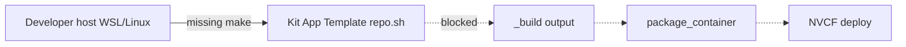

# Missing make (build-essential)

## Summary

[Kit App Template](https://github.com/NVIDIA-Omniverse/kit-app-template) build scripts invoke **GNU make** when you run `./repo.sh build`, `./repo.sh template new`, or related packaging steps. On a fresh **Ubuntu** or **WSL2** distro, `make` is often not installed, so the build stops immediately with **`make: command not found`** (or `/bin/sh: 1: make: not found`).

This is a **host toolchain** problem on the machine where you build the Kit app. It happens **before** Docker packaging, NVCF deploy, or portal streaming. Fixing it does not require NVCF or portal skills.

The OV on DGXC Kit guide calls this out explicitly: WSL2 users must install **`build-essential`** (see **Step 4: Configure WSL2 for Kit Development** in [OV on DGXC documentation](https://docs.omniverse.nvidia.com/omniverse-dgxc/latest/index.html)). The same fix applies to native Linux workstations.

---

## Symptom

Typical terminal output during a Kit App Template step:

```text
make: command not found
```

or:

```text
/bin/sh: 1: make: not found
```

Common commands that trigger it:

| Command | When it fails |
|---------|----------------|
| `./repo.sh build` | Compiling/linking the application and dependencies |
| `./repo.sh template new` | Some template tooling paths invoke the build system |
| `./repo.sh package` / `./repo.sh package_container` | If a build step runs before packaging |

You have **not** yet produced `_build/linux-x86_64/release/...` or a local Docker image. NVCF and the portal are unaffected until the container build succeeds.

---

## When you see this

| Pattern | What it suggests |
|---------|------------------|
| **First build on new WSL/Ubuntu VM** | Default image has no `build-essential` |
| **Error in PowerShell or cmd, not Ubuntu** | Kit builds must run **inside WSL2 Ubuntu**, not Windows shell |
| **remote Linux build host or cloud Linux never updated** | Minimal image missing compiler toolchain |
| **`gcc: command not found` after fixing make** | Same package family — reinstall `build-essential` |
| **Build worked before, fails on new machine** | New environment; prerequisites not repeated |

Collect before diagnosing: OS (Windows + WSL vs native Linux), Ubuntu version, exact command (`./repo.sh build`, etc.), and whether the shell prompt is `user@hostname` in **Ubuntu**, not `PS C:\>`.

---

## Where it fails (diagnostic layer)



| Layer | This issue? |
|-------|-------------|
| **Build / package (host)** | **Yes** — install `build-essential` here |
| NGC / registry | No |
| NVCF function | No |
| Portal / WebRTC | No |

See [STREAMING-REFERENCE.md](../STREAMING-REFERENCE.md) (build / package) and Phase A–C checklist — this symptom is fixed in **Phase 0** (local build), not in stream-start logs.

---

## Root causes

| Cause | How it happens |
|-------|----------------|
| **`build-essential` not installed** | Fresh Ubuntu/WSL; only minimal packages present |
| **Commands run outside WSL** | Windows PowerShell cannot see Linux `make` even if installed in WSL |
| **Wrong WSL distro or version** | Kit guide requires **WSL2 with Ubuntu 22.04** for Windows developers |
| **Incomplete WSL setup** | Skipped **Step 4: Configure WSL2 for Kit Development** in the Kit guide after installing Ubuntu |
| **Different Linux user/session** | Installed packages as root in one distro instance; building in another |

`build-essential` is a meta-package that pulls in **`make`**, **`gcc`**, **`g++`**, and related tools. Kit App Template and many native dependencies expect a standard GNU build environment on Linux.

---

## Diagnosis

### 1. Confirm you are in the right environment

**Windows developers:** Open **Ubuntu** from the Start menu (or `wsl` into the correct distro). The prompt should look like a Linux shell, not PowerShell.

Kit guide prerequisite ([Required tools](https://docs.omniverse.nvidia.com/omniverse-dgxc/latest/index.html)):

- **WSL2 with Ubuntu 22.04** is required for Windows.
- Follow the **Windows WSL2 Setup Guide** in that document, then **Step 4: Configure WSL2 for Kit Development**.

Docker-only setup is documented separately in [Installing & configuring Docker for WSL](https://docs.docker.com/desktop/wsl/) — that guide’s “Step 4” is `apt update`; the Kit guide’s **Step 4** additionally covers dev packages such as **`build-essential`**.

### 2. Verify `make` is missing

In the **same terminal** where you run `./repo.sh`:

```bash
which make
make --version
```

| Result | Meaning |
|--------|---------|
| No output / exit non-zero for `which make` | `make` not installed — apply fix below |
| Path such as `/usr/bin/make` | `make` exists; look for PATH, wrong distro, or a different error in the log |

### 3. Check related tools (optional)

```bash
gcc --version
g++ --version
```

If `make` works but the build later fails on `gcc` or `g++`, install or reinstall `build-essential` rather than only `make`.

### 4. Confirm other Kit guide prerequisites

Missing `make` is the most common early failure, but the **Build a Kit-based app to run on NVCF** section assumes you already completed **Prerequisites**:

| Tool | Install (Ubuntu/Debian) | Notes |
|------|-------------------------|--------|
| `git`, `curl`, `jq` | `sudo apt update && sudo apt install -y jq curl git` | Kit guide Linux utils |
| **Git LFS** | `sudo apt install -y git-lfs && git lfs install` | Kit App Template README |
| **Docker** | Kit guide or WSL Docker doc | Needed for `package_container`, not for first `build` |
| **`make` (via build-essential)** | See fix below | Required for `./repo.sh build` |

---

## Fix

Apply in **WSL Ubuntu** or native Linux — not from Windows PowerShell.

### A. Install build-essential (primary fix)

Matches the Kit guide note under **Build a Kit-based app to run on NVCF**:

```bash
sudo apt-get update
sudo apt-get install -y build-essential
```

Verify:

```bash
make --version
```

Then from your Kit App Template clone:

```bash
./repo.sh build
```

Expect: `BUILD (RELEASE) SUCCEEDED (Took XX.XX seconds)` when the rest of the environment is correct.

### B. Windows — use WSL2 Ubuntu 22.04

If you have not completed WSL setup:

1. Enable **Windows Subsystem for Linux** and install **Ubuntu 22.04** (Kit guide → Windows WSL2 Setup Guide).
2. Complete **Step 4: Configure WSL2 for Kit Development** in the Kit guide (system updates + **`build-essential`**).
3. Clone and build **inside** the Ubuntu terminal:

```bash
git clone https://github.com/NVIDIA-Omniverse/kit-app-template
cd kit-app-template
./repo.sh build
```

**Alternative:** Request a **remote Linux build host** with Ubuntu 22.04 if local WSL or network is unsuitable (Kit guide notes builds can exceed 15 minutes).

### C. Windows native (not recommended for OV on DGXC)

Kit App Template on Windows uses **Visual Studio** for C++ (`Desktop development with C++`), not `make`, per the [public kit-app-template README](https://github.com/NVIDIA-Omniverse/kit-app-template). The **OV on DGXC streaming guide** documents Linux/WSL paths only. For portal/NVCF container workflows, use WSL2 or Linux.

### D. After `make` works — next build steps

From the Kit guide, typical sequence:

1. `./repo.sh template new` — include `[nvcf_streaming]` (108+) or `[ovc_streaming]` (107).
2. `./repo.sh build`
3. `./repo.sh package --container` (Kit before 109) or `./repo.sh package_container` (Kit 109+)

If Docker pull fails next, see [docker-access-denied-ov-base.md](docker-access-denied-ov-base.md). If extensions are wrong after build, see [missing-livestream-extensions.md](missing-livestream-extensions.md).

---

## Verification

1. `which make` returns `/usr/bin/make` (or similar).
2. `./repo.sh build` completes with **BUILD (RELEASE) SUCCEEDED**.
3. Optional: `./repo.sh package_container` (or `package --container`) succeeds once Docker and `NVCF_TOKEN` are configured.

No NVCF or portal check is required to confirm this fix.

---

## Distinguish from similar errors

| Symptom / message | Layer | What to do |
|-------------------|-------|------------|
| **`make: command not found`** | Host Linux/WSL | This guide — `build-essential` |
| **`gcc: error` / `g++: not found`** | Host toolchain | `sudo apt-get install -y build-essential` |
| **Command works in WSL, fails in PowerShell** | Wrong shell | Run all `./repo.sh` commands in Ubuntu |
| **Docker Access Denied on `ov-base`** | Registry auth | [docker-access-denied-ov-base.md](docker-access-denied-ov-base.md) |
| **`package_container` pip / DNS errors** | Network | [package-container-dns-pip.md](package-container-dns-pip.md) |
| **No peer info found** (portal) | Stream runtime | [../portal-ui/no-peer-info-found.md](../portal-ui/no-peer-info-found.md) |

---

## Quick checks (agent)

1. Ask whether the user is on **Windows** → confirm **WSL2 Ubuntu 22.04** and commands run inside Ubuntu.
2. Run `which make` in the build environment.
3. If missing: `sudo apt-get update && sudo apt-get install -y build-essential`.
4. Retry `./repo.sh build` before investigating NVCF or portal symptoms.
5. Point to Kit guide **Prerequisites** and **Build a Kit-based app to run on NVCF** for the full tool list.

---

## Related documentation

| Resource | Relevance |
|----------|-----------|
| [STREAMING-REFERENCE.md](../STREAMING-REFERENCE.md) | Symptom row: missing `make` → `build-essential` |
| [OV on DGXC documentation](https://docs.omniverse.nvidia.com/omniverse-dgxc/latest/index.html) | WSL2 requirement; `build-essential` NOTE; `./repo.sh build` |
| [Docker Desktop WSL documentation](https://docs.docker.com/desktop/wsl/) | WSL install and Docker Engine (after toolchain) |
| [Kit App Template](https://github.com/NVIDIA-Omniverse/kit-app-template) | Source repo used in the guide |
| [kit-app-template (GitHub)](https://github.com/NVIDIA-Omniverse/kit-app-template) | Public prerequisites (`build-essential`, Git LFS) |
| [OV on DGXC customer docs](https://docs.omniverse.nvidia.com/omniverse-dgxc/latest/index.html) | Published Omniverse DGXC documentation |

---

## Agent notes

- Classify as **build-package** / pre-NVCF. Do not run `check-nvcf-function` or portal stream diagnostics for this symptom alone.
- On Windows, the fix is almost always **WSL + apt**, not installing make on Windows.
- After fixing, continue the Kit guide build → publish → NVCF flow; link [forgot-nvcf-streaming-layer.md](forgot-nvcf-streaming-layer.md) if streaming layers were skipped during `template new`.
- Escalation: contact your build-environment owner for toolchain or shared VM access.
