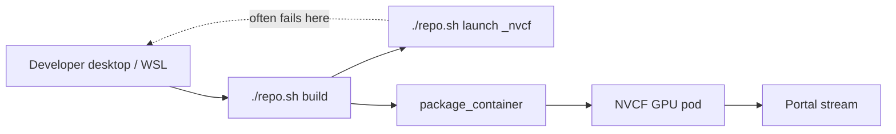

# NVCF kit crashes locally

## Summary

After adding the NVCF streaming layer, Kit App Template produces a `*_nvcf.kit` (Kit 108+) or `*_ovc.kit` (107.x) variant that pulls in livestream and NVCF service extensions. Running that kit locally with `./repo.sh launch` (or selecting the `_nvcf` / streaming app in the launcher) often **crashes or exits** on a developer laptop or WSL desktop — especially when the machine lacks the same **cloud GPU / RTX stack** (L40-class datacenter GPU, driver profile, and headless streaming runtime) that NVCF provides.

The OV on DGXC Kit guide treats this as **expected in many cases**: a local GPU/RTX initialization failure on a desktop does **not** reliably predict whether the same container will succeed on NVCF. The authoritative check is **NVCF History logs** (search **`RTX Ready`**) and **`check-nvcf-function`** after deploy — not a green local `./repo.sh launch`.

This is a **build-time / local dev** symptom (Phase 0 in the diagnostic foundation). It is fixed by **classifying** the crash (benign vs real build error) and **validating in cloud**, not by blocking the publish pipeline solely because local launch failed.

---

## Symptom

Typical user report:

- `./repo.sh build` succeeds, but launching the **streaming / `_nvcf`** app crashes, hangs, or closes within seconds.
- Console shows RTX/GPU errors, extension load failures, or a silent exit after the splash screen.
- The **non-streaming** base app (without `[nvcf_streaming]` / `[ovc_streaming]`) may launch fine on the same machine.

Common terminal or Kit log patterns:

| Pattern | Often means |
|---------|-------------|
| **`ERROR_DEVICE_LOST`**, GPU crash, Vulkan/CUDA interop errors | Local GPU/driver cannot sustain the streaming RTX path |
| Exit shortly after RTX / shader / Hydra init | Desktop GPU stack differs from cloud L40 profile |
| **`Failed to resolve extension`** / **platform incompatible** | Real build error — not benign local-only |
| Missing **`omni.services.livestream.*`** in dependency resolve | KAT vs PB mismatch — fix before NVCF |
| **`Can't read ... *_nvcf.kit`** / serializer errors | Wrong kit path or packaging — fix build, not “ignore local crash” |

Collect before diagnosing: Kit version, whether `[nvcf_streaming]` or `[ovc_streaming]` was applied, local GPU model and driver, WSL vs bare Linux vs Windows, whether **base** (non-streaming) app launches, and whether the user has already deployed to NVCF (`function_id`, `function_version_id` if known).

---

## When you see this

| Pattern | What it suggests |
|---------|------------------|
| **First launch of `_nvcf` on laptop / WSL** | Often **expected** — proceed to `package_container` and NVCF if `./repo.sh build` succeeded |
| **Base app launches; `_nvcf` only fails** | Streaming extensions / NVCF runtime path — local limitation or missing cloud stack |
| **Both base and `_nvcf` crash** | Broader Kit/GPU/driver issue on the dev machine — still may work on NVCF; verify cloud logs |
| **Crash during extension resolve (before RTX)** | **Build/package bug** — fix extensions or platform, do not dismiss as “local only” |
| **Local OK; NVCF History has no RTX Ready** | Cloud failure — use [deploying-over-15-minutes.md](../nvcf-deployment/deploying-over-15-minutes.md), not this doc alone |
| **Local crash + NVCF ACTIVE + RTX Ready** | Confirms local crash was **not** predictive — no further local fix required |

---

## Where it fails (diagnostic layer)

| Layer | This issue? |
|-------|-------------|
| **Local launch (`_nvcf`)** | **Yes** — may crash while cloud path is still valid |
| **`./repo.sh build` / resolve** | Sometimes — extension or platform errors are real blockers |
| **Docker `package_container`** | No — separate doc if pull/DNS fails |
| **NVCF deploy / History logs** | **Verification layer** — RTX Ready is ground truth |
| **Portal / WebRTC** | No — only after NVCF is **ACTIVE** |

See [STREAMING-REFERENCE.md](../STREAMING-REFERENCE.md) (build / package): `_nvcf` kit **crashes locally** → expected on machine without cloud GPU → **check cloud logs**.

---

## Expected local crash vs real build failure

Use this table before telling the user to “ignore” local launch:

| Evidence | Classification | Action |
|----------|----------------|--------|
| `./repo.sh build` **SUCCEEDED**; resolve logs show livestream extensions; crash **after** RTX/GPU init | **Likely benign for NVCF** | Package, deploy, validate **RTX Ready** on NVCF |
| **`Failed to resolve extension dependencies`** or **platform incompatible** | **Real blocker** | [platform-incompatible-extensions.md](platform-incompatible-extensions.md); target x86_64 L40-class cloud |
| Livestream plugins **missing** from `*_nvcf.kit` vs NGC PB | **Real blocker** | [missing-livestream-extensions.md](missing-livestream-extensions.md) |
| No `[nvcf_streaming]` / `[ovc_streaming]` layer | **Real blocker** | [forgot-nvcf-streaming-layer.md](forgot-nvcf-streaming-layer.md) |
| **`make: command not found`** during build | Host toolchain | [missing-make.md](missing-make.md) — never reached a valid `_nvcf` binary |
| NVCF History: **no RTX Ready** on same image | **Cloud failure** | [deploying-over-15-minutes.md](../nvcf-deployment/deploying-over-15-minutes.md) |

**Rule of thumb:** If the failure happens during **dependency resolution** or **platform check**, fix the build. If it happens during **GPU/RTX startup** on a desktop that is not your NVCF target GPU, treat local launch as **optional** and validate on NVCF.

---

## Root causes

| Cause | How it happens |
|-------|----------------|
| **Desktop GPU ≠ cloud GPU profile** | `_nvcf` kit enables livestream + NVCF services tuned for headless L40-class pods; local GeForce/Quadro/WSL passthrough may not match |
| **WSL GPU passthrough limits** | RTX init or WebRTC stack unstable under WSL even when `./repo.sh build` works |
| **NVCF-specific extensions at local launch** | `omni.services.livestream.nvcf` / `omni.services.livestream.session` expect cloud runtime wiring not present locally |
| **Driver / VRAM / multi-GPU edge cases** | Local Kit GPU crashes (device lost, shader compile) — orthogonal to container behavior ( covers slow **cloud** RTX, not “local must work”) |
| **Missing streaming layer or plugins** | Same crash signature locally **and** will fail on NVCF — not “expected” |
| **Unsupported architecture (e.g. DGX Spark)** | Extension resolve fails — cannot deploy WebRTC stack |

---

## Diagnosis

Work in order: confirm build health, classify local crash, then validate on NVCF with **`check-nvcf-function`** and **History** logs.

### 1. Confirm build and kit file (local)

| Check | How |
|-------|-----|
| Build succeeded | `./repo.sh build` ends with **BUILD (RELEASE) SUCCEEDED** |
| Streaming layer present | Kit 108+: `[nvcf_streaming]` and `source/apps/*_nvcf.kit`; 107.x: `[ovc_streaming]` and `*_ovc.kit` |
| Livestream deps | Open kit file or build log — compare to [STREAMING-REFERENCE.md](../STREAMING-REFERENCE.md) minimum extension table |
| Launch target | User ran streaming variant (`./repo.sh launch` selecting `_nvcf` / streaming app), not base template only |

If resolve failed or extensions are missing, fix [missing-livestream-extensions.md](missing-livestream-extensions.md) or [forgot-nvcf-streaming-layer.md](forgot-nvcf-streaming-layer.md) **before** deploy.

### 2. Classify the local crash log

Scroll to the **first fatal error** (not the last GPU stack trace):

| First fatal signal | Branch |
|--------------------|--------|
| Extension resolve / platform incompatible | Fix build — see real build failure above |
| RTX / GPU / `ERROR_DEVICE_LOST` after extensions loaded | **Likely expected locally** — continue to NVCF log checks |
| Immediate exit with no RTX line | Compare base app launch; if base works, treat as streaming-path local limit |

Optional local dev workaround (does not validate NVCF):

- Launch the **non-streaming** base app for USD/scene work on desktop.
- Use NVCF/portal for streaming integration tests.

Do **not** remove livestream extensions from the NVCF-bound kit just to get local launch working.

### 3. Validate on NVCF — `check-nvcf-function`

After `package_container` and function deploy, run [check-nvcf-function/SKILL.md](../../skills/check-nvcf-function/SKILL.md) with `function_id` and `function_version_id`.

| Report field | Healthy streaming pattern |
|--------------|---------------------------|
| Control-plane status | **ACTIVE** (or transient **DEPLOYING** ~10 min) |
| `functionType` | **STREAMING** with Low Latency Streaming |
| Health | HTTP **`/v1/streaming/ready`**, port **8011** (Kit ≥107.3.3) or template-specific |
| Inference | Port **49100**, path **`/sign_in`** |
| Container image | Tag from your latest package — not stale `latest` |

If status is **DEPLOYING** >15 min or **ERROR**, switch to [deploying-over-15-minutes.md](../nvcf-deployment/deploying-over-15-minutes.md) — local crash is no longer the primary question.

### 4. NVCF History logs — RTX Ready (ground truth)

Open [NVCF functions](https://nvcf.ngc.nvidia.com/functions) → function → version → **Logs** → **History**.

Per [NVCF debuggability](https://docs.nvidia.com/cloud-functions/user-guide/latest/cloud-function/debuggability.html), use **History** for startup and first **RTX Ready** timing.

| Log signal | Interpretation |
|------------|----------------|
| **RTX Ready** present | Cloud GPU/RTX path OK — **local crash was not predictive** |
| No **RTX Ready**; extension errors | Same build bug as local — fix container/plugins |
| No **RTX Ready**; GPU/driver errors on L40 pod | Real cloud failure — driver, OOM, or image — not “ignore local” |
| Search **`livestream`** | Confirm plugin versions match foundation minimums |

Local `./repo.sh launch` does not produce **RTX Ready** in NVCF logs — only deployed instances do.

---

## Fix

Apply the smallest change that matches evidence. Change **one variable at a time**.

### A — Expected local crash (build OK, resolve OK, GPU crash on desktop only)

1. **Do not block** on local `./repo.sh launch` of `_nvcf`.
2. Continue Kit guide flow: `./repo.sh package_container` (or `./repo.sh package --container` on older Kit) → push image → create/update NVCF function.
3. Deploy; wait ~10 min for **ACTIVE**.
4. Confirm **RTX Ready** in **History** and **`check-nvcf-function`** report.
5. Register on portal if needed; test stream with a **new** session.

No image change required solely because local launch failed.

### B — Real build / resolve failure (local and NVCF will both fail)

1. Add streaming layer: `./repo.sh template modify` → `nvcf_streaming` or `ovc_streaming` ([forgot-nvcf-streaming-layer.md](forgot-nvcf-streaming-layer.md)).
2. Align livestream extensions with NGC Production Branch (, [missing-livestream-extensions.md](missing-livestream-extensions.md)).
3. Confirm target is **x86_64** cloud GPU — not Spark-only .
4. Rebuild, repackage, deploy **new function version**; update portal `function_version_id` if UUID changed.

### C — Local dev without streaming crash

| Goal | Approach |
|------|----------|
| Edit USD / extensions on desktop | Launch **base** (non-`_nvcf`) app locally |
| Test WebRTC / portal | Use NVCF deploy + portal — required path for streaming |
| remote Linux build host with datacenter GPU | Kit guide alternative when WSL GPU is too limited for any RTX work |

---

## Verification

1. **`./repo.sh build`** — **SUCCEEDED**; `*_nvcf.kit` (or `*_ovc.kit`) lists required livestream dependencies.
2. **`check-nvcf-function`** — control-plane **ACTIVE**; STREAMING type; health and inference ports match [scripts/create_function.sh](../../../scripts/create_function.sh).
3. **NVCF History** — **RTX Ready** on latest deploy; search **`livestream`** for expected plugin versions.
4. **Portal launch** (optional) — new session loads stream; stream-start errors are separate docs ([no-peer-info-found.md](../portal-ui/no-peer-info-found.md), etc.).

Local `./repo.sh launch` of `_nvcf` is **not** a required verification step once NVCF shows **RTX Ready**.

---

## Distinguish from similar issues

| Observation | Likely issue | Doc |
|-------------|--------------|-----|
| **`_nvcf` crashes locally; NVCF RTX Ready OK** | Expected local limitation | This doc (local vs cloud) |
| **`_nvcf` crashes locally; NVCF no RTX Ready** | Container/build/runtime | [deploying-over-15-minutes.md](../nvcf-deployment/deploying-over-15-minutes.md) |
| **Extension resolve platform incompatible** | Wrong arch / Spark | [platform-incompatible-extensions.md](platform-incompatible-extensions.md) |
| **Missing livestream in kit file** | KAT vs PB | [missing-livestream-extensions.md](missing-livestream-extensions.md) |
| **Skipped streaming layer** | Template wizard | [forgot-nvcf-streaming-layer.md](forgot-nvcf-streaming-layer.md) |
| **`make: command not found`** | WSL toolchain | [missing-make.md](missing-make.md) |
| **ACTIVE but No peer info found** | Ports/plugins at runtime | [no-peer-info-found.md](../portal-ui/no-peer-info-found.md) |
| **Stream visible, mouse dead** | Client/GPU on pod | [stream-not-interactive.md](../portal-ui/stream-not-interactive.md) |

---

## Related documentation

| Resource | Relevance |
|----------|-----------|
| [STREAMING-REFERENCE.md](../STREAMING-REFERENCE.md) | Symptom row: local `_nvcf` crash → validate cloud logs |
| [OV on DGXC documentation](https://docs.omniverse.nvidia.com/omniverse-dgxc/latest/index.html) | Build → package → NVCF; GPU-related local crash vs cloud note |
| [check-nvcf-function skill](../../skills/check-nvcf-function/SKILL.md) | Post-deploy status, health, inference, deployment |
| [NVCF debuggability](https://docs.nvidia.com/cloud-functions/user-guide/latest/cloud-function/debuggability.html) | **History** vs Live Tail for **RTX Ready** |
| [deploying-over-15-minutes.md](../nvcf-deployment/deploying-over-15-minutes.md) | When cloud also fails to reach **ACTIVE** / **RTX Ready** |

---

## Agent notes

- Classify **build-package / pre-stream** — do not conflate with portal WebRTC errors until NVCF is **ACTIVE**.
- **`./repo.sh build` success + extension resolve OK + local GPU crash** → advise user to **continue to NVCF**; do not spend cycles forcing local `_nvcf` launch.
- **`check-nvcf-function`** is the post-deploy skill for this doc — run after the user has `function_id` / `function_version_id`; never echo API keys.
- Always search NVCF **History** for **`RTX Ready`** — it overrides local launch outcome.
- If **no RTX Ready** on NVCF with the same image, escalate to deploy/build docs — local crash was a red herring or shared root cause (missing plugins).
- Distinguish **optional local dev** (base app) from **NVCF validation** (streaming kit in container).
- On Windows, `./repo.sh launch` runs in **WSL Ubuntu**; WSL GPU limits amplify “expected” local crashes.
- Escalation: contact your NVCF platform owner when cloud logs also lack **RTX Ready** after a clean build, or when History shows capacity errors.
