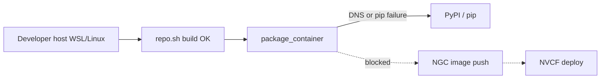

# package_container DNS / pip errors

## Summary

[`./repo.sh package_container`](https://github.com/NVIDIA-Omniverse/kit-app-template) (Kit 109+) or `./repo.sh package --container` (older Kit) builds a Docker image for NVCF. During that step, packaging tooling may run **`pip install`** against **PyPI** for Python dependencies. A common failure is resolving or downloading **`cloudpathlib`** (or similar packages) when **DNS name resolution** fails or the network path to `pypi.org` is blocked.

This is a **host or build-environment network** problem. It occurs **after** `./repo.sh build` succeeds and **before** you push an image to NGC or deploy to NVCF. Fixing it does not require portal or NVCF skills unless you are chasing a downstream symptom caused by never finishing the container build.

The OV on DGXC Kit guide recommends a **remote Linux build host** when local WSL or home network is slow or unreliable; the same guidance applies when **pip/DNS** failures block `package_container`.

---

## Symptom

Typical terminal output during `./repo.sh package_container` or `./repo.sh package --container`:

```text
ERROR: Could not find a version that satisfies the requirement cloudpathlib
```

Often preceded by DNS or connectivity errors:

```text
WARNING: Retrying (Retry(total=4, ...)) after connection broken by 'NewConnectionError(...)'
Temporary failure in name resolution
```

or:

```text
Could not fetch URL https://pypi.org/simple/cloudpathlib/: ...
Name or service not known
```

| Command | When it fails |
|---------|----------------|
| `./repo.sh package_container` | Kit 109+ container packaging |
| `./repo.sh package --container` | Kit before 109 |
| Docker build stage inside packaging | `RUN pip install ...` or equivalent tooling step |

`./repo.sh build` may already have succeeded. You do **not** yet have a pushed NGC image or a working NVCF function until packaging completes.

---

## When you see this

| Pattern | What it suggests |
|---------|------------------|
| **Fails only on corporate laptop with VPN on** | VPN DNS or split tunnel blocking PyPI |
| **Works on VPN off, fails on VPN on** | Corporate policy — use remote Linux build host or approved network |
| **Intermittent “Temporary failure in name resolution”** | Flaky DNS (home router, WSL resolver, captive portal) |
| **Fails on WSL, works on colleague’s Linux** | WSL `/etc/resolv.conf` or Windows DNS integration |
| **Never fails on remote Linux build host** | Local network unsuitable — use the remote build host for packaging |
| **Fails immediately after Docker pull succeeded** | Not registry auth — see [docker-access-denied-ov-base.md](docker-access-denied-ov-base.md) |
| **All HTTPS sites fail from same shell** | General connectivity, not Kit-specific |

Collect before diagnosing: OS (WSL2 vs native Linux), VPN on/off, exact command, whether `pypi.org` resolves from the **same terminal** used for `./repo.sh`, and whether `./repo.sh build` already passed.

---

## Where it fails (diagnostic layer)



| Layer | This issue? |
|-------|-------------|
| **Build / package (host + Docker build network)** | **Yes** — DNS/VPN/path to PyPI |
| NGC / registry (`docker pull ov-base`) | No — unless error is clearly `nvcr.io` Access Denied |
| NVCF function | No |
| Portal / WebRTC | No |

See [STREAMING-REFERENCE.md](../STREAMING-REFERENCE.md) (build / package). This is fixed in **Phase 0** (local container build), not in NVCF History or portal stream-start logs.

---

## Root causes

| Cause | How it happens |
|-------|----------------|
| **Corporate VPN DNS** | VPN sends DNS to resolvers that block or fail to resolve `pypi.org` |
| **Split tunnel / firewall** | HTTPS to PyPI allowed only off VPN or only on internal networks |
| **Flaky home or guest Wi‑Fi** | Short DNS outages during long Docker build |
| **WSL2 DNS quirks** | Windows host DNS changes not reflected in WSL; stale `resolv.conf` |
| **Proxy required but not configured** | Some sites work via browser proxy; `pip` in Docker build does not use it |
| **SSL inspection** | Corporate MITM breaks `pip` TLS unless certs are trusted in the image build |
| **Transient PyPI outage** | Rare; retry after confirming DNS from host |

`cloudpathlib` is a representative package name in logs; the same failure mode applies to **any** pip dependency fetched during `package_container`, not only that package.

---

## Diagnosis

### 1. Confirm the failing step

Ensure the error appears during **packaging**, not `./repo.sh build`:

| Step | Typical failure |
|------|-----------------|
| `./repo.sh build` | Compiler, extensions, `make` — see [missing-make.md](missing-make.md) |
| `docker pull ... ov-base` | Access Denied — see [docker-access-denied-ov-base.md](docker-access-denied-ov-base.md) |
| **`package_container` / `package --container`** | **pip / DNS / PyPI** — this guide |

### 2. Test DNS and HTTPS from the build shell

Run in the **same Ubuntu/WSL session** where you run `./repo.sh`:

```bash
getent hosts pypi.org
curl -sI https://pypi.org/simple/cloudpathlib/ | head -5
```

| Result | Meaning |
|--------|---------|
| No address / `Temporary failure in name resolution` | DNS problem on host — fix network before retrying packaging |
| DNS OK, `curl` fails or times out | Firewall, VPN, or proxy blocking HTTPS |
| Both succeed | Host network OK; retry packaging; if still failing, inspect Docker build network (VPN still affecting Docker daemon) |

### 3. VPN A/B test

1. Note VPN state when the failure occurred.
2. Toggle VPN (on → off or off → on per your org policy).
3. Re-run the two checks above, then retry `./repo.sh package_container`.

| Observation | Next step |
|-------------|-----------|
| Works only with VPN **off** | Use remote Linux build host for packaging, or IT-approved build network |
| Works only with VPN **on** | Some orgs require VPN for PyPI; keep VPN on for packaging |
| No change | See WSL DNS and remote Linux build host below |

### 4. WSL2 (Windows developers)

If DNS works in Windows browser but fails in WSL:

```bash
cat /etc/resolv.conf
```

Kit guide prerequisite: **WSL2 with Ubuntu 22.04**. DNS fixes are environment-specific; common mitigations include restarting WSL (`wsl --shutdown` from PowerShell) or aligning WSL DNS with your IT guidance. Do not change corporate VPN policy without IT approval.

### 5. Docker vs host

If host `curl` to PyPI works but packaging still fails, Docker may use a different DNS path:

```bash
docker run --rm alpine nslookup pypi.org
```

If this fails while host lookup succeeds, restart Docker (`sudo service docker restart` in WSL) and retry after VPN stabilizes.

---

## Fix

Apply **one change at a time**, then retry `./repo.sh package_container`.

### A. Network and VPN (first)

1. Toggle corporate VPN per your org’s rules for external package repos.
2. Retry DNS/`curl` checks, then packaging.
3. Avoid switching VPN mid-build; Docker layers may cache a failed step.

### B. remote Linux build host (recommended for unreliable local network)

The [OV on DGXC documentation](https://docs.omniverse.nvidia.com/omniverse-dgxc/latest/index.html) guide notes that builds can exceed 15 minutes and recommends a **remote Linux build host** (Ubuntu 22.04) when local WSL or network is unsuitable.

On the build host:

1. Clone Kit App Template and complete prerequisites (`build-essential`, Docker, `NVCF_TOKEN` for later push).
2. Run `./repo.sh build` then `./repo.sh package_container` on the VM.
3. Push the image from the VM or copy artifacts per your team workflow.

Escalation: contact your Omniverse Cloud or build-environment owner if you need access to a shared Linux build VM.

### C. Retry after transient DNS failure

If diagnostics showed a one-time resolution error and PyPI is reachable now:

```bash
./repo.sh package_container
```

Do not assume a failed partial image is valid; let the script complete cleanly.

### D. Corporate proxy (only if IT documents one)

If your organization requires an HTTP proxy for outbound HTTPS, `pip` inside the Docker build must receive proxy environment variables per IT instructions. This is environment-specific; do not guess proxy URLs. Confirm with IT before modifying Kit App Template Dockerfiles.

### E. Continue the publish flow after packaging succeeds

Typical sequence from the Kit guide:

1. `./repo.sh template new` with streaming layer (`[nvcf_streaming]` or `[ovc_streaming]`).
2. `./repo.sh build`
3. `./repo.sh package_container` (or `package --container`)
4. Push image to NGC; create NVCF function

If pull of `ov-base` fails next, see [docker-access-denied-ov-base.md](docker-access-denied-ov-base.md). If stream fails after deploy, use portal/NVCF guides — not this doc.

---

## Verification

1. `getent hosts pypi.org` and `curl -sI https://pypi.org/simple/cloudpathlib/` succeed from the build environment.
2. `./repo.sh package_container` (or `package --container`) completes without pip/DNS errors.
3. Docker image exists locally (team-specific tag/path under `_build` or Docker `images` per Kit App Template output).
4. Optional: `docker push` to NGC succeeds (separate from PyPI; uses `NVCF_TOKEN` / registry auth).

No NVCF **RTX Ready** or portal stream test is required to confirm this fix.

---

## Distinguish from similar errors

| Symptom / message | Layer | What to do |
|-------------------|-------|------------|
| **`Temporary failure in name resolution`** / **pip cannot fetch PyPI** | Network during `package_container` | This guide — VPN, DNS, remote Linux build host |
| **`Access Denied`** pulling **`nvcr.io/.../ov-base`** | NGC registry auth | [docker-access-denied-ov-base.md](docker-access-denied-ov-base.md) |
| **`make: command not found`** | Host toolchain | [missing-make.md](missing-make.md) |
| **Missing livestream extensions** in NVCF logs | Wrong KAT/PB or layers | [missing-livestream-extensions.md](missing-livestream-extensions.md) |
| **No peer info found** (portal) | Stream runtime | [../portal-ui/no-peer-info-found.md](../portal-ui/no-peer-info-found.md) |
| **DEPLOYING >15 min** | NVCF health/runtime | [../nvcf-deployment/deploying-over-15-minutes.md](../nvcf-deployment/deploying-over-15-minutes.md) |

---

## Quick checks (agent)

1. Confirm failure is during **`package_container`** / **`package --container`**, not `build` or `docker pull`.
2. Ask **VPN on/off** and whether the user can open `https://pypi.org` from the same Linux shell.
3. Run `getent hosts pypi.org` and a quick `curl -sI` to PyPI from that shell.
4. If local network is unreliable or VPN blocks PyPI: recommend **remote Linux build host** per Kit guide.
5. If `nvcr.io` pull fails with Access Denied, switch to [docker-access-denied-ov-base.md](docker-access-denied-ov-base.md) — do not treat as DNS/pip.
6. Do not run `check-nvcf-function` or portal stream diagnostics until a container image exists.

---

## Related documentation

| Resource | Relevance |
|----------|-----------|
| [STREAMING-REFERENCE.md](../STREAMING-REFERENCE.md) | Symptom row: `package_container` DNS / pip → VPN, remote Linux build host |
| [OV on DGXC documentation](https://docs.omniverse.nvidia.com/omniverse-dgxc/latest/index.html) | remote Linux build host; full build → package → publish flow |
| [Docker Desktop WSL documentation](https://docs.docker.com/desktop/wsl/) | Docker Engine in WSL (after host network is stable) |
| [Kit App Template](https://github.com/NVIDIA-Omniverse/kit-app-template) | `package_container` implementation |
| [kit-app-template (GitHub)](https://github.com/NVIDIA-Omniverse/kit-app-template) | Public packaging prerequisites |
| [missing-make.md](missing-make.md) | Earlier build-step failure |
| [docker-access-denied-ov-base.md](docker-access-denied-ov-base.md) | Registry auth during same packaging phase |

---

## Agent notes

- Classify as **build-package** / pre-NVCF. No IDs are tied to this symptom in the foundation index.
- **`cloudpathlib`** in the symptom string is an example from real logs; search the user’s log for `pip`, `pypi.org`, and `name resolution`.
- Prefer **remote Linux build host** over repeated VPN experiments when the user is on a known-restricted corporate network.
- After packaging succeeds, continue publish/NVCF skills (`publish-streaming-app`, `check-nvcf-function`) as needed.
- Escalation: contact your build-environment or Omniverse Cloud owner for VM or OV on DGXC questions.
