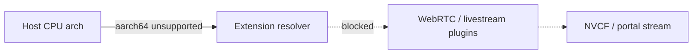

# Platform incompatible livestream extensions

## Summary

Kit’s extension resolver loads the **WebRTC / NVCF livestream** stack (`omni.kit.livestream.webrtc`, `omni.kit.livestream.core`, `omni.services.livestream.nvcf`, `omni.kit.streamsdk.plugins`, and related packages). Those binaries are published for **x86_64** Linux and Windows (`lx64`, `wx64`). On **unsupported CPU architectures** — notably **ARM64 / aarch64** systems such as **DGX Spark** — registry packages may exist but are marked **platform incompatible**, so dependency resolution fails with **Available versions: (none found)** and a long **Platform incompatible packages** list.

This is **not** a version mismatch or a missing streaming layer on a supported platform. It is an **architecture / product support** boundary. **Omniverse Cloud (OV on DGXC) streaming** targets **x86_64 GPU cloud** (for example L40-class NVCF clusters), not ARM64 edge devices.

 (Isaac Sim 5.1 on DGX Spark) documents the same resolver failure when users ran `livestream.py` on Spark; the product fix was to **exit early on aarch64** with a clear message instead of failing deep in extension resolve.

---

## Symptom

Typical Kit log during startup or when enabling livestream extensions:

```text
[Error] [omni.ext.plugin] Failed to resolve extension dependencies. Failure hints:
[omni.services.livestream.nvcf-7.2.0] dependency: 'omni.kit.livestream.webrtc' = { version='^' } can't be satisfied.
Available versions: (none found)
Platform incompatible packages:
 - [omni.kit.livestream.webrtc-8.1.2+108.0.0.la64.d.cp312] (registry)
 - [omni.kit.livestream.webrtc-8.1.2+108.0.0.lx64.r.cp312] (registry)
 - [omni.kit.livestream.webrtc-8.1.2+108.0.0.wx64.d.cp312] (registry)
 ...
```

You may see the same pattern for `omni.kit.livestream.core`, `omni.kit.streamsdk.plugins`, or older `omni.services.livestream.nvcf` versions. The resolver lists many package IDs but **none match the host platform**.

| Where it appears | Typical trigger |
|------------------|-----------------|
| **Local Kit / Isaac Sim on DGX Spark** | Running `livestream.py` or a kit file that pulls NVCF/WebRTC extensions |
| **`./repo.sh build` on ARM64 Linux** | App or template includes `[nvcf_streaming]` / `[ovc_streaming]` or manual livestream deps |
| **Container built for wrong arch** | Image built on ARM and pushed to NVCF (unusual; NVCF GPU nodes are x86_64) |
| **NVCF History logs** | Same resolve error if the container runtime arch does not match published binaries |

After fix (Isaac Sim 5.1.0-alpha.57+), Isaac’s standalone example may instead print:

```text
Livestream is not supported on ARM64 architecture. Exiting.
```

That message is **expected** on Spark — not a broken install.

---

## When you see this

| Pattern | What it suggests |
|---------|------------------|
| **`nvidia-smi` shows GB10 / DGX Spark** | ARM64 host; WebRTC livestream stack not supported for interactive streaming on this platform |
| **Only `la64` in incompatible list, host is aarch64** | Packages exist for Linux ARM64 tag but are not valid for this Kit/product combo |
| **`lx64` / `wx64` listed but “none found” on x86_64** | Unlikely this doc — check [missing-livestream-extensions.md](missing-livestream-extensions.md) or registry sync |
| **Build on WSL x86_64, deploy to NVCF** | Build host is fine; error on Spark or another ARM machine is separate |
| **Portal ERROR + History shows platform incompatible** | Container or kit config targets livestream on wrong arch — redeploy x86_64 image without livestream on ARM |

Collect: `uname -m` (expect `aarch64` vs `x86_64`), GPU model, Kit version, whether the goal is **OV on DGXC / NVCF** or **local/edge ARM**, and the first failing extension name from the log.

---

## Where it fails (diagnostic layer)



| Layer | This issue? |
|-------|-------------|
| **Build / package (host arch)** | **Yes** — do not enable livestream on unsupported arch |
| NGC / registry | No (packages exist; wrong arch for host) |
| NVCF function | Only if a wrong-arch image was deployed |
| Portal / WebRTC client | No until Kit resolves livestream on a **supported** server |

See [STREAMING-REFERENCE.md](../STREAMING-REFERENCE.md) (build / package phase).

---

## Supported vs unsupported targets

| Target | OV on DGXC / NVCF WebRTC streaming | Notes |
|--------|-------------------------------------|--------|
| **x86_64 Linux** cloud GPU (L40, etc.) | **Supported** | Standard Kit App Template → `package_container` → NVCF |
| **WSL2 Ubuntu 22.04 x86_64** (Windows dev) | **Supported** for build/packaging | Build on x86_64; run stream in cloud |
| **Windows x86_64** desktop | Plugins exist (`wx64`); OV on DGXC path is still Linux containers | Not the primary NVCF workflow |
| **DGX Spark / ARM64 (aarch64)** | **Not supported** for WebRTC livestream stack | Use cloud NVCF for streaming; do not expect local WebRTC on Spark |
| **Apple Silicon / other ARM** | **Not supported** for this stack | Same class of failure as Spark |

Minimum livestream extensions on **supported** Kit versions are listed in STREAMING-REFERENCE (for example 108.x: `omni.services.livestream.session`, `omni.kit.livestream.webrtc`, `omni.kit.livestream.core`, `omni.kit.livestream.app`). Those versions only apply after the host arch is supported.

---

## Reading extension platform tags

Registry package IDs embed platform and config, for example:

`omni.kit.livestream.webrtc-8.1.2+108.0.0.lx64.d.cp312`

| Token | Meaning |
|-------|---------|
| **lx64** | Linux x86_64 |
| **wx64** | Windows x86_64 |
| **la64** | Linux ARM64 (aarch64) |
| **`.r` / `.d`** | Release vs debug |
| **`cp312`** | Python 3.12 ABI |

When the log says **Platform incompatible packages** and lists `lx64` / `wx64` / `la64` variants but **Available versions: (none found)**, the host OS/CPU does not match any **compatible** build for that product — even though the registry synced (log often shows `kit/default`, `kit/prod/default`, etc.).

---

## Root causes

| Cause | How it happens |
|-------|----------------|
| **WebRTC stack not built for host arch** | Livestream plugins ship for x86_64; ARM64 hosts cannot load them |
| **Streaming layer on ARM kit app** | `[nvcf_streaming]` / `[ovc_streaming]` or manual deps in `*_nvcf.kit` on aarch64 build |
| **Sample or script still references livestream** | e.g. Isaac `livestream.py` on DGX Spark |
| **Expectation mismatch** | Treating DGX Spark like an NVCF streaming node |
| **Wrong container platform** | Rare: `docker build` / manifest for `linux/arm64` with livestream-enabled Kit |

---

## Diagnosis

### 1. Confirm CPU architecture

On the machine where Kit fails (Spark, build host, or inside container):

```bash
uname -m
```

| Output | Implication |
|--------|-------------|
| **aarch64** | This doc applies — do not pursue WebRTC livestream on this host |
| **x86_64** | Look elsewhere: [missing-livestream-extensions.md](missing-livestream-extensions.md), [forgot-nvcf-streaming-layer.md](forgot-nvcf-streaming-layer.md) |

Optional: `nvidia-smi` — Spark systems often report **GB10**; cloud NVCF targets datacenter GPUs on x86_64.

### 2. Confirm the log signature

Search Kit or NVCF History logs for:

- `Failed to resolve extension dependencies`
- `Platform incompatible packages`
- `omni.kit.livestream.webrtc` or `omni.services.livestream.nvcf`

If versions are **missing entirely** without “platform incompatible”, use [missing-livestream-extensions.md](missing-livestream-extensions.md).

### 3. Inspect kit dependencies (Kit App Template)

On an aarch64 build host, check whether streaming was added:

| Kit | Streaming artifact |
|-----|-------------------|
| 108+ | `[nvcf_streaming]` layer → `*_nvcf.kit` |
| 107.x | `[ovc_streaming]` layer → `*_ovc.kit` |

If the product should run on Spark **without** streaming, remove those layers/deps for ARM builds or maintain a separate non-streaming kit variant.

### 4. NVCF / portal (only if you already deployed)

If portal status is **ERROR** and logs show the same resolve text, the running image still expects livestream on an unsupported runtime. Confirm the deployed image was built for **linux/amd64** and that the Kit app inside does not force livestream on ARM. See [portal-status-error.md](../portal-registration/portal-status-error.md).

---

## Fix

Apply the path that matches your goal. **Do not** try to “fix” resolver errors by pinning random extension versions on ARM — there is no supported WebRTC binary for that platform in this stack.

### A. OV on DGXC / NVCF streaming (recommended product path)

1. **Build and package on x86_64** (WSL2 Ubuntu 22.04 or Linux workstation) per the Kit guide.
2. Deploy the container to **NVCF x86_64 GPU** clusters only.
3. Use the portal and WebRTC client against the **cloud** function — not against Kit livestream on Spark.

On Spark, use the device for simulation/workloads that do not require local WebRTC; stream from NVCF when needed.

### B. Remove livestream from ARM / Spark builds

1. Do not select `[nvcf_streaming]` / `[ovc_streaming]` when creating templates intended for aarch64.
2. Remove `omni.services.livestream.*` and `omni.kit.livestream.*` from custom `.kit` dependency lists for ARM products.
3. Remove or gate samples that import NVCF/WebRTC (Isaac: early exit in `livestream.py` — see resolution below).

### C. Isaac Sim / product-specific (DGX Spark)

**Expected after fix:** running `livestream.py` on aarch64 prints that livestream is not supported and exits cleanly.

**Product resolution:** Isaac Sim merged an early-exit for unsupported `livestream.py` on aarch64; included from **Isaac Sim 5.1.0-alpha.57** onward.

### D. What not to do

| Action | Why it fails |
|--------|----------------|
| Force-install `la64` wheels manually | Product does not support WebRTC livestream on Spark |
| Deploy same NVCF function to ARM | NVCF streaming functions expect x86_64 GPU images |
| Debug portal “No peer info” first | Fix arch/support boundary first — see [../portal-ui/no-peer-info-found.md](../portal-ui/no-peer-info-found.md) only after Kit starts on x86_64 |

---

## Verification

| Check | Pass criteria |
|-------|----------------|
| **aarch64 host** | Kit starts **without** livestream extensions; no resolve error; streaming samples exit or are absent |
| **x86_64 build** | `./repo.sh build` succeeds with streaming layer; logs show livestream plugins resolving |
| **NVCF** | History shows **RTX Ready** and livestream versions on x86_64 instance — not platform incompatible |
| **Portal** | Stream start works from cloud function (Phase C in foundation), not from Spark-local WebRTC |

No portal or `check-nvcf-function` run is required to close an **ARM-only local resolve** issue once livestream is removed or gated.

---

## Distinguish from similar errors

| Symptom / message | Layer | What to do |
|-------------------|-------|------------|
| **`Platform incompatible packages`** + **none found** on **aarch64** | Arch / support | This guide — use cloud x86_64 or drop livestream |
| **Missing extensions** on **x86_64** | Build / template | [missing-livestream-extensions.md](missing-livestream-extensions.md) |
| **No `[nvcf_streaming]` layer** | Template wizard | [forgot-nvcf-streaming-layer.md](forgot-nvcf-streaming-layer.md) |
| **No peer info found** (portal) | Stream runtime on **supported** server | [../portal-ui/no-peer-info-found.md](../portal-ui/no-peer-info-found.md) |
| **Portal status ERROR** + resolve in logs | Deployed container | [../portal-registration/portal-status-error.md](../portal-registration/portal-status-error.md) |

---

## Background

On **DGX Spark (aarch64)**, Isaac Sim and similar stacks may still expose `livestream.py` even though WebRTC/NVCF streaming is unsupported on that platform. Extension resolve then fails with hundreds of **platform incompatible** registry entries for `omni.kit.livestream.*`.

**Expected product behavior on Spark:** exit early with a clear message instead of a deep resolve failure; use **x86_64** Kit builds and NVCF for supported streaming paths.

---

## Quick checks (agent)

1. Ask for `uname -m` and whether the user is on **DGX Spark** or **NVCF cloud**.
2. If **aarch64**: classify as **unsupported platform** — stop investigating portal WebRTC until target is x86_64 NVCF.
3. Search logs for `Platform incompatible packages` and the first failing `omni.kit.livestream` / `omni.services.livestream` extension.
4. If the goal is OV on DGXC streaming, redirect to **x86_64 build → package_container → NVCF**; link [missing-make.md](missing-make.md) for WSL toolchain if needed.
5. If Isaac Sim on Spark, confirm Kit/Isaac version includes the aarch64 early-exit or document that `livestream.py` is intentionally unsupported locally.

---

## Related documentation

| Resource | Relevance |
|----------|-----------|
| [STREAMING-REFERENCE.md](../STREAMING-REFERENCE.md) | Kit/NVCF shared facts and plugin minimums |
| [OV on DGXC customer docs](https://docs.omniverse.nvidia.com/omniverse-dgxc/latest/index.html) | Supported cloud streaming product scope |
| [Kit App Template](https://github.com/NVIDIA-Omniverse/kit-app-template) | x86_64 packaging for NVCF |

---

## Agent notes

- Classify as **build-package** / **platform support**, not a registry outage.
- Do **not** run `check-nvcf-function` or portal stream diagnostics for Spark-local resolve failures unless the user also deployed a function and needs log correlation.
- On **x86_64**, if the log does **not** mention platform incompatible, switch to missing-extensions or streaming-layer docs.
- Escalation: confirm supported cloud targets with your Omniverse program; route Isaac Sim or DGX Spark questions to your product support contact.
