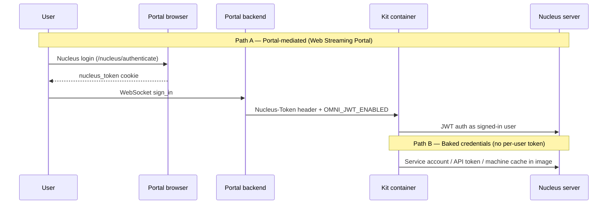

# Cannot connect to Nucleus in stream

## Symptom

The streaming session **starts** (WebRTC video may load) but Kit inside the headless NVCF container **cannot connect to Nucleus** or open content from the **Nucleus server**. Typical patterns:

| What the user sees | What it often means |
|--------------------|---------------------|
| Stream loads but **scene is empty**, default stage, or missing references | OmniClient never authenticated to the expected Nucleus server |
| User tries to add a **Nucleus server** **in-session** and nothing happens | Kit attempted desktop-style browser login — no browser exists in the container |
| **Missing textures / broken USD references** on Nucleus paths | Partial resolve — auth or server URL wrong |
| Works on **desktop Kit** with browser login; fails only in **cloud stream** | Headless credential model not configured |
| **Legacy sample server** works for some users but not customer Nucleus | Hard-coded read-only sample credential vs customer token path |

There is usually **no portal red banner** specific to Nucleus — the failure appears inside the streamed app or in NVCF logs (OmniClient / Nucleus / JWT errors).

Collect before diagnosing: portal URL, `app_id` or NVCF IDs, Kit version, Nucleus server URL, which Nucleus server hosts the content, `authentication_type`, and whether Nucleus browser login completed before the stream.

## When you see this

| Pattern | What it suggests |
|---------|------------------|
| Portal Nucleus login **succeeded**; stream starts; USD still missing | Token forwarding or headless JWT path broken — not a browser tenant issue |
| **`authentication_type: NONE`** but app reads user-scoped Nucleus USD | No `Nucleus-Token` forwarded — container needs service credentials or auth type change |
| Env vars **`NVDA_KIT_NUCLEUS`** / **`OMNI_JWT_ENABLED`** missing | Fix [env-needs-nucleus.md](env-needs-nucleus.md) first |
| Env vars **present**; logs still show OmniClient auth failures | This doc — pre-auth token, service account, or portal token not reaching Kit |
| **Direct NVCF** / custom streaming client (no portal) | Portal-mediated auth unavailable — bake Nucleus token into image |
| User adds Nucleus connection **inside** streamed Composer / Create | Interactive browser auth cannot run headless — use portal login or baked credentials |

## How headless Nucleus auth fits the stack

Headless Kit on NVCF has **no display and no browser**. OmniClient’s default Nucleus flow opens a browser on the **host** for SSO — that path does not work inside the container . Supported models:

| Path | When to use | Requirements |
|------|-------------|--------------|
| **A — Portal-mediated** | Web Streaming Portal; per-user Nucleus content | `authentication_type: NUCLEUS` or `OPENID`; user completes Nucleus login in **browser**; `NVDA_KIT_NUCLEUS` + `OMNI_JWT_ENABLED=1`; portal forwards **`Nucleus-Token`** on WebSocket sign-in ([backend/app/routers/sessions.py](../../../backend/app/routers/sessions.py)) |
| **B — Baked credentials** | Shared read-only content, automation, custom streaming without portal | Nucleus **API token** or service credentials embedded at **image build** or via mounted machine cache; often paired with `authentication_type: NONE` |
| **C — Legacy sample server** | Legacy sample deployments | Some cloud images shipped **hard-coded read-only credentials to a sample server — not a general customer pattern |

Portal token forwarding ([backend/app/routers/sessions.py](../../../backend/app/routers/sessions.py)):

| `authentication_type` | `Nucleus-Token` source |
|-----------------------|------------------------|
| **`NUCLEUS`** | `nucleus_token` cookie from `/nucleus/authenticate` |
| **`OPENID`** | Portal IdP **`access_token`** (same header name) |
| **`NONE`** | Header **not set** — Kit must use baked credentials or public content only |

Frontend gate ([web/src/pages/AppStream.tsx](../../../web/src/pages/AppStream.tsx)): for `NUCLEUS`, redirect to `/nucleus/authenticate` until `useNucleusSession` is established.

**Do not confuse with:**

| Symptom / doc | Difference |
|---------------|------------|
| [azure-ad-tenant-nucleus-login.md](../portal-registration/azure-ad-tenant-nucleus-login.md) | **Azure tenant error** on Nucleus login — **before** stream starts; user never gets `nucleus_token` |
| [env-needs-nucleus.md](env-needs-nucleus.md) | Missing **`NVDA_KIT_NUCLEUS`** / **`OMNI_JWT_ENABLED`** on the NVCF function |
| Portal UI “No peer info found” | WebRTC/signaling — stream never reaches Nucleus asset load |
| Portal UI “Failed to load the stream” (generic) | App metadata or session API — not Nucleus-specific |

## Root causes

| Cause | How it happens |
|-------|----------------|
| **Expecting in-container browser auth** | User or extension triggers standard Nucleus “add server” flow inside streamed Kit — no browser in headless container |
| **`authentication_type: NONE`** with user-scoped Nucleus USD | Portal never sends `Nucleus-Token`; env vars alone cannot impersonate the signed-in user |
| **Portal token not forwarded** | `NUCLEUS` auth but missing/expired `nucleus_token` cookie; dev portal on wrong domain (cookies not shared — [web/README.md](../../../web/README.md)) |
| **`OMNI_JWT_ENABLED` off or wrong Nucleus URL** | JWT from portal not accepted — see [env-needs-nucleus.md](env-needs-nucleus.md) |
| **No baked credentials for shared content** | Customer deploys headless Docker without portal and without embedding Nucleus API token |
| **Wrong Nucleus server / token scope** | Token valid for server A; Kit configured for server B; or read-only token on write paths |
| **Relying on legacy sample-server shortcut** | Sample assumed read-only credentials; production Nucleus needs explicit token path |

## Diagnosis

Work in this order. Confirm **browser Nucleus login** and **container env** before assuming a deeper OmniClient bug.

### 1. Portal auth model — `check-streaming-app`

Provide `portal_url` and `app_id` or both NVCF IDs.

| Field | If user-scoped Nucleus content is required |
|-------|---------------------------------------------|
| **Authentication type** | Must be **`NUCLEUS`** (dedicated Nucleus login) or **`OPENID`** (IdP token as `Nucleus-Token`) — not **`NONE`** |
| **Runtime status** | **ACTIVE** / **DEGRADING** — registration OK |
| **Function IDs** | Note for Step 2 |

If the app only needs **shared** Nucleus content (same for all users), **`NONE`** plus baked credentials may be correct — record that intent before changing auth type.

### 2. NVCF Nucleus environment — `check-nvcf-function`

Provide `function_id` and `function_version_id`.

Verify **`NVDA_KIT_NUCLEUS`** (correct URL) and **`OMNI_JWT_ENABLED`: `1`**. If either is missing, fix [env-needs-nucleus.md](env-needs-nucleus.md) first and retest.

Compare Nucleus URL with portal `config.endpoints.nucleus` from `{portal_url}/config/main.json` — they should refer to the same environment.

### 3. Confirm browser Nucleus login completed

For **`authentication_type: NUCLEUS`**:

1. Sign in to portal → open app → complete **`/nucleus/authenticate`** without Azure tenant error ([azure-ad-tenant-nucleus-login.md](../portal-registration/azure-ad-tenant-nucleus-login.md)).
2. Confirm **`nucleus_token`** cookie exists (do not echo value).
3. Start a **new** session (not Reconnect).

If Azure login fails, fix account access first — headless Kit never receives a token.

### 4. NVCF logs (History / Live Tail)

Open [NVCF functions](https://nvcf.ngc.nvidia.com/functions) → function → **Logs** for the failing session.

| Log signal | Interpretation |
|------------|----------------|
| **OmniClient** / **Nucleus** “authentication required” or browser / SSO mentions | Headless path missing — portal token or baked credentials |
| **JWT** / **token** invalid or expired | `OMNI_JWT_ENABLED`, stale `nucleus_token`, or wrong auth type |
| Connection OK but **USD open** fails on Nucleus path | Token scope, path permissions, or wrong server |
| No Nucleus errors; empty stage | App may not reference Nucleus USD — verify kit default stage |

### 5. Direct Docker / non-portal streaming

If there is **no** Web Streaming Portal in the path :

- Portal-mediated auth (Path A) is unavailable.
- Confirm whether the image includes a **Nucleus access token** or machine cache from build time.
- Follow [OV on DGXC documentation](https://docs.omniverse.nvidia.com/omniverse-dgxc/latest/index.html) for embedding credentials in the container workflow.

## Fix

Apply the smallest change that matches the diagnosis. Change one variable at a time.

1. **Use portal-mediated auth for per-user Nucleus** — Re-run **`publish-streaming-app`** with `authentication_type: "NUCLEUS"` (or `"OPENID"` when IdP token is sufficient). Ensure NVCF has `NVDA_KIT_NUCLEUS` + `OMNI_JWT_ENABLED=1` ([env-needs-nucleus.md](env-needs-nucleus.md)). User completes Nucleus login in the **browser** before streaming — not inside Kit.

2. **Use `NONE` + baked credentials for shared content** — When all users read the same Nucleus assets, set `authentication_type: "NONE"` and embed a Nucleus **API token** or service credentials in the Docker image at build time . Do not expect users to log into Nucleus inside the streamed app.

3. **Do not trigger desktop Nucleus login in-session** — Train users not to “add server” / connect a Nucleus server through Kit UI in the stream. Preconfigure the Nucleus server via env and auth path above.

4. **Clear stale Nucleus session** — Sign out Nucleus in the portal header, clear site cookies, repeat `/nucleus/authenticate` with the correct account ([azure-ad-tenant-nucleus-login.md](../portal-registration/azure-ad-tenant-nucleus-login.md)).

5. **Align Nucleus server URL** — Set `NVDA_KIT_NUCLEUS` and portal `config.endpoints.nucleus` to the same host your users authenticate against.

6. **Customer-specific Nucleus (e.g. customer-specific)** — Where legacy samples used hard-coded sample-server access access, provision **API tokens** for the target server per your deployment guide.

7. **Content cache / UJITSO deployments** — When using [scripts/create_function_with_caches.sh](../../../scripts/create_function_with_caches.sh), Nucleus env and auth path still apply; cache vars do not replace Nucleus credentials.

## Verification

1. **`check-streaming-app`** — `authentication_type` matches intent; runtime **ACTIVE** / **DEGRADING**.
2. **`check-nvcf-function`** — `NVDA_KIT_NUCLEUS` and `OMNI_JWT_ENABLED: 1` present; status **ACTIVE**.
3. **Portal Nucleus login** (if `NUCLEUS`) — completes without Azure error; **`nucleus_token`** cookie set.
4. **New streaming session** — Nucleus-backed USD/content visible in-session; no in-app “connect to Nucleus” prompt that expects a browser.
5. **NVCF Live Tail** — no recurring OmniClient / JWT auth errors during session start and USD load.

## Distinguish from similar issues

| Observation | Likely issue | Doc |
|-------------|--------------|-----|
| Azure tenant error on launch | Wrong Nucleus user / tenant | [azure-ad-tenant-nucleus-login.md](../portal-registration/azure-ad-tenant-nucleus-login.md) |
| No `NVDA_KIT_NUCLEUS` / `OMNI_JWT_ENABLED` | Missing container env | [env-needs-nucleus.md](env-needs-nucleus.md) |
| Env + portal auth OK; still fails | Token scope, server URL, or baked-credential gap | This doc — escalate with logs |
| Stream never starts | WebRTC / NVCF config | [no-peer-info-found.md](../portal-ui/no-peer-info-found.md) |
| `authentication_type: NONE` on user-scoped app | Portal not forwarding token | [publish-streaming-app SKILL](../../skills/publish-streaming-app/SKILL.md) |

## Related documentation

| Resource | Relevance |
|----------|-----------|
| [STREAMING-REFERENCE.md](../STREAMING-REFERENCE.md) | (Nucleus in stream); architecture diagram |
| [check-streaming-app SKILL](../../skills/check-streaming-app/SKILL.md) | Read `authentication_type` and portal status |
| [check-nvcf-function SKILL](../../skills/check-nvcf-function/SKILL.md) | Read `containerEnvironment`, logs context |
| [publish-streaming-app SKILL](../../skills/publish-streaming-app/SKILL.md) | Set `NONE` / `OPENID` / `NUCLEUS` |
| [env-needs-nucleus.md](env-needs-nucleus.md) | `NVDA_KIT_NUCLEUS`, `OMNI_JWT_ENABLED` |
| [azure-ad-tenant-nucleus-login.md](../portal-registration/azure-ad-tenant-nucleus-login.md) | Pre-stream Nucleus browser login failures |
| [OV on DGXC documentation](https://docs.omniverse.nvidia.com/omniverse-dgxc/latest/index.html) | Nucleus auth in cloud / Docker |
| [NVCF debuggability](https://docs.nvidia.com/cloud-functions/user-guide/latest/cloud-function/debuggability.html) | Logs: History vs Live Tail |

## Agent notes

- Treat **stream started + missing Nucleus content** as distinct from **stream failed to start** — do not debug WebRTC first when the user reports empty stage or Nucleus connection failures.
- Always run **`check-streaming-app`** and **`check-nvcf-function`** together: auth type and container env are both required for portal-mediated per-user Nucleus.
- If **`authentication_type: NONE`**, expect **Path B** (baked credentials) — do not send the user to `/nucleus/authenticate` unless changing auth type.
- If Azure tenant errors appear **before** the stream, use [azure-ad-tenant-nucleus-login.md](../portal-registration/azure-ad-tenant-nucleus-login.md) — this doc applies **after** browser Nucleus login succeeds.
- Headless Kit **cannot** open an interactive browser for Nucleus — never suggest “log in inside the streamed app” as the primary fix .
- For non-portal Docker deployments, point to **token-in-image** pattern from and Kit guide — not a product defect.
- Do not echo `nucleus_token`, portal tokens, API keys, or embedded Nucleus tokens in chat or command output.