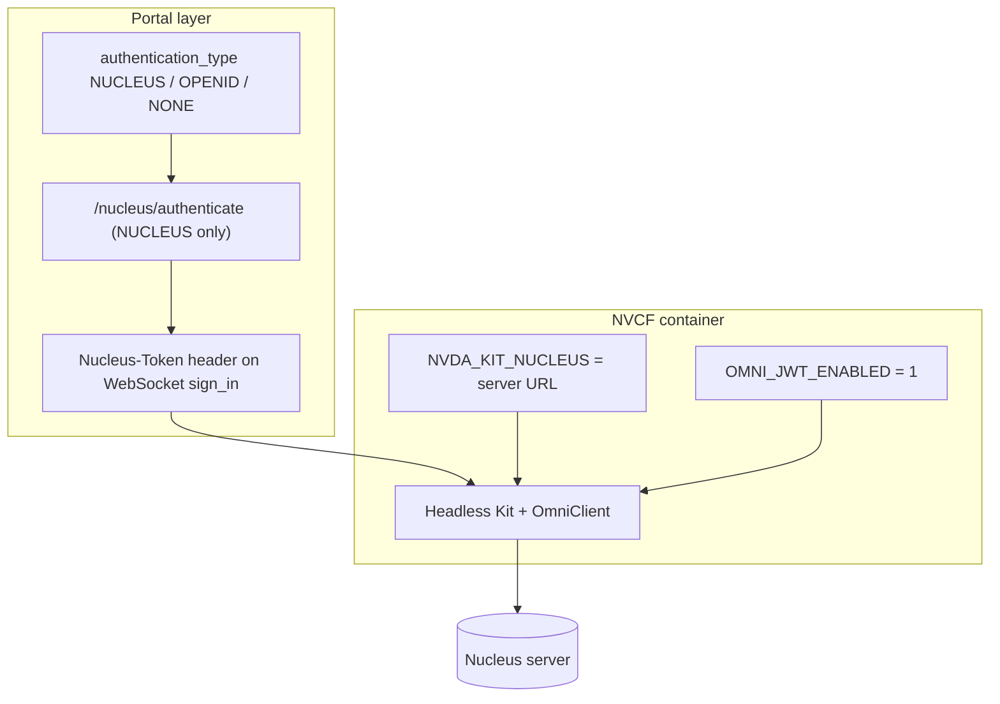

# Missing Nucleus environment variables

## Summary

Kit apps that open USD or other assets from **Omniverse Nucleus** inside the NVCF container need two container environment variables on the function version: **`NVDA_KIT_NUCLEUS`** (Nucleus server URL) and **`OMNI_JWT_ENABLED=1`** (JWT-based Nucleus auth in headless Kit). Without them, the stream may start but Nucleus-backed content fails to load, or Kit logs show Nucleus connection / auth errors.

This is **NVCF function configuration**, not portal registration. Portal **`authentication_type: NUCLEUS`** (or `OPENID`) forwards a user token to Kit at WebSocket sign-in; the container env vars tell Kit **which Nucleus server** to use and **how to accept JWT tokens**. Both layers are required when the app reads user-scoped Nucleus content in the cloud.

## Symptom

There is no single portal banner for missing env vars. Typical user-visible patterns:

| What the user sees | What it often means |
|--------------------|---------------------|
| Stream **starts** (video/WebRTC OK) but **scene is empty** or default stage | Kit never connected to the expected Nucleus path |
| **Missing textures / references** in-session | Partial Nucleus resolve failure |
| App worked **locally** with Nucleus but not after NVCF deploy | Function created without `containerEnvironment` Nucleus keys |
| Portal Nucleus login **succeeds** but in-stream USD still fails | Portal token path OK; container missing `NVDA_KIT_NUCLEUS` / `OMNI_JWT_ENABLED` |
| NVCF History logs mention **Nucleus**, **OmniClient**, or **JWT** auth failures | Strong signal for this doc |

Collect before diagnosing: portal URL, `app_id` or NVCF IDs, whether the Kit app reads from Nucleus (USD path on Nucleus), Nucleus server URL for the environment, and whether the function was created via NGC UI, API, or [scripts/create_function.sh](../../../scripts/create_function.sh).

## How Nucleus env vars fit the stack

Two independent configuration points must align:



| Layer | Setting | Purpose |
|-------|---------|---------|
| Portal | `authentication_type: NUCLEUS` | User completes Nucleus login; portal sends `nucleus_token` as **`Nucleus-Token`** during WebSocket sign-in ([backend/app/routers/sessions.py](../../../backend/app/routers/sessions.py)) |
| Portal | `authentication_type: OPENID` | Forwards portal IdP **`access_token`** as `Nucleus-Token` — different login path, same header name |
| Portal | `authentication_type: NONE` | No user token forwarded — fine for apps that do not read user-scoped Nucleus content |
| NVCF | **`NVDA_KIT_NUCLEUS`** | Tells Kit which Nucleus server to connect to (e.g. dev Nucleus URL for the environment) |
| NVCF | **`OMNI_JWT_ENABLED=1`** | Enables JWT validation so headless Kit can use portal-forwarded tokens without a browser |

Reference defaults in this repo ([scripts/create_function.sh](../../../scripts/create_function.sh)):

```json
"containerEnvironment": [
 {"key": "NVDA_KIT_NUCLEUS", "value": "<NUCLEUS_SERVER>"},
 {"key": "OMNI_JWT_ENABLED", "value": "1"},
 {"key": "NVDA_KIT_ARGS", "value": "--/app/livestream/nvcf/sessionResumeTimeoutSeconds=300"}
]
```

For Kit **108+**, use the resume-timeout arg from [STREAMING-REFERENCE.md](../STREAMING-REFERENCE.md): `--/exts/omni.services.livestream.session/resumeTimeoutSeconds=300`.

**Do not confuse with:**

| Symptom / doc | Difference |
|---------------|------------|
| [azure-ad-tenant-nucleus-login.md](../portal-registration/azure-ad-tenant-nucleus-login.md) | **Browser** Azure tenant error on `/nucleus/authenticate` — happens **before** stream; env vars not the first fix |
| [cannot-connect-nucleus-in-stream.md](cannot-connect-nucleus-in-stream.md) | Env vars **present** but headless Kit still cannot auth (service account, machine cache, pre-auth tokens) |
| Portal UI “No peer info found” | WebRTC/signaling — stream never reaches Nucleus asset load |
| Portal status **ERROR** | Container crash / health — may need env vars among other fixes ([portal-status-error.md](../portal-registration/portal-status-error.md)) |

## When you see this

| Pattern | What it suggests |
|---------|------------------|
| Function created via **NGC UI** without Environment section filled | `containerEnvironment` empty or missing Nucleus keys |
| Copied minimal JSON from a doc with `"containerEnvironment": []` | Inference/health OK; Nucleus vars never added |
| **`check-nvcf-function`** shows no `NVDA_KIT_NUCLEUS` | This doc applies directly |
| App uses **`omniverse://`** or Nucleus paths in kit file | Nucleus env required on NVCF |
| **`authentication_type: NONE`** on portal but app needs user Nucleus USD | Missing portal auth **and** possibly missing env — fix both |
| Nucleus URL changed | `NVDA_KIT_NUCLEUS` still points at old server |

## Root causes

| Cause | How it happens |
|-------|----------------|
| **Omitted at function create time** | NGC UI form or API POST without Nucleus entries in `containerEnvironment` |
| **Wrong template / script** | Used a minimal create snippet (501/408 docs show empty `containerEnvironment`) instead of [scripts/create_function.sh](../../../scripts/create_function.sh) |
| **`OMNI_JWT_ENABLED` missing or not `1`** | Kit cannot validate JWT from portal `Nucleus-Token` header in headless mode |
| **`NVDA_KIT_NUCLEUS` wrong or empty** | Kit targets wrong host; resolves fail even with valid user token |
| **Portal `authentication_type: NONE`** | No `Nucleus-Token` forwarded — env vars alone cannot supply per-user Nucleus access |
| **Mismatched Nucleus URL** | Portal `config.endpoints.nucleus` and `NVDA_KIT_NUCLEUS` should refer to the same environment |

## Diagnosis

Work in this order. Confirm missing **container** env before chasing browser Nucleus login.

### 1. NVCF function environment — `check-nvcf-function`

Provide `function_id` and `function_version_id`.

In the **Environment** section of the report, verify:

| Key | Expected | If missing / wrong |
|-----|----------|-------------------|
| **`NVDA_KIT_NUCLEUS`** | HTTPS URL of the Nucleus server for this deployment | Add or correct — must match your org's Nucleus endpoint |
| **`OMNI_JWT_ENABLED`** | `1` | Add — required for portal-mediated JWT auth in Kit |
| **`NVDA_KIT_ARGS`** | Portal resume timeout **300** s (Kit-version-specific path) | Recommended for portal sessions; see STREAMING-REFERENCE |

Also confirm runtime status is **ACTIVE** (or **DEGRADING**) so env inspection is meaningful — if **ERROR**, fix deploy first ([portal-status-error.md](../portal-registration/portal-status-error.md)).

### 2. Portal auth model — `check-streaming-app`

Provide `portal_url` and `app_id` or both NVCF IDs.

| Field | If app reads user-scoped Nucleus content |
|-------|------------------------------------------|
| **Authentication type** | Should be **`NUCLEUS`** (dedicated Nucleus login) or **`OPENID`** (portal IdP token as `Nucleus-Token`) — not **`NONE`** |
| **Function IDs** | Must match the function you checked in Step 1 |
| **Runtime status** | **ACTIVE** / **DEGRADING** — registration OK |

If `authentication_type` is `NONE` but the app needs the signed-in user's Nucleus access, plan a **`publish-streaming-app`** update to `NUCLEUS` or `OPENID` after fixing NVCF env.

### 3. NVCF logs (History / Live Tail)

Open [NVCF functions](https://nvcf.ngc.nvidia.com/functions) → function → **Logs**.

| Log signal | Interpretation |
|------------|----------------|
| Nucleus / OmniClient **connection refused** or **unknown host** | Wrong or missing `NVDA_KIT_NUCLEUS` |
| **JWT** / **auth** / **token** errors from OmniClient | Missing `OMNI_JWT_ENABLED=1` or missing `Nucleus-Token` from portal |
| Stream starts, then **USD load** errors on `omniverse://` or Nucleus paths | Env + token path — continue with [cannot-connect-nucleus-in-stream.md](cannot-connect-nucleus-in-stream.md) if env is correct |

### 4. Rule out browser Nucleus login (different doc)

If the user never gets past **Azure tenant** errors on launch, fix account access first ([azure-ad-tenant-nucleus-login.md](../portal-registration/azure-ad-tenant-nucleus-login.md)). Env vars matter **after** portal can forward a token.

## Fix

Apply the smallest change that matches the diagnosis. Change one variable at a time.

1. **Add Nucleus env vars to the function version** — Set `containerEnvironment` entries (new version or supported edit):

 ```json
 {"key": "NVDA_KIT_NUCLEUS", "value": "https://<your-nucleus-host>"},
 {"key": "OMNI_JWT_ENABLED", "value": "1"}
 ```

 Use the same Nucleus URL your portal uses (`config.endpoints.nucleus` on `{portal_url}/config/main.json`). For API creation, follow [scripts/create_function.sh](../../../scripts/create_function.sh) and set `NUCLEUS_SERVER` before POST.

2. **Add portal resume timeout to `NVDA_KIT_ARGS`** — Per Kit version in [STREAMING-REFERENCE.md](../STREAMING-REFERENCE.md) (106–107 vs 108+ arg path). Keeps long Nucleus loads from timing out portal sessions.

3. **Set portal `authentication_type`** — If the app needs user Nucleus access, re-run **`publish-streaming-app`** with `NUCLEUS` (or `OPENID` if IdP token is sufficient). Prefer **`NONE`** only when the app does not read user-scoped Nucleus content.

4. **Redeploy and update portal IDs if version UUID changed** — New function versions get a new `function_version_id`. Update the portal app via `publish-streaming-app` or `PUT /api/apps/{app_id}` so linkage stays correct.

5. **Apps with content caches** — See [scripts/create_function_with_caches.sh](../../../scripts/create_function_with_caches.sh) for additional env (`OMNI_CONN_CACHE`, UJITSO-related `NVDA_KIT_ARGS`) when using DDCS/content cache — Nucleus keys still required.

6. **If env is correct but assets still fail in-stream** — Escalate to [cannot-connect-nucleus-in-stream.md](cannot-connect-nucleus-in-stream.md) (pre-auth tokens, service credentials, below).

## Verification

1. **`check-nvcf-function`** — `containerEnvironment` lists **`NVDA_KIT_NUCLEUS`** (correct URL) and **`OMNI_JWT_ENABLED`: `1`**; control-plane status **ACTIVE**.
2. **`check-streaming-app`** — `authentication_type` matches intent (`NUCLEUS` / `OPENID` / `NONE`); function IDs match Step 1.
3. **Portal Nucleus login** (if `NUCLEUS`) — completes without Azure tenant error ([azure-ad-tenant-nucleus-login.md](../portal-registration/azure-ad-tenant-nucleus-login.md)).
4. **New streaming session** — start from home tile (not Reconnect); Nucleus-backed USD/content loads in-session.
5. **NVCF Live Tail** — no recurring Nucleus connection or JWT auth errors during session start.

## Distinguish from similar issues

| Observation | Likely issue | Doc |
|-------------|--------------|-----|
| No `NVDA_KIT_NUCLEUS` / `OMNI_JWT_ENABLED` on function | Missing container env | This doc |
| Env present; OmniClient auth still fails in logs | Headless credential model | [cannot-connect-nucleus-in-stream.md](cannot-connect-nucleus-in-stream.md) |
| Azure tenant error on launch | Wrong Nucleus user / tenant | [azure-ad-tenant-nucleus-login.md](../portal-registration/azure-ad-tenant-nucleus-login.md) |
| Stream never starts; “No peer info found” | WebRTC / plugins / ports | [no-peer-info-found.md](../portal-ui/no-peer-info-found.md) |
| Portal **ERROR**; no RTX Ready | Deploy / health / crash | [portal-status-error.md](../portal-registration/portal-status-error.md) |
| `authentication_type: NONE` but app needs user USD | Portal auth not forwarding token | [publish-streaming-app SKILL](../../skills/publish-streaming-app/SKILL.md) |

## Related documentation

| Resource | Relevance |
|----------|-----------|
| [STREAMING-REFERENCE.md](../STREAMING-REFERENCE.md) | (Nucleus in stream); Phase B `authentication_type`; env table |
| [check-nvcf-function SKILL](../../skills/check-nvcf-function/SKILL.md) | Read `containerEnvironment` from function version API |
| [check-streaming-app SKILL](../../skills/check-streaming-app/SKILL.md) | Read `authentication_type` and NVCF linkage |
| [publish-streaming-app SKILL](../../skills/publish-streaming-app/SKILL.md) | Set `NONE` / `OPENID` / `NUCLEUS` |
| [scripts/create_function.sh](../../../scripts/create_function.sh) | Reference POST body with Nucleus env |
| [OV on DGXC documentation](https://docs.omniverse.nvidia.com/omniverse-dgxc/latest/index.html) | NVCF environment variables |
| [NVCF function creation](https://docs.nvidia.com/cloud-functions/user-guide/latest/cloud-function/function-creation.html) | Deployment and env configuration fields |

## Agent notes

- Run **`check-nvcf-function`** first when the user suspects missing env — `containerEnvironment` is authoritative.
- Run **`check-streaming-app`** in parallel or immediately after to verify **`authentication_type`**; missing env and `NONE` auth are a common combined misconfiguration.
- **`NVDA_KIT_NUCLEUS` + `OMNI_JWT_ENABLED`** do **not** replace portal Nucleus login when the app needs **per-user** Nucleus content — both container env and `NUCLEUS` (or `OPENID`) auth type are required.
- If the user only sees **Azure tenant** errors, send them to [azure-ad-tenant-nucleus-login.md](../portal-registration/azure-ad-tenant-nucleus-login.md) before editing NVCF env.
- If env vars are present and logs still show auth failures, use [cannot-connect-nucleus-in-stream.md](cannot-connect-nucleus-in-stream.md) — do not keep adding duplicate env keys.
- After adding env, a **new function version** may change `function_version_id` — confirm portal app still references the active version.
- Do not echo API keys, `nucleus_token`, or portal tokens in chat or command output.