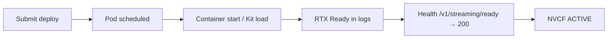

# Deployment stuck DEPLOYING

## Symptom

An NVCF function version remains in **DEPLOYING** state in the NGC UI or in the control-plane API for **longer than ~15 minutes**. A healthy Kit streaming deploy typically reaches **ACTIVE** in about **10 minutes**.

While status is **DEPLOYING**:

| Surface | What the user sees |
|---------|-------------------|
| **NVCF UI** | Function version Overview shows **DEPLOYING**; no stable active instance pool |
| **Portal app** | Runtime status **DEPLOYING** — tile hidden from home page ([app-not-on-home-page.md](../portal-registration/app-not-on-home-page.md)) |
| **Stream start** | Cannot launch — backend waits for **ACTIVE** |
| **After prolonged DEPLOYING** | May flip to **ERROR** if health never passes or pods crash |

This is a **deploy-time / backend health** failure (Phase A in the diagnostic foundation), not a browser or WebRTC symptom.

## When you see this

| Pattern | What it suggests |
|---------|------------------|
| **First deploy of a new image** | Wrong health port/URI, missing streaming layer, or container crash before **RTX Ready** |
| **Deploy was ~10 min before; now >15 min** | Recent config change (health, env, cluster), larger image, or cluster slowdown |
| **History shows RTX Ready but still DEPLOYING** | NVCF health probe mismatch, livestream service not exposing `/v1/streaming/ready`, or known NVCF gating delay |
| **No RTX Ready in History** | Kit/GPU/RTX failed — scroll up for crash, OOM, shader, or extension errors |
| **DEPLOYING then ERROR after ~20+ min** | Health timeout or repeated failed health checks — see [portal-status-error.md](../portal-registration/portal-status-error.md) |
| **Capacity string in logs** | Cluster quota — not health — see [instance-terminated-no-capacity.md](instance-terminated-no-capacity.md) |

Collect before diagnosing: `function_id`, `function_version_id`, Kit version and template (Composer / Explorer / custom), container image tag, whether deploy is first-time or after an update, health port configured in NVCF vs build scripts, and portal `app_id` if registered.

## Expected deploy timeline



| Phase | Typical duration | Signal |
|-------|------------------|--------|
| Image pull + pod start | 1–3 min | History: container stdout |
| Kit / RTX init | 3–8 min | **RTX Ready** in History |
| NVCF health + control plane | 1–3 min after RTX Ready | Status **DEPLOYING** → **ACTIVE** |
| **Total (healthy)** | **~10 min** | **ACTIVE** in NVCF UI |

Beyond **15 minutes** without **ACTIVE**, treat as misconfiguration, crash, capacity failure, or (less commonly) NVCF platform gating — not normal cold start.

## Health check interpretation (STREAMING-REFERENCE health checks)

Use **History** logs to branch diagnosis. This is the primary decision tree for stuck **DEPLOYING**:

| Log signal | Meaning | Next step |
|------------|---------|-----------|
| **No RTX Ready** | Kit/RTX failed to initialize | Scroll up for crash, OOM, shader, GPU, or extension resolve errors; fix container/build |
| **RTX Ready** but NVCF not **ACTIVE** | Health/signaling not reaching NVCF | Verify health port, URI, livestream service extensions; NVCF probes wrong endpoint |
| **RTX Ready** but slow to **ACTIVE** / invocable | NVCF gating beyond Kit ready | Confirm health config first; if correct, may be platform polling delay — plan `minInstances`, session timeouts |

**RTX Ready** means Kit believes GPU/RTX is up. NVCF **ACTIVE** additionally requires repeated successful HTTP health checks on the configured port and path. Those are not the same milestone.

## Root causes

| Cause | How it happens |
|-------|----------------|
| **Wrong health port** | NVCF probes port A; Kit serves `/v1/streaming/ready` on port B (`CONTROL_SERVER_PORT` in [scripts/create_function.sh](../../../scripts/create_function.sh)) |
| **Wrong health URI or protocol** | Not HTTP **`/v1/streaming/ready`** with expected status **200** |
| **Container crash before RTX Ready** | Missing deps, bad entrypoint, extension errors, OOM |
| **Missing livestream / streaming layer** | Container built without `[nvcf_streaming]` / `[ovc_streaming]` or required plugins — see [missing-livestream-extensions.md](../build-package/missing-livestream-extensions.md) |
| **Wrong function type (secondary)** | Not `STREAMING` / LLS off — usually causes **501** at stream start, but combined misconfig can contribute to deploy health failures |
| **Inference wrong after NGC UI** | Health filled after Inference — can corrupt fields; see [inference-wrong-after-ui-form.md](inference-wrong-after-ui-form.md) |
| **Cluster capacity** | Pod never stays healthy — `instance-terminated-no-capacity` in History |
| **Custom health env** | Custom or non-default health binding |
| **NVCF RTX Ready → ACTIVE gap** | Kit ready; NVCF control plane slow to mark invocable — only after health config verified |

## Expected health configuration (Kit streaming)

Reference: [STREAMING-REFERENCE.md](../STREAMING-REFERENCE.md), [scripts/create_function.sh](../../../scripts/create_function.sh).

| Field | Expected value |
|-------|----------------|
| `health.protocol` | **HTTP** |
| `health.uri` | **`/v1/streaming/ready`** |
| `health.expectedStatusCode` | **200** |
| `health.timeout` | e.g. **PT10S** (must allow Kit startup before first success) |
| `functionType` | **STREAMING** with Low Latency Streaming |
| Inference (for later stream start) | Port **49100**, path **`/sign_in`**, `apiBodyFormat` **CUSTOM** |

### Health port by Kit version and template

| Kit / template | Health port (`CONTROL_SERVER_PORT`) |
|----------------|-------------------------------------|
| **≥107.3.3** (all templates) | **8011** |
| USD Composer **≤107.3.2** | **8111** |
| USD Explorer **≤107.3.2** | **8311** |
| Other templates **≤107.3.2** | **8011** |

Default in repo create scripts is **`8111`** (`CONTROL_SERVER_PORT` env) — override to **8011** for Kit ≥107.3.3 or non-Composer older templates as needed.

Wrong port is the **most common** reason deploy stays **DEPLOYING** until timeout even when logs show **RTX Ready**.

## Diagnosis

Work in order: confirm NVCF config with `check-nvcf-function`, read **History** logs, branch on **RTX Ready**. Use the skills listed in frontmatter.

### 1. Portal linkage (optional) — `check-streaming-app`

When the user has a portal URL or `app_id`, run this first to resolve NVCF IDs and portal status.

Confirm:

- **`function_id`** and **`function_version_id`** match NVCF Overview
- Portal runtime status **DEPLOYING** (or **ERROR** if deploy already failed)
- Same NGC org as the NVCF deployment

### 2. NVCF function configuration — `check-nvcf-function`

Provide `function_id` and `function_version_id`. Per [check-nvcf-function/SKILL.md](../../skills/check-nvcf-function/SKILL.md), the report must include control-plane **runtime status**, health block, inference, container image, and deployment spec.

| Check | Expected for Kit streaming |
|-------|---------------------------|
| Control-plane status | **DEPLOYING** (or **ERROR** if timed out) |
| Function type | **STREAMING** with Low Latency Streaming |
| **Health port** | Matches Kit template table above — **8011** for Kit ≥107.3.3 |
| **Health URI** | **`/v1/streaming/ready`** |
| **Health expected status** | **200** |
| Inference | Port **49100**, path **`/sign_in`**, **CUSTOM** |
| Container image | Intended tag (not stale `latest` from another build) |
| Cluster / `minInstances` | Achievable — rule out [instance-terminated-no-capacity.md](instance-terminated-no-capacity.md) |

Call out mismatches explicitly, e.g.:

```text
Health port: 8111 (NVCF) — Kit ≥107.3.3 expects 8011 → fix function config, no rebuild
```

### 3. NVCF logs — History (primary for DEPLOYING)

Open [NVCF functions](https://nvcf.ngc.nvidia.com/functions) → function → version → **Logs** → **History**.

Per [NVCF debuggability](https://docs.nvidia.com/cloud-functions/user-guide/latest/cloud-function/debuggability.html):

| Log type | When to use |
|----------|-------------|
| **History** | Failed or stuck **DEPLOYING**, startup crashes, first **RTX Ready** timing |
| **Live Tail** | After at least one instance runs — intermittent post-ACTIVE issues |

| Log signal | Interpretation | Next step |
|------------|----------------|-----------|
| No **RTX Ready** | Kit never finished GPU init | Scroll up for first fatal error; fix build/env/extensions |
| **RTX Ready** + health probe failures / no ACTIVE | Wrong port or URI | Update NVCF health to match Kit |
| Search **`livestream`** | Plugin load | Compare to foundation minimums — [missing-livestream-extensions.md](../build-package/missing-livestream-extensions.md) |
| **`instance-terminated-no-capacity`** | Quota / cluster | [instance-terminated-no-capacity.md](instance-terminated-no-capacity.md) |
| **RTX Ready** early, **ACTIVE** late (15+ min) | Possible NVCF gating | Verify health first; see below |

Note timestamps: time from container start → **RTX Ready** vs **RTX Ready** → **ACTIVE**. Slow Kit startup increases total deploy time but should still show **RTX Ready** before NVCF health passes.

### 4. Rule out capacity vs health

| History evidence | Conclusion |
|------------------|------------|
| **`instance-terminated-no-capacity`** | Cluster/quota — not health port |
| Crash / traceback / no **RTX Ready** | Container/build |
| **RTX Ready**, no capacity string, health port wrong in `check-nvcf-function` | Health misconfig |
| **RTX Ready**, health config matches Kit, still **DEPLOYING** >15 min | Escalate — possible NVCF platform delay after health is correct |

## Fix

Apply the smallest change that matches log evidence. Change **one variable at a time**.

### A — No RTX Ready (startup failure)

1. Fix container build: streaming layer (`[nvcf_streaming]` for 108+, `[ovc_streaming]` for 107.x), livestream extensions, entrypoint.
2. Fix env: `NVDA_KIT_ARGS` for portal resume timeout; Nucleus vars if required ([STREAMING-REFERENCE.md](../STREAMING-REFERENCE.md)).
3. Push new image; deploy new function version; update portal `function_version_id` if UUID changed.

### B — RTX Ready but wrong health (most common)

1. Update function version health: HTTP, **`/v1/streaming/ready`**, correct port for Kit/template, status **200**.
2. In NGC UI, fill **Health before Inference** ([inference-wrong-after-ui-form.md](inference-wrong-after-ui-form.md)).
3. Redeploy; wait ~10 min for **ACTIVE**.
4. **No image rebuild** required if logs already show **RTX Ready** on the current image.

API reference ([scripts/create_function.sh](../../../scripts/create_function.sh)):

```json
"health": {
 "protocol": "HTTP",
 "uri": "/v1/streaming/ready",
 "port": 8011,
 "timeout": "PT10S",
 "expectedStatusCode": 200
}
```

Set `"port"` to **8111** or **8311** only when your Kit template requires it.

### C — Capacity (not health)

If History shows **`instance-terminated-no-capacity`**, follow [instance-terminated-no-capacity.md](instance-terminated-no-capacity.md) — switch cluster or lower `minInstances`. Do not rebuild the image for pure capacity errors.

### D — RTX Ready, health verified, still slow to ACTIVE

 documents a gap between Kit marking itself ready (**RTX Ready**) and NVCF marking the function invocable (**ACTIVE**). In OKAS/Self-hosted stacks, clients could connect as soon as **RTX Ready** was true; NVCF polls the streaming infrastructure (SIS) and may add delay beyond Kit readiness.

| Fact | Implication |
|------|-------------|
| NVCF readiness polling improvements (2026) | Event-driven readiness vs polling on the platform side
| Affects managed and self-hosted | Not fixable by portal registration alone |
| Health must still be correct | Do not assume RTX Ready vs ACTIVE delay until health port/URI match Kit and **RTX Ready** is present — see [app-not-on-home-page.md](../portal-registration/app-not-on-home-page.md) |

Mitigations while waiting for platform improvements:

- Set **`minInstances` ≥ 1** so at least one warm pod is **ACTIVE** before users click ([http-408-creating-session.md](http-408-creating-session.md), [stream-timeout-try-again-later.md](../portal-ui/stream-timeout-try-again-later.md)).
- Align portal/session timeouts with expected cold-start + NVCF gating.
- For deploy stuck **DEPLOYING** (not just slow first stream), health misconfig is still more likely than RTX Ready gating alone — re-verify health and History probe errors.

## Verification

1. **`check-nvcf-function`** — control-plane status **ACTIVE**; health port/URI match Kit; inference **49100** / **`/sign_in`**; image is the fixed tag.
2. **`check-streaming-app`** (if registered) — portal status **ACTIVE** or **DEGRADING**; tile visible on home page.
3. **History logs** — **RTX Ready** on latest deploy; deploy completed in ~10 min (not >15 min recurring).
4. **Health spot-check** — from a debug context, HTTP GET `http://<pod>:<health-port>/v1/streaming/ready` → **200** (usually via NVCF operational tools — not required for every triage).
5. **Launch test** — start a **new** streaming session; stream-start errors (501, 408, No peer info) are separate docs once **ACTIVE**.

## Distinguish from similar issues

| Observation | Likely issue | Doc |
|-------------|--------------|-----|
| **DEPLOYING** >15 min, no **RTX Ready** | Container crash / build | This doc (health path A); [portal-status-error.md](../portal-registration/portal-status-error.md) |
| **DEPLOYING** >15 min, **RTX Ready**, wrong health port | Health misconfig | This doc (health path B) |
| **`instance-terminated-no-capacity`** in History | Cluster quota | [instance-terminated-no-capacity.md](instance-terminated-no-capacity.md) |
| Portal **ERROR** after long **DEPLOYING** | Deploy timeout / health failure | [portal-status-error.md](../portal-registration/portal-status-error.md) |
| **ACTIVE** but **HTTP501** on click | Inference / LLS | [http-501-streaming-session.md](../portal-ui/http-501-streaming-session.md) |
| **ACTIVE** but stream timeout | Capacity / min instances | [http-408-creating-session.md](http-408-creating-session.md) |
| Portal **UNKNOWN** | Wrong IDs / org | [portal-status-unknown.md](../portal-registration/portal-status-unknown.md) |

## Related patterns

| Resource | Relevance |
|----------|-----------|
| [NVCF debuggability](https://docs.nvidia.com/cloud-functions/user-guide/latest/cloud-function/debuggability.html) | **History** vs **Live Tail**, operational logging |
| [STREAMING-REFERENCE.md](../STREAMING-REFERENCE.md) | Health check deep dive, RTX Ready interpretation |
| [check-nvcf-function skill](../../skills/check-nvcf-function/SKILL.md) | API workflow for status, health, deployment |
| [missing-livestream-extensions.md](../build-package/missing-livestream-extensions.md) | Build-time plugin gaps |
| [forgot-nvcf-streaming-layer.md](../build-package/forgot-nvcf-streaming-layer.md) | Missing `[nvcf_streaming]` layer |
| [inference-wrong-after-ui-form.md](inference-wrong-after-ui-form.md) | NGC UI field ordering |

## Agent notes

- Run **`check-nvcf-function`** early — capture **DEPLOYING** status, **health port/URI**, and container image in one report.
- Use **`check-streaming-app`** first when the user has a portal URL to resolve NVCF IDs.
- For stuck **DEPLOYING**, always open **History** (not Live Tail first) per [NVCF debuggability](https://docs.nvidia.com/cloud-functions/user-guide/latest/cloud-function/debuggability.html).
- Search History for **`RTX Ready`** before suggesting a full image rebuild — if **RTX Ready** is present, prefer health port/URI fix in NVCF function config.
- Compare NVCF **health.port** to Kit **`CONTROL_SERVER_PORT`** / template table — **8011 vs 8111** confusion is the top misconfiguration for Kit ≥107.3.3.
- Distinguish **DEPLOYING >15 min** (this doc) from **ACTIVE but slow first stream** ([app-not-on-home-page.md](../portal-registration/app-not-on-home-page.md) + min instances) — collect whether the failure is deploy-time or click-to-stream.
- Do not echo API keys when running check skills.