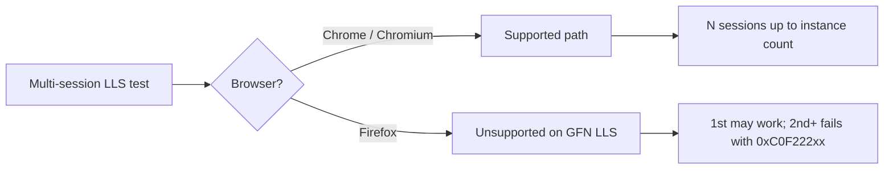

# Firefox second client fails

## Summary

When stress-testing NVCF **Low Latency Streaming (LLS)** with multiple concurrent browser clients, the **first Firefox session often succeeds** but the **second and later Firefox sessions fail** with a StreamSDK client error (for example **`0xc0f222219`**). The same deployment and load pattern work in **Google Chrome** or other Chromium-based browsers.

This is **not** an NVCF capacity or scaling defect when Chrome passes the same test. Engineering confirmed that **GFN-backed LLS and the NVCF sample LLS client are Chrome/Chromium-only** for multi-session use. Firefox is not a supported browser for this stack; the sample client does not detect or block unsupported browsers, so failures surface as opaque error codes instead of a clear “unsupported browser” message.

**Applies to:** NVCF container functions on **GFN** instance types (for example `ga10g_1.br20_2xlarge` / A10G), NVCF staging or production LLS invoke flows, and QA automation that opens multiple LLS sessions from Firefox. The Omniverse **portal** normally serves one stream per session; this guide matters most for **multi-client LLS stress tests** and custom invoke UIs.

---

## Symptoms

| What you see | What it usually means |
|--------------|------------------------|
| Firefox client 1 connects; client 2+ fails immediately or during stream start | Firefox multi-session limitation on GFN LLS — not missing GPU capacity |
| Error **`0xc0f222219`** (or related `0xC0F222xx` codes) on 2nd+ Firefox tab/window | StreamSDK client timeout/failure on unsupported browser path |
| Same function, same min/max instances, **`maxRequestConcurrency: 1`**, Chrome opens N sessions OK | Rules out pure NVCF saturation — browser-specific |
| 100% repro on Firefox, 0% on Chrome for identical steps | Matches |

**Typical repro configuration** :

- Container streaming function deployed to **ACTIVE** on GFN (A10G)
- **Minimum instances = 5**, **Maximum instances = 5**, **Max concurrency = 1**
- Invoke with multiple clients; expect up to five concurrent streams (one per instance)
- Firefox **132.x**: first client OK, second fails with **`0xc0f222219`**
- Chrome **131.x**: all five clients succeed

---

## Root cause

| Fact | Detail |
|------|--------|
| Supported browsers | **Chrome or Chromium-based** browsers for NVCF/GFN LLS sample and E2E tests |
| Firefox on GFN | **Not supported** for multi-session LLS streaming |
| Sample client gap | Test/sample LLS client does **not** report “unsupported browser” — failures look like StreamSDK errors |
| NVCF backend | Can be healthy (`ACTIVE`, enough instances); Chrome success proves capacity is not the blocker |
| Outcome | E2E templates updated (Dec 2024) with Chrome-only note — **not** a Firefox enablement fix |

**Engineering resolution:** QA updated test plans and E2E templates to state *“Only supported on Chrome or Chromium Browsers.”* If a product **requires** Firefox streaming, that is a separate feature request (contact GFN/streaming owners per triage).

**Related capacity bugs (different symptom):** Multi-node UI stress on **non-GFN** clusters can interrupt sessions with other error codes — do not assume Firefox if Chrome also fails.

---

## Diagnostic workflow

Confirm NVCF is healthy first, then isolate the browser. Use **`check-nvcf-function`** before concluding this is a Firefox-only issue.

### 1. Reproduce with Chrome (control)

1. Deploy or pick the same function version used in the failing test.
2. Set **min instances**, **max instances**, and **`maxRequestConcurrency`** to match the test (often `maxRequestConcurrency: 1` for one stream per pod).
3. Open **N** concurrent LLS sessions in **Chrome** (N ≤ max instances).

| Chrome result | Next step |
|---------------|-----------|
| All N sessions succeed | Strong signal for **this** Firefox limitation — continue below |
| Chrome also fails on 2nd+ session | **Not** this doc — see [http-408-creating-session.md](http-408-creating-session.md), [stream-timeout-try-again-later.md](../portal-ui/stream-timeout-try-again-later.md), [max-instances-over-available.md](max-instances-over-available.md) |

### 2. NVCF function health — `check-nvcf-function`

Provide `function_id` and `function_version_id`. Record:

| Check | Expected for LLS streaming |
|-------|----------------------------|
| Control-plane status | `ACTIVE` |
| Function type | `STREAMING` with Low Latency Streaming |
| **Min / max instances** | Match test design (e.g. 5/5 for five concurrent streams) |
| **`maxRequestConcurrency`** | Typically **1** for one LLS client per instance |
| **`activeInstances`** | At or below max under test load |
| Inference | Port **49100**, path **`/sign_in`** |
| Instance type | GFN types (e.g. A10G) when reproducing GFN-specific browser policy |

If Chrome passes with these values, NVCF capacity and deployment config are sufficient; Firefox failures are client/browser support, not missing pods.

### 3. Confirm Firefox-specific pattern

- **Browser:** Note exact Firefox version (reports used **132.0.2** and similar).
- **Session order:** First Firefox window/tab works; second opened against the same function fails.
- **Error code:** Capture hex (e.g. **`0xc0f222219`**) — same family as generic StreamSDK timeouts in [streamer-no-stun-responses-received.md](../portal-ui/streamer-no-stun-responses-received.md), but here tied to **browser + session index**, not cluster cold start.
- **Environment:** GFN container function vs non-GFN — Firefox limitation was stated explicitly for **GFN** LLS paths.

### 4. Rule out look-alikes

| If you also see… | See instead |
|------------------|-------------|
| Gray second viewport, WebRTC “connected” | [second-stream-gray.md](../portal-ui/second-stream-gray.md) — signaling port mismatch |
| `0xC0F22226` on **first** Firefox session, intermittent on any browser | [streamer-no-stun-responses-received.md](../portal-ui/streamer-no-stun-responses-received.md) — Kit/NVCF/ cluster timeout |
| HTTP **408** at session creation | [http-408-creating-session.md](http-408-creating-session.md) |
| Sign-in / cookie errors on one browser only | [streamer-sign-in-failure.md](../portal-ui/streamer-sign-in-failure.md) — try Chrome after clearing cookies; return here if multi-client Firefox still fails |

---

## Fix

There is **no NVCF deployment knob** that enables Firefox multi-session LLS on GFN. Apply the workaround that matches your role:

### Option A — Use Chrome or Chromium for multi-client tests (recommended)

- Run LLS stress, E2E, and concurrent-session QA in **Chrome** or another **Chromium-based** browser (Edge, etc.).
- Align with updated NVCF E2E templates: *Only supported on Chrome or Chromium Browsers.*

### Option B — Single Firefox session only

- One Firefox viewer against one instance may work for ad hoc checks.
- Do **not** use Firefox to validate concurrent capacity or multi-user LLS — results are invalid for pass/fail.

### Option C — Product requirement for Firefox

- If the application must support Firefox streaming, treat it as a **new requirement**, not a bug in the current GFN LLS stack.
- Escalate through GFN/streaming product channels for Firefox support requests.

### Option D — Custom client UX

- Production apps should **detect unsupported browsers** and show a clear message instead of relying on StreamSDK error codes the sample client exposes.

---

## Quick checks

1. **Chrome control:** Same function, same instance count — do N concurrent Chrome sessions succeed?
2. **`check-nvcf-function`:** Status `ACTIVE`, `maxRequestConcurrency` and min/max instances match the test, enough `activeInstances` for load.
3. **Browser note:** Testing on **Firefox** with **2+** LLS clients on **GFN** — expect failure; not an NVCF scale bug.
4. **Error code:** `0xc0f222219` or similar on **2nd+ Firefox only** — matches this guide.
5. **Do not confuse** with portal gray second stream ([second-stream-gray.md](../portal-ui/second-stream-gray.md)) or generic `0xC0F22226` timeouts ([streamer-no-stun-responses-received.md](../portal-ui/streamer-no-stun-responses-received.md)).

---

## Verification

1. Run `check-nvcf-function` — function `ACTIVE`, scaling fields as designed.
2. Open **max instances** concurrent sessions in **Chrome** — all succeed.
3. Repeat with **two Firefox** clients — second fails with StreamSDK error (confirms browser limitation, not backend regression).
4. Document test plans with **Chrome/Chromium only** for GFN LLS multi-session coverage.

---

## Related patterns

| Title / theme | Outcome |
|------|------|
| LLS 2nd client fails on Firefox; Chrome OK (GFN, 5 instances, `0xc0f222219`) | E2E templates updated (Dec 2024) — **Chrome/Chromium only**; Firefox not supported on GFN LLS |
| Multi-node non-GFN UI stress (`0x0f22202`, `0xc0f2230f`) | Different stack; see also if Chrome fails too |

**Platform guidance (paraphrased):**

- *“In GFN we don't support streaming to Firefox browser… we should only test with chrome or chromium based browsers.”*
- *“Changed all E2E templates that added: Note: Only supported on Chrome or Chromium Browsers.”*

---

## When this is not the issue

- **Chrome also fails** on the second concurrent session — investigate NVCF capacity, min/max instances, and [http-408-creating-session.md](http-408-creating-session.md).
- **First Firefox session fails** with `0xC0F22226` — see [streamer-no-stun-responses-received.md](../portal-ui/streamer-no-stun-responses-received.md) (Kit/cluster/timeout).
- **Second viewer gray but “connected”** — see [second-stream-gray.md](../portal-ui/second-stream-gray.md) (WebRTC signaling port).
- **Portal single-stream launch** in Firefox — portal may work for one session; this doc targets **multi-client LLS invoke** patterns.

---

## Further reading

- [STREAMING-REFERENCE.md](../STREAMING-REFERENCE.md) NVCF deployment symptom table
- [stream-timeout-try-again-later.md](../portal-ui/stream-timeout-try-again-later.md) — note browser when stress testing
- [streamer-sign-in-failure.md](../portal-ui/streamer-sign-in-failure.md) — cross-link for Firefox-only sign-in issues
