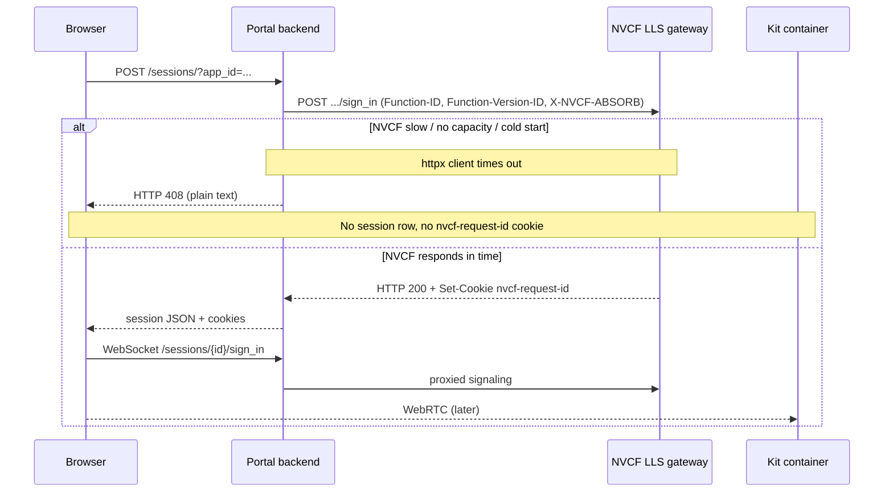

# HTTP 408 creating session

## Summary

The portal backend calls NVCF Low Latency Streaming (LLS) **`POST /sign_in`** to allocate a GPU instance. If NVCF does not respond before the HTTP client times out, the backend returns **HTTP 408** with a plain-text body about network congestion or unavailable GPUs. No portal session row is created, so retries on the same failed flow must use a **new** launch — follow-up WebSocket or sign-in calls may return **404** or close with **1006** because NVCF never issued a valid `nvcf-request-id`.

This failure happens at **session creation** (Phase C, first step), before WebRTC signaling. It is distinct from the later banner *"Failed to connect a streaming session with a timeout — try again later"* (WebSocket path after a session record exists). See [stream-timeout-try-again-later.md](../portal-ui/stream-timeout-try-again-later.md).

## Client library and portal backend

| Layer | Signal |
|-------|--------|
| Portal `POST /sessions/` | **HTTP 408** — `This could be caused by network congestion or no GPUs available. Please try again.` |
| Portal WebSocket | Close **3008** — `Failed to connect a streaming session with a timeout -- try again later.` |
| ov-web-rtc | Usually **not reached** — failure happens before `AppStreamer.connect` |

See [OV-WEB-RTC-ERROR-CODES.md](../OV-WEB-RTC-ERROR-CODES.md).

## Symptom

User launches an app from the portal home page (`POST /sessions/?app_id=...`). The UI surfaces an error from [web/src/state/Sessions.ts](../../../web/src/state/Sessions.ts):

```text
Failed to start a streaming session -- HTTP408.
This could be caused by network congestion or no GPUs available. Please try again.
```

Backend source ([backend/app/routers/sessions.py](../../../backend/app/routers/sessions.py)): `httpx.TimeoutException` on the NVCF `POST` is mapped to **408** with that body. NVCF non-timeout errors are passed through with their original status code.

| Follow-up behavior | Meaning |
|--------------------|---------|
| User retries the **same** bookmarked session URL | **404** or expired cookies — session was never persisted or NVCF session expired |
| WebSocket to `/sessions/{id}/sign_in` after 408 | **1006** abnormal closure — no valid `nvcf-request-id` cookie |
| Portal UI retries launch | [useStreamStart.tsx](../../../web/src/hooks/useStreamStart.tsx) may retry the mutation up to **3** times with a “taking longer than expected” toast — each attempt is a new `POST /sessions/`, not an in-request NVCF retry |

## Where it fails



Portal backend posts to `construct_nvcf_endpoint` — `settings.nvcf_signaling_endpoint` (default `wss://grpc.nvcf.nvidia.com`) rewritten to HTTPS at **`/sign_in`**, with:

| Header | Purpose |
|--------|---------|
| `Authorization: Bearer <nvcf_api_key>` | your identity provider / NGC API key on portal backend |
| `Function-ID` | From published app metadata |
| `Function-Version-ID` | From published app metadata |
| `X-NVCF-ABSORB: true` | Required for LLS session start |

The backend does **not** retry NVCF inside a single request ( comment). A single slow scale-up event surfaces as one 408.

## When you see this

| Pattern | What it suggests |
|---------|------------------|
| **First N sessions succeed, then 408** | Concurrent load exceeds **`minInstances`** pre-warmed pool; extra sessions wait on NVCF scale-up |
| **Only under burst / many users** | `maxInstances` saturation or autoscaler lag (, fixed) |
| **Every launch fails, even alone** | Function not `ACTIVE`, cluster capacity (`instance-terminated-no-capacity`), or pods never reach **RTX Ready** — not pure min/max tuning |
| **408 then 404 on same session ID** | Session never created on portal/NVCF; use **new** launch from home tile |
| **408 occasionally, then succeeds on retry** | Scale-up eventually completes; UI mutation retries may mask intermittency ( Sept 2025 comment) |

Collect before diagnosing: portal URL (or `app_id`), exact error text, approximate concurrent session count, `function_id` / `function_version_id`, cluster name, and `minInstances` / `maxInstances`.

**Reference scenario :** High concurrency, **min 8**, **max 16** — roughly the first **7** sessions reliable; additional concurrent sessions often 408 until new pods are invocable.

## Root causes

| Cause | Mechanism |
|-------|-----------|
| **`minInstances` too low** | All pre-warmed pods busy; new session waits for NVCF to provision another instance |
| **Cold start slower than portal HTTP timeout** | Kit pod still starting (**RTX Ready** not yet in logs) when `POST /sign_in` must complete |
| **`maxInstances` / cluster quota** | No free GPU slots; scale-up blocked or pods terminated ([instance-terminated-no-capacity.md](instance-terminated-no-capacity.md), [max-instances-over-available.md](max-instances-over-available.md)) |
| **NVCF autoscaler delay (LLS)** | Invocation-based scaling lag for streaming paths — parent fix in |
| **Misleading 408 text** | Portal maps any `httpx` timeout to “network congestion or no GPUs”; root cause is often **capacity/scale-up**, not client network |

Less common:

- Portal backend `httpx` default timeout (no explicit timeout in `start_stream`) — very slow NVCF responses always appear as 408 regardless of NVCF error semantics.
- Stale `function_version_id` on the portal app after redeploy with new scaling — run `check-streaming-app` to confirm IDs.

## Diagnosis

Work through capacity and scaling first, then portal wiring, then instance logs. Use the skills listed in frontmatter.

### 1. Portal app linkage — `check-streaming-app`

Provide `portal_url` and either `app_id` or both NVCF IDs.

Confirm:

- Portal **runtime status** is `ACTIVE` or `DEGRADING` (not `UNKNOWN` / `ERROR` / stuck `DEPLOYING`)
- `function_id` and `function_version_id` match the NVCF function you will inspect
- **`deployment.minInstances` / `maxInstances`** — compare to concurrent load at failure time
- Portal and NVCF use the **same NGC org**

If `deployment` is null, run `check-nvcf-function` directly for scaling fields.

### 2. NVCF function and capacity — `check-nvcf-function`

Provide `function_id` and `function_version_id`. Report must show:

| Check | What to look for |
|-------|------------------|
| Control-plane status | `ACTIVE` — not stuck `DEPLOYING` >15 min or `ERROR` |
| **Min / max instances** | `minInstances` vs concurrent sessions; 408 often when load > min |
| **`activeInstances`** | At or near `maxInstances` → saturation |
| Cluster | Healthy cluster with quota (not full or `instance-terminated-no-capacity`) |
| Function type | `STREAMING` with Low Latency Streaming enabled (wrong type → **501**, not 408 — [http-501-streaming-session.md](../portal-ui/http-501-streaming-session.md)) |

### 3. NVCF logs (History and Live Tail)

Open [NVCF functions](https://nvcf.ngc.nvidia.com/functions) → your function → **Logs**.

| Log signal | Interpretation |
|------------|----------------|
| New pod starting, no **RTX Ready** | Cold start in progress — 408 if portal times out first |
| **RTX Ready** on new instance after client already got 408 | Scale-up slower than portal HTTP timeout |
| **`instance-terminated-no-capacity`** | Cluster full — fix cluster/quota before raising min |
| Autoscaler / scaling events | Historical LLS scaling issues tracked under |

At 408 time there is often **no** portal `sessionId` yet — correlate by timestamp and concurrent session count instead.

### 4. Distinguish from later timeout

| Stage | HTTP / UI | Session row in portal DB? |
|-------|-----------|---------------------------|
| **This doc** — `POST /sessions/` | **408** + congestion text | No |
| [stream-timeout-try-again-later.md](../portal-ui/stream-timeout-try-again-later.md) — WebSocket sign-in | Banner “timeout — try again later”; WS **3008** | Yes (created earlier) |

If the user only sees the WebSocket banner, use the portal-ui doc, not this one.

## Fix

Apply the smallest change that matches your diagnosis. Change one variable at a time.

1. **Cold start / min pool too small** — Increase **Min Instances** so enough pods are pre-warmed for expected concurrency . Redeploy the function version and confirm portal app still points at the same version IDs.

2. **Capacity saturation** — Wait for disconnects or increase **Max Instances** if cluster quota allows ([max-instances-over-available.md](max-instances-over-available.md)).

3. **Cluster capacity** — If logs show `instance-terminated-no-capacity` or quota errors, lower max instances, pick another cluster (another cluster your org can use), or contact your NVCF platform owner for capacity ([instance-terminated-no-capacity.md](instance-terminated-no-capacity.md)).

4. **Stale session after 408** — Start a **new** session from the portal home tile; do not reuse a failed session URL or expect Reconnect to recover.

5. **Function not ready** — If status is `DEPLOYING` or pods crash before RTX Ready, fix health/build first ([deploying-over-15-minutes.md](deploying-over-15-minutes.md)) — 408 will persist until the function is `ACTIVE`.

6. **Platform / autoscaler** — For environments still on builds before fix, confirm NVCF platform version and NVCF platform release notes.

## Verification

1. Run `check-nvcf-function` — status `ACTIVE`, `minInstances` / `maxInstances` reflect your change, `activeInstances` below max under test load.
2. Run `check-streaming-app` — portal status healthy, deployment fields updated after redeploy.
3. Start a **new** session with no other clients — confirm no **HTTP408** on `POST /sessions/`.
4. Repeat with concurrent sessions up to your expected peak; verify 408 rate drops after min/max adjustment.
5. After a forced 408, confirm a fresh launch succeeds (not the same session URL).

## Related patterns

| Resource | Relevance |
|----------|-----------|
| Shared-cluster intermittent 408 when concurrent sessions exceed min pool | Often duplicate of a known autoscaler scaling issue — verify platform version |
| Root autoscaler / LLS invocation scaling issue | Fixed in a prior NVCF platform release for LLS invoke scaling |
| [STREAMING-REFERENCE.md](../STREAMING-REFERENCE.md) | Symptom table; Phase A–C checklist |
| [stream-timeout-try-again-later.md](../portal-ui/stream-timeout-try-again-later.md) | Later WebSocket timeout (session already created) |
| [max-instances-over-available.md](max-instances-over-available.md) | Max instances over cluster quota |
| [instance-terminated-no-capacity.md](instance-terminated-no-capacity.md) | Pod terminated for capacity |
| [deploying-over-15-minutes.md](deploying-over-15-minutes.md) | Stuck DEPLOYING / health misconfig |
| [NVCF debuggability](https://docs.nvidia.com/cloud-functions/user-guide/latest/cloud-function/debuggability.html) | History vs Live Tail |

## Agent notes

- Always run **`check-streaming-app`** before **`check-nvcf-function`** when the user has a portal URL — resolve `function_id` and deployment min/max from the app record.
- **408 on `POST /sessions/`** ≠ **WebSocket timeout banner** — same underlying capacity theme, different pipeline stage and fixes (session row may exist only for the latter).
- Portal backend **does not retry NVCF** within one `start_stream` call; frontend `useStreamStart` may retry the whole `POST` up to three times — do not confuse with NVCF-side retry.
- When `activeInstances` ≈ `maxInstances`, saturation is the leading hypothesis — fix scaling before chasing Kit build issues.
- After any 408, instruct a **new** launch; warn that old session IDs and cookies are invalid.
- Do not echo API keys or portal tokens when running check skills.
-