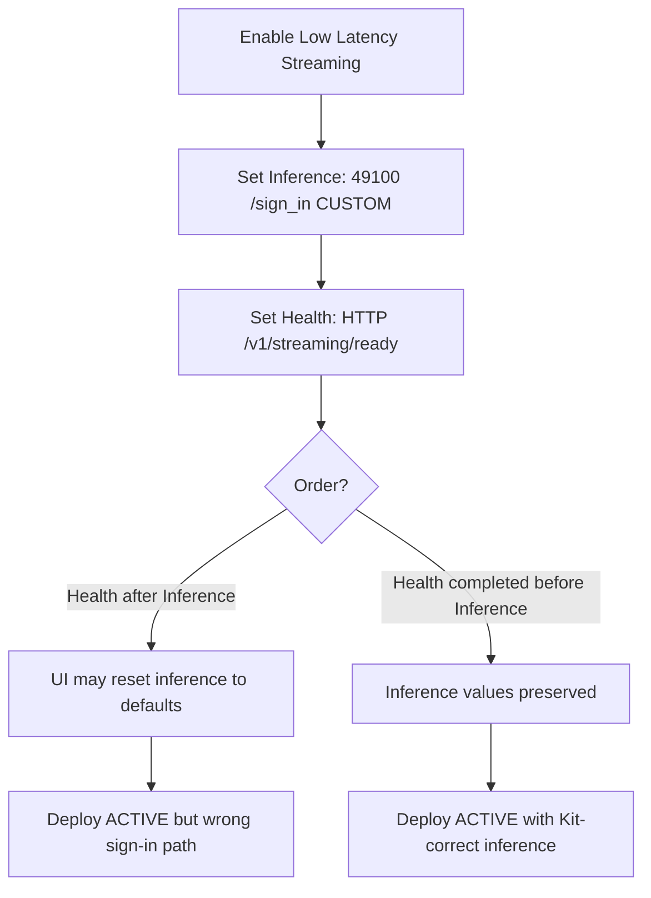

# Inference settings wrong after NGC UI create

## Summary

When you create an NVCF streaming function in the [NGC create-function wizard](https://docs.nvidia.com/cloud-functions/user-guide/latest/cloud-function/function-creation.html), completing **Health** (wizard step 7) **after** you already set **Inference** (step 8) can silently reset inference port and URL to NVCF defaults. Kit streaming requires inference port **49100** and path **`/sign_in`** with **`apiBodyFormat` `CUSTOM`** and **`functionType` `STREAMING`**. Wrong values often surface only at portal session start as **[HTTP 501](../portal-ui/http-501-streaming-session.md)** even when the function reaches **ACTIVE**.

The function definition is wrong at the NVCF API layer; fixing it does not require rebuilding the container image if health and image are otherwise correct.

## Symptom

You discover the problem indirectly:

| When you notice | What you see |
|-----------------|--------------|
| After deploy in NGC Overview | Inference port not **49100**, or endpoint not **`/sign_in`** |
| Portal stream start | **Failed to start a streaming session — HTTP501** — see [http-501-streaming-session.md](../portal-ui/http-501-streaming-session.md) |
| `check-nvcf-function` | `Inference port` / `Inference URL` / `API body format` do not match Kit streaming defaults |
| Agent triage | `functionType` is **STREAMING** and LLS was enabled, but inference fields still wrong |

You may have filled the wizard top-to-bottom (Inference before Health), or returned to Health after setting Inference to fix health port/URI.

## How the UI quirk works



Known behavior (OV on DGXC documentation):

1. Wizard step **7 — Health**: protocol **HTTP**, URI **`/v1/streaming/ready`**, port per Kit template (often **8011**, **8111**, or **8311**), expected status **200**.
2. Wizard step **8 — Inference**: port **49100**, URL **`/sign_in`**, body format **Custom**.
3. If step 7 is saved or revisited **after** step 8, the UI can overwrite inference port/URL (and sometimes related fields) unless Health was fully committed **before** Inference.

API creation ([scripts/create_function.sh](../../../scripts/create_function.sh)) sets both in one POST and avoids this ordering issue.

## Expected vs wrong configuration

| Field | Kit streaming (correct) | Common wrong values after UI reset |
|-------|-------------------------|-------------------------------------|
| `inferencePort` | **49100** | Default inference port (e.g. 8000, 8080) |
| `inferenceUrl` | **`/sign_in`** | `/` or generic inference path |
| `apiBodyFormat` | **`CUSTOM`** | `JSON` |
| `functionType` | **`STREAMING`** | Often still STREAMING if LLS toggle was on — 501 can persist due to inference alone |
| `health` | HTTP, `/v1/streaming/ready`, template port, status 200 | May be correct even when inference is wrong |

Health mistakes cause **DEPLOYING** stuck or **ERROR** — see [deploying-over-15-minutes.md](deploying-over-15-minutes.md). This doc is specifically **inference/sign-in** wrong while health and deploy may look fine.

## Downstream impact

Portal session create posts to NVCF **`/sign_in`** with `Function-ID` / `Function-Version-ID` headers (see [http-501-streaming-session.md](../portal-ui/http-501-streaming-session.md)). NVCF returns **501 Not Implemented** when the function version is not eligible for Low Latency Streaming sign-in — including wrong inference port/path even if `functionType` is **STREAMING**.

| Layer | Effect of wrong inference |
|-------|---------------------------|
| NVCF LLS gateway | **501** on session allocate (no GPU pod for WebRTC yet) |
| Portal status | May show **ACTIVE** if health passes |
| Browser | HTTP501 banner before WebRTC |
| Container logs | Often empty for failed session — failure is pre-pod |

## Diagnosis

### 1. Resolve IDs

From portal app metadata, user input, or `check-streaming-app`:

- `function_id`
- `function_version_id`

### 2. Run `check-nvcf-function`

Use [check-nvcf-function/SKILL.md](../../skills/check-nvcf-function/SKILL.md) with both UUIDs. In **Endpoints and ports** and **Container and configuration**, confirm:

```text
Function type: STREAMING
Inference port: 49100
Inference URL: /sign_in
API body format: CUSTOM
Health: HTTP /v1/streaming/ready on <template port> → 200
```

**Control plane** runtime status can be **ACTIVE** while inference is still wrong — do not treat ACTIVE alone as proof of correct streaming config.

### 3. NGC UI spot-check

[NVCF functions UI](https://nvcf.ngc.nvidia.com/functions) → function → version → Overview:

- **Low Latency Streaming** enabled at create time.
- Inference: port **49100**, endpoint **`/sign_in`**, body **Custom**.
- If wrong, recall whether Health was edited after Inference.

### 4. Correlate with portal symptom

If the user only reports **HTTP501**, walk [http-501-streaming-session.md](../portal-ui/http-501-streaming-session.md) and rule out LLS off or non-STREAMING type. When type is STREAMING but inference fields are wrong, this doc is the primary fix path.

## Fix

Change one variable at a time. After any recreate, wait until **ACTIVE**, then update portal `function_version_id` if the version UUID changed.

### Option A — NGC UI (new function or new version)

1. [Create function](https://docs.nvidia.com/cloud-functions/user-guide/latest/cloud-function/function-creation.html) with image already in registry.
2. Enable **Low Latency Streaming**.
3. **Complete Health first (step 7):** HTTP, **`/v1/streaming/ready`**, port for your Kit/template, expected status **200**.
4. **Then Inference (step 8):** port **49100**, URL **`/sign_in`**, body format **Custom**.
5. Do not go back to Health after Inference unless you re-verify inference fields on Overview before deploy.
6. Deploy; confirm **ACTIVE**.
7. Update portal registration if IDs changed (`publish-streaming-app` or `PUT /api/apps/{app_id}`).

### Option B — API (recommended; matches repo)

Single POST avoids form reordering — see [scripts/create_function.sh](../../../scripts/create_function.sh):

```json
{
 "name": "my-streaming-app",
 "inferenceUrl": "/sign_in",
 "inferencePort": 49100,
 "health": {
 "protocol": "HTTP",
 "uri": "/v1/streaming/ready",
 "port": 8111,
 "timeout": "PT10S",
 "expectedStatusCode": 200
 },
 "containerImage": "<your-image>",
 "apiBodyFormat": "CUSTOM",
 "functionType": "STREAMING",
 "containerEnvironment": []
}
```

Adjust `health.port` and `containerEnvironment` per Kit version ([STREAMING-REFERENCE.md](../STREAMING-REFERENCE.md)).

### Option C — Patch existing version (when supported)

If your org allows editing the function version via API without a full recreate, PATCH/PUT the version with correct `inferencePort`, `inferenceUrl`, and `apiBodyFormat`. Many teams recreate a **new function version** because NVCF does not always expose full inference edits in UI after deploy.

### Verify fix

1. `check-nvcf-function` — inference **49100** / **`/sign_in`**, **CUSTOM**, **STREAMING**, **ACTIVE**.
2. Portal: start a **new** session (not reconnect).
3. If 501 persists, re-read [http-501-streaming-session.md](../portal-ui/http-501-streaming-session.md) for LLS off, stale `function_version_id`, or wrong org.

## Distinguish from similar issues

| Observation | Likely issue | Doc |
|-------------|--------------|-----|
| Inference wrong; type STREAMING; ACTIVE | NGC UI Health-after-Inference | This doc |
| **HTTP501**; type not STREAMING or LLS off | Not a streaming function | [http-501-streaming-session.md](../portal-ui/http-501-streaming-session.md) |
| **HTTP408** on session start | Capacity / cold start | [http-408-creating-session.md](http-408-creating-session.md) |
| DEPLOYING >15 min | Health port/URI or crash | [deploying-over-15-minutes.md](deploying-over-15-minutes.md) |
| **No peer info found** after session created | Container / plugins | [no-peer-info-found.md](../portal-ui/no-peer-info-found.md) |
| Portal **UNKNOWN** | Wrong function IDs | [portal-status-unknown.md](../portal-registration/portal-status-unknown.md) |

## Quick checks (agent)

1. `check-nvcf-function` — `inferencePort`, `inferenceUrl`, `apiBodyFormat`, `functionType`, runtime **ACTIVE**.
2. Compare to [scripts/create_function.sh](../../../scripts/create_function.sh) (`49100`, `/sign_in`, `CUSTOM`, `STREAMING`).
3. Ask whether the function was created in NGC UI; if yes, confirm **Health before Inference** in the wizard.
4. If user sees **HTTP501**, link [http-501-streaming-session.md](../portal-ui/http-501-streaming-session.md) and confirm portal `function_version_id` matches the fixed NVCF version.
5. After fix, new portal session — not Reconnect.

## Further reading

- [NVCF function creation](https://docs.nvidia.com/cloud-functions/user-guide/latest/cloud-function/function-creation.html)
- [NVCF streaming functions](https://docs.nvidia.com/nvcf/streaming-functions)
- [HTTP 501 starting streaming session](../portal-ui/http-501-streaming-session.md)
- [STREAMING-REFERENCE.md — Phase A checklist](../STREAMING-REFERENCE.md)
- [check-nvcf-function skill](../../skills/check-nvcf-function/SKILL.md)
