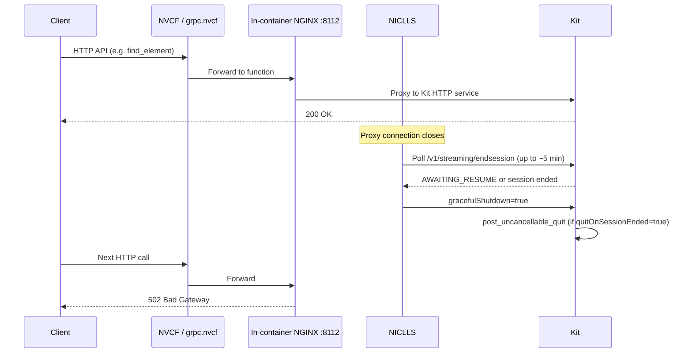

# Kit 109 HTTP no response

## Symptom

HTTP clients calling a Kit NVCF function on OVC stop getting useful responses while the same workflow works on an older Kit (typically **107.3.4**).

| What you see | Notes |
|--------------|-------|
| **No response** / hung request | Client times out waiting for Kit |
| **502 Bad Gateway** (nginx HTML body) | NGINX inside the function container cannot reach Kit |
| NVCF function **DEGRADING** / **DEGRADED** | Control plane marks the instance unhealthy after Kit exits |
| Works for **~5–10 minutes**, then fails | Typical when short-lived HTTP calls keep the function “warm” without a persistent WebRTC session |
| **107.3.4 works; 109.0.2 / 107.3.5 / 110 fail** | Reported in QA automation on cloud RC environment |

The failure is **not** limited to portal streaming. It also appears when driving Kit through **`omni.kit.remote_ui_automator`** HTTP APIs via `https://grpc.nvcf.nvidia.com` → in-container NGINX (port **8112**) → Kit.

## When you see this

This symptom appears at **deploy/runtime** (Phase A), often after the function reaches **ACTIVE** and serves a few requests.

| Pattern | What it suggests |
|---------|------------------|
| Fails only on **Kit 109+** (or **107.3.5**) with identical NVCF config | Wrong **`NVDA_KIT_ARGS`** session keys for the Kit line, or NICLLS session lifecycle killing Kit |
| **502** after several minutes of periodic HTTP calls | NICLLS end-session polling + Kit shutdown (`quitOnSessionEnded=true`) |
| Immediate **502** with Starlette traceback in logs | Separate crash in `omni.kit.remote_ui_automator` (BackgroundTask / non-callable) — container exit |
| Portal stream works briefly then portal shows errors | Same underlying Kit restart; see portal-ui docs once status flips |

Collect before diagnosing: `function_id`, `function_version_id`, Kit version and container tag, **`NVDA_KIT_ARGS`** / container env, whether traffic is **WebRTC streaming** vs **HTTP API automation**, and NVCF History logs around the failure time.

## Root cause

Two failure modes were triaged under . The dominant one for Kit 109+ on OVC is **NICLLS session lifecycle forcing a Kit restart**, not a broken HTTP stack in isolation.

### 1. NICLLS end-session polling → Kit shutdown (primary)

Kit on NVCF runs with the **NICLLS** (Low Latency Streaming) sidecar. Each short-lived HTTP API call closes the proxy connection. NICLLS then polls Kit’s **`/v1/streaming/endsession`** endpoint for up to the **reconnect window** (default **5 minutes**; header `X-NVCF-RECONNECT-WINDOW-SECS` is **capped at 5 minutes** by NICLLS).

| Step | Behavior |
|------|----------|
| HTTP call completes | NICLLS starts end-session cleanup |
| Kit **`resumeTimeoutSeconds`** too low (default **30 s** on Kit 108+) | Kit ends session quickly instead of **`AWAITING_RESUME`** |
| Reconnect window expires while Kit still returns **`AWAITING_RESUME`** | NICLLS sends **`gracefulShutdown=true`** (bypasses resume timeout) |
| Kit **`quitOnSessionEnded=true`** (default) | `omni.services.livestream.session` calls **`post_uncancellable_quit(0)`** |
| Health returns **503** (“Streaming session ended - recycle instance”) | NVCF marks function **DEGRADING**; NGINX returns **502** |

Kit **107.3.4** could appear healthy with older session settings; **109.0.2**, **107.3.5**, and **110** expose the mismatch when functions reuse 107-era **`NVDA_KIT_ARGS`** or omit **`quitOnSessionEnded=false`** for HTTP-only workloads.

### 2. Starlette crash in remote UI automator (secondary)

Early logs showed **`TypeError: the first argument must be callable`** in Starlette’s `run_in_threadpool` inside **`omni.kit.remote_ui_automator`**, followed by **Container exiting**. That path kills Kit independently of NICLLS timing. Triage moved toward session lifecycle once restarts correlated with the ~5 minute window rather than a specific API payload.

## Architecture (where it breaks)



## Diagnosis

Work through function config and logs. Use **`check-nvcf-function`** with `function_id` and `function_version_id`.

### 1. NVCF function configuration — `check-nvcf-function`

| Check | What to look for |
|-------|------------------|
| Control-plane status | **ACTIVE** initially; **DEGRADING** / **DEGRADED** after Kit restart |
| Container image tag | Kit **109.x**, **107.3.5**, or **110** vs known-good **107.3.4** |
| **`NVDA_KIT_ARGS`** | Session timeout **key matches Kit line** (see Fix table below) |
| Health | Port **8011**, URI **`/v1/streaming/ready`** — may flip to **503** after forced shutdown |
| Inference / streaming | Port **49100**, **`/sign_in`**, **`functionType: STREAMING`** (unchanged from 107) |

Compare **`containerEnvironment`** side-by-side with a working **107.3.4** function on the same cluster. Diff **`NVDA_KIT_ARGS`** first.

### 2. NVCF History / Live Tail logs

Open [NVCF functions](https://nvcf.ngc.nvidia.com/functions) → function → **Logs**.

| Log signal | Interpretation |
|------------|----------------|
| **`gracefulShutdown=true`** / **end streaming session … gracefully** | NICLLS forced shutdown after reconnect window |
| **`post_uncancellable_quit`** / **`appState: 'shutdown'`** | Kit process exited |
| **503** / **Streaming session ended - recycle instance** | Health check failing; instance recycle |
| **Container exiting** / **Kit process has ended** | Pod restart imminent |
| **`resume timeout is set to … starting resume window`** | Session extension handling NICLLS polls |
| Starlette **`TypeError: the first argument must be callable`** | Automator crash path — separate from timing-only failures |

Correlate timestamps: first failures often appear **~5–10 minutes** after the last “successful” HTTP stretch.

### 3. Client-side symptoms

| Client error | Meaning |
|--------------|---------|
| HTML **502 Bad Gateway** from nginx | Kit not listening; NGINX upstream dead |
| Empty / timed-out response | Function scaling or Kit not yet ready |
| JSON parse error on HTML body | Same as 502 — client expected JSON from Kit API |

## Fix

Pick the row that matches your workload. Change **`NVDA_KIT_ARGS`** on the function version (or rebuild env in NGC UI), redeploy, and wait for **ACTIVE**.

### `NVDA_KIT_ARGS` by Kit version and workload

| Kit line | Portal WebRTC streaming (default OVC) | Long-running HTTP API / UI automation |
|----------|----------------------------------------|----------------------------------------|
| **106–107.3.4** | `--/app/livestream/nvcf/sessionResumeTimeoutSeconds=300` | Same 300 s is usually enough for portal; for multi-hour HTTP tests add **`quitOnSessionEnded=false`** on 108+ session extension if backported |
| **107.3.5+** / **108+** / **109+** / **110** | `--/exts/omni.services.livestream.session/resumeTimeoutSeconds=300` | `--/exts/omni.services.livestream.session/resumeTimeoutSeconds=7200 --/exts/omni.services.livestream.session/quitOnSessionEnded=false` |

**Why two flags for HTTP automation**

- **`resumeTimeoutSeconds=7200`** — Kit responds **`AWAITING_RESUME`** during NICLLS polling instead of ending the session at 30 s.
- **`quitOnSessionEnded=false`** — When NICLLS eventually sends **`gracefulShutdown=true`** after the 5-minute reconnect cap, Kit **does not** call **`post_uncancellable_quit(0)`** and keeps serving HTTP.

For **portal streaming**, keep **`resumeTimeoutSeconds=300`** to align with portal idle timeout ([failed-stream-after-idle-reconnect.md](../portal-ui/failed-stream-after-idle-reconnect.md)). Do **not** set **`quitOnSessionEnded=false`** unless you intentionally want Kit to stay up after session end (automation-only pattern from RCA).

### Other fixes

1. **Wrong Kit arg path** — QA found tests passing **`--/exts/omni.services.livestream.session/resumeTimeoutSeconds=7200`** while Kit **109** automation expected **`--/app/livestream/nvcf/sessionResumeTimeoutSeconds=7200`** in one iteration; the **extension path** plus **`quitOnSessionEnded=false`** is the documented final RCA fix (correct Kit extension settings path).

2. **Do not rely on reconnect header alone** — `X-NVCF-RECONNECT-WINDOW-SECS: 7200` is **silently capped at 300 s** in NICLLS; extend behavior via Kit args, not headers.

3. **Starlette / automator crash** — If logs show the BackgroundTask **`TypeError`** on every request, treat as an extension bug path; session-arg fixes will not help until that crash is resolved or the automator version is updated.

4. **Redeploy** — Update function version env, wait ~10 minutes, confirm **ACTIVE**, then rerun the HTTP or automation script.

Example env fragment for Kit **109** HTTP automation (adjust to your image):

```json
{"key": "NVDA_KIT_ARGS", "value": "--/exts/omni.services.livestream.session/resumeTimeoutSeconds=7200 --/exts/omni.services.livestream.session/quitOnSessionEnded=false"}
```

Portal streaming on Kit **109** (this repo’s default pattern uses 300 s):

```json
{"key": "NVDA_KIT_ARGS", "value": "--/exts/omni.services.livestream.session/resumeTimeoutSeconds=300"}
```

## Verification

1. **`check-nvcf-function`** — status **ACTIVE**; **`NVDA_KIT_ARGS`** matches the workload table; container image is the intended Kit tag.
2. **Sustained HTTP test** — Run periodic API calls for **≥20 minutes** (repro script in steps); no **502** and no transition to **DEGRADING**.
3. **Logs** — No **`post_uncancellable_quit`** during the test window; no **503** recycle message while automation runs.
4. **Portal spot-check** (if applicable) — New streaming session still reaches video/interaction with **300 s** resume arg, not the 7200 s automation profile.

## Distinguish from similar symptoms

| Symptom | Layer | Typical cause | Doc |
|---------|-------|---------------|-----|
| **502** / no HTTP after ~5–10 min on Kit **109+** | NICLLS + session args | Missing **`quitOnSessionEnded=false`** or wrong resume key | This doc |
| **DEPLOYING** >15 min | Health / startup | Wrong health port; no RTX Ready | [deploying-over-15-minutes.md](deploying-over-15-minutes.md) |
| **HTTP 408** on session create | Capacity / cold start | Min instances, scale-up timeout | [http-408-creating-session.md](http-408-creating-session.md) |
| **No peer info found** | Stream start / WebRTC | ACTIVE function; peer path broken | [no-peer-info-found.md](../portal-ui/no-peer-info-found.md) |
| Portal **ERROR** | Deploy failure | Container crash at startup | [portal-status-error.md](../portal-registration/portal-status-error.md) |
| Idle **Reconnect** fails | Portal + 300 s window | Auth or stale session | [failed-stream-after-idle-reconnect.md](../portal-ui/failed-stream-after-idle-reconnect.md) |

## Related patterns

| Resource | Relevance |
|----------|-----------|
| [STREAMING-REFERENCE.md](../STREAMING-REFERENCE.md) | Health ports, **`NVDA_KIT_ARGS`** portal defaults, Phase A checklist |
| [failed-stream-after-idle-reconnect.md](../portal-ui/failed-stream-after-idle-reconnect.md) | Why portal streaming uses **300 s** resume timeout |
| [NVCF debuggability](https://docs.nvidia.com/cloud-functions/user-guide/latest/cloud-function/debuggability.html) | History vs Live Tail |

## Agent notes

- Run **`check-nvcf-function`** and diff **`NVDA_KIT_ARGS`** against a **known-good 107.3.4** function before assuming a Kit **109** regression in application code.
- Ask whether the workload is **WebRTC portal streaming** (300 s, default quit behavior) vs **HTTP API automation** (7200 s + **`quitOnSessionEnded=false`**).
- **502 from nginx** inside the container means Kit is down or not accepting connections — prioritize History logs for shutdown/restart, not only NVCF control-plane capacity.
- Timings near **5 minutes** strongly implicate NICLLS reconnect window; timings near **30 seconds** implicate default **`resumeTimeoutSeconds`** without override.
- Do not echo API keys when inspecting function env via NVCF APIs.
- Verify behavior with a sustained HTTP test, not issue-tracker status alone, while platform fixes roll out.
