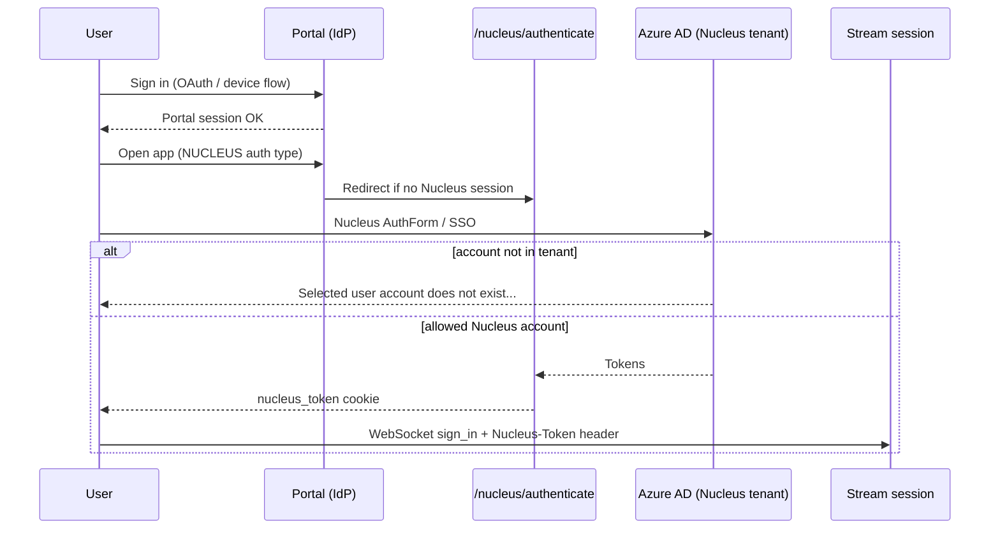

# Azure AD tenant error on Nucleus login

## Symptom

When the user launches a portal app that requires Nucleus, the browser shows an **Azure AD** (Microsoft login) error instead of starting the stream. Typical text:

```text
Selected user account does not exist in tenant '<your-tenant-name>' and cannot access the application '<app-id>' in that tenant.
```

Variants mention an **external user** not existing in the tenant, or being unable to sign in to the Nucleus SSO application.

This is **not** a failure of portal registration (`PUT /api/apps`), portal OAuth (device flow / API key), or NVCF deployment. Portal login can succeed while Nucleus login fails on the next step.

## When you see this

| Pattern | What it suggests |
|---------|------------------|
| Error on **first click** to stream, before video/WebRTC | Nucleus browser auth required; user lacks access to the Nucleus Azure AD tenant |
| User signed into portal with one account, picked another at Microsoft login | Wrong identity for the Nucleus server configured on the portal |
| App works for colleagues but not this user | Missing Nucleus tenant provisioning or wrong Microsoft account in the picker |
| Error after changing app to `authentication_type: NUCLEUS` | App now requires a Nucleus token; previously `NONE` apps did not hit this path |

Collect before diagnosing: `portal_url`, `app_id`, exact Azure error text, which Microsoft account was selected, and whether the app was published with `NUCLEUS` auth.

## How Nucleus auth fits the portal

Two separate sign-ins are involved for Nucleus-backed apps:



| Step | Layer | What succeeds / fails here |
|------|--------|----------------------------|
| 1 | Portal IdP | Portal home, API calls — **unaffected** by this issue |
| 2 | Nucleus UI ([web/src/pages/NucleusAuthenticate.tsx](../../../web/src/pages/NucleusAuthenticate.tsx)) | `@omniverse/auth` **AuthForm** against `config.endpoints.nucleus` |
| 3 | Azure AD | **This symptom** — the Nucleus tenant rejects the account |
| 4 | Stream | Portal forwards `nucleus_token` to Kit as `Nucleus-Token` ([backend/app/routers/sessions.py](../../../backend/app/routers/sessions.py)) |

Frontend behavior ([web/src/pages/AppStream.tsx](../../../web/src/pages/AppStream.tsx)): if `authentication_type` is `NUCLEUS` and no Nucleus session exists, redirect to `/nucleus/authenticate?redirectAfter=...` before allocating the stream.

**Do not confuse with:**

| Symptom / doc | Difference |
|---------------|------------|
| PUT **401** / **403** | Portal API auth or admin group — happens at publish time, not launch |
| [cannot-connect-nucleus-in-stream.md](../nucleus-auth/cannot-connect-nucleus-in-stream.md) | Stream started but **headless Kit** cannot complete Nucleus login in the container |
| [env-needs-nucleus.md](../nucleus-auth/env-needs-nucleus.md) | Missing `NVDA_KIT_NUCLEUS` / `OMNI_JWT_ENABLED` on the NVCF function |
| Portal UI “No peer info found” | WebRTC/signaling — after Nucleus and session start |

## Root causes

| Cause | How it happens |
|-------|----------------|
| **No Nucleus tenant account** | The Nucleus server’s Azure AD tenant does not include this user |
| **Wrong Microsoft account** | User picked a personal or corporate account that is not registered in the Nucleus tenant |
| **`authentication_type: NUCLEUS` on a public-style app** | Publish skill set Nucleus forwarding when the app only needs portal identity ([publish-streaming-app](../../skills/publish-streaming-app/SKILL.md) — prefer `NONE` if unsure) |
| **Confused portal vs Nucleus identity** | `OPENID` forwards the **portal IdP** access token as `Nucleus-Token`; `NUCLEUS` requires a separate Nucleus login and `nucleus_token` cookie |
| **Portal Nucleus endpoint mismatch** | `config.endpoints.nucleus` points at a server whose tenant does not match the accounts your users have |

## Diagnosis

Work in this order. This issue is almost always **account / auth-type**, not NVCF capacity or streaming plugins.

### 1. Confirm the app requires Nucleus — `check-streaming-app`

Provide `portal_url` and `app_id` or both NVCF IDs.

| Field | If Nucleus-related failure |
|-------|----------------------------|
| **Authentication type** | `NUCLEUS` — this issue applies. If `NONE`, the user should **not** hit Azure tenant errors on launch. If `OPENID`, they use portal IdP token, not `/nucleus/authenticate` |
| **Runtime status** | `ACTIVE` / `DEGRADING` — registration is fine; problem is launch-time Nucleus |

### 2. Reproduce the Nucleus login path

1. Sign in to the portal normally.
2. Open the app tile (or `/app/:appId/...`).
3. Confirm redirect to **`/nucleus/authenticate`** (expected for `NUCLEUS`).
4. Note which account was selected on the Microsoft picker.
5. Capture the **exact** Azure error string.

### 3. Rule out NVCF Nucleus env (secondary)

Only if the app loads USD from Nucleus **inside** the container after login — see [env-needs-nucleus.md](../nucleus-auth/env-needs-nucleus.md). Azure tenant errors occur **before** those variables matter.

## Fix

1. **Provision Nucleus access** — Ask your portal or Nucleus administrator to add the user to the Azure AD tenant used by `config.endpoints.nucleus`, or follow your organization’s Nucleus onboarding process ([OV on DGXC documentation](https://docs.omniverse.nvidia.com/omniverse-dgxc/latest/index.html)).

2. **Sign in with the correct account** — On the Microsoft account picker, choose the account registered for that Nucleus server, not necessarily the same account used for the portal.

3. **Use `NONE` if the app does not need user Nucleus** — Re-run `publish-streaming-app` with `authentication_type: "NONE"` when the Kit app does not read user-scoped Nucleus content.

4. **Use `OPENID` only when appropriate** — When the app should use the **same** identity as the portal IdP, set `OPENID` so the backend sends `user.access_token` as `Nucleus-Token`. This only works if that IdP user can access the target Nucleus assets.

5. **Clear stale Nucleus session** — Sign out of Nucleus in the portal header (if shown), clear site cookies for the portal domain, and repeat login with the correct account.

## Verification

1. `check-streaming-app` — `authentication_type` matches intent.
2. Portal sign-in → open app → `/nucleus/authenticate` → Azure login **completes** without tenant error.
3. Browser has **`nucleus_token`** cookie (do not echo value in reports).
4. Start a **new** streaming session — stream loads; if in-container Nucleus fails, see [cannot-connect-nucleus-in-stream.md](../nucleus-auth/cannot-connect-nucleus-in-stream.md).

## Agent notes

- **Portal login OK + Azure tenant error on launch** → this doc first; do not debug NVCF health or WebRTC first.
- Run **`check-streaming-app`** to confirm `authentication_type: NUCLEUS` before asking for Nucleus tenant provisioning.
- If `authentication_type` is `NONE` but Azure errors persist, clear stale Nucleus cookies.
- Prefer **`NONE`** for demos without per-user Nucleus USD.
- Do not echo `nucleus_token`, portal tokens, or API keys in chat.
