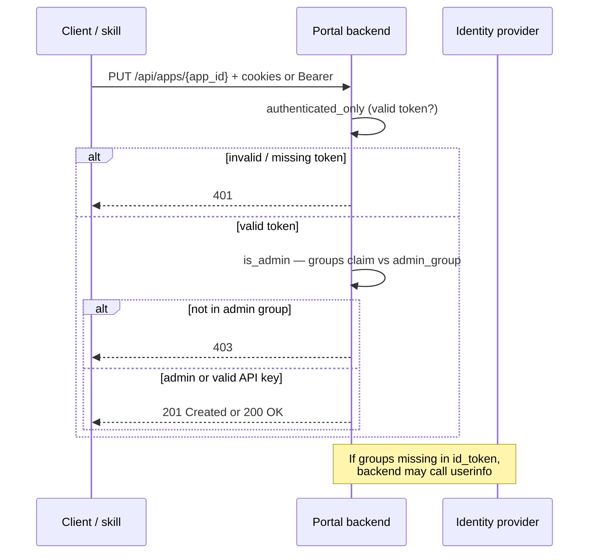

# Portal PUT returns 403

## Summary

The portal backend accepted your credentials (you are authenticated) but rejected the write because the caller is **not a portal administrator**. `PUT /api/apps/{app_id}` and `DELETE /api/apps/{app_id}` are protected by `admin_only` in [backend/app/auth.py](../../../backend/app/auth.py): the IdP must include a group membership that matches `settings.admin_group`.

On a **shared team portal**, membership is usually managed through your operator's admin group (Helm `config.auth.adminGroup`). On a **self-hosted** deployment from this repo, the default Helm value is `admin` ([helm/web-streaming-example/values.yaml](../../../helm/web-streaming-example/values.yaml) → `config.auth.adminGroup`).

This is a **registration / RBAC** failure, not an NVCF or streaming-runtime problem. Fixing it does not require redeploying Kit.

## Symptom

HTTP response when publishing or updating an app (Swagger, curl, `publish-streaming-app`, or portal automation):

```text
HTTP/1.1 403 Forbidden
```

Typical request:

```text
PUT {portal_url}/api/apps/{app_id}
Content-Type: application/json
Cookie: id_token=...; access_token=...
```

or, with API key auth:

```text
Authorization: Bearer <portal-api-key>
```

**401** means missing or invalid auth — see [put-401-portal-auth.md](put-401-portal-auth.md). **403** means auth succeeded but the user is not in the configured admin group.

## Where it fails



Relevant code:

| Check | Location | Behavior |
|-------|----------|----------|
| Endpoint guard | [backend/app/routers/apps.py](../../../backend/app/routers/apps.py) `publish_app`, `delete_app` | `Depends(admin_only)` |
| Admin definition | [backend/app/auth.py](../../../backend/app/auth.py) `User.is_admin` | API key users → always admin; OAuth users → `admin_group` in `groups` claim (or userinfo) |
| Config | [backend/app/settings.py](../../../backend/app/settings.py) `admin_group`, `groups_claim` | Defaults: `admin`, `groups` |
| Deployed value | [helm/web-streaming-example/templates/configmap.yaml](../../../helm/web-streaming-example/templates/configmap.yaml) | `admin_group` from `config.auth.adminGroup` |

## Root causes

| Cause | How it happens |
|-------|----------------|
| **Not in portal admin group** | Signed in to [your portal]({portal_url}) with an account that was never added to the configured admin group |
| **Admin request pending** | Access request submitted to your operator but approval not complete, or group membership not yet visible in tokens |
| **Wrong group name on self-hosted portal** | IdP assigns `ovc-portal-admins` but Helm still has `adminGroup: "admin"` |
| **Groups not in token and userinfo fails** | `groups` absent from `id_token`; backend calls `userinfo_endpoint` — misconfiguration or scope omission |
| **Stale OAuth session** | Old cookies from before DL membership; token still valid but without updated groups (less common than pending DL) |
| **Invalid API key (Bearer path)** | Key unknown or disabled — backend may return **403** even though the issue is credentials, not DL membership ([publish-streaming-app](../../skills/publish-streaming-app/SKILL.md) treats API-key 403 as invalid key) |

Regular portal users can **read** apps (`GET /api/apps/...` with `authenticated_only`) but cannot **publish**, **update**, or **delete** them without admin membership.

## Request portal admin access

For your deployment (`{portal_url}` and OpenAPI at `/api/`):

1. Ask your **portal administrator** to add your account to the admin group (Helm `config.auth.adminGroup` or equivalent).
2. Wait for approval and confirm the group appears in your IdP.
3. Sign out of the portal, sign in again (or complete a fresh OAuth device flow) so new group claims appear.
4. Retry `PUT`.

If access is urgent or the DL request is stuck, contact your **portal administrator** (portal access, API keys, admin distribution list).

## Self-hosted / custom portal

Align three names:

| Piece | Where to set |
|-------|----------------|
| IdP group users receive | Azure AD / your identity provider / your OIDC `groups` claim |
| Backend expectation | `admin_group` in `settings.toml` or Helm `config.auth.adminGroup` |
| Claim field name | `groups_claim` (default `groups`) if your IdP uses another claim |

After changing Helm values, redeploy the backend ConfigMap so `admin_group` updates.

**API key path:** When `apiKeys.enabled` is true and keys are provisioned in `api-keys.toml` / Helm `apiKeys`, valid Bearer keys are treated as administrators without DL membership ([backend/app/auth.py](../../../backend/app/auth.py) `is_api_key_user`). Use this for automation when the IdP has no device flow — see `publish-streaming-app` Step 3b.

## Diagnosis

### 1. Confirm 403 vs 401

| Status | Meaning |
|--------|---------|
| **401** | No cookie / bad Bearer / expired JWT — re-authenticate |
| **403** | Valid auth, not admin (OAuth) or unrecognized API key |

### 2. Check admin flag (OAuth)

While signed in with the same cookies you use for `PUT`:

```text
GET {portal_url}/api/users/me
Cookie: id_token=...; access_token=...
```

Expected for a publisher:

```json
{ "is_admin": true }
```

If `is_admin` is `false`, you will get **403** on `PUT` / `DELETE`. This endpoint only requires `authenticated_only` ([backend/app/routers/users.py](../../../backend/app/routers/users.py)).

### 3. Inspect groups (optional)

Decode the `id_token` (jwt.io or local tooling) and look for the `groups` array (or your configured `groups_claim`). It must contain the string that matches `admin_group` exactly:

- portal deployment: **`portal admin group`** (name in Helm `config.auth.adminGroup`; confirm with your portal operator)
- Default sample chart: **`admin`**

If `groups` is missing, the backend logs a warning and may fetch groups via `userinfo_endpoint` using `access_token` ([backend/app/auth.py](../../../backend/app/auth.py) `get_groups`).

### 4. API key path

If using `Authorization: Bearer ...`:

- Valid provisioned key → `is_admin` true, `PUT` should succeed.
- **403** on `PUT` with Bearer usually means the key is wrong, expired, or API keys are disabled — not “join the DL.” Rotate or request a new key from the portal administrator.

## Fix

### Option A — Dev portal (OAuth)

1. Join [portal admin group](your portal administrator (admin group membership)).
2. After approval, sign out and sign in (or rerun device authorization in `publish-streaming-app`).
3. `GET /api/users/me` → `"is_admin": true`.
4. `PUT /api/apps/{app_id}` with `function_id` and `function_version_id` (use [publish-streaming-app](../../skills/publish-streaming-app/SKILL.md)).
5. Open `{portal_url}/app/{app_id}` to verify registration.

### Option B — Self-hosted (OAuth)

1. Portal operator adds your account to the IdP group that matches `config.auth.adminGroup`.
2. Redeploy is **not** required for membership changes; re-login **is** required.
3. Verify `GET /api/users/me`, then `PUT`.

### Option C — Automation without DL (API key)

1. Portal admin enables API keys and adds an entry to `api-keys.toml` (Helm `apiKeys` — [values.yaml](../../../helm/web-streaming-example/values.yaml)).
2. Call `PUT` with `Authorization: Bearer <key>`.
3. Do not use a personal OAuth session for CI if the IdP cannot grant the admin group to a robot account.

### Verify fix

| Step | Success signal |
|------|----------------|
| `GET /api/users/me` | `"is_admin": true` (OAuth path) |
| `PUT /api/apps/{slug}:{version}` | **201** (new) or **200** (update) |
| `GET /api/apps/{app_id}` | App record with correct `function_id` / `function_version_id` |
| Portal UI | App tile on configured `page` / `category` (visibility also depends on NVCF status — see [app-not-on-home-page.md](app-not-on-home-page.md)) |

## Distinguish from similar errors

| Symptom | Layer | Typical cause |
|---------|-------|----------------|
| **PUT 403** | Portal RBAC | Not in `admin_group` / dev admin DL |
| **PUT 401** | Portal auth | Expired session / bad token — [put-401-portal-auth.md](put-401-portal-auth.md) |
| **PUT 201/200 but no tile** | Metadata / NVCF status | Wrong `page` / `category`; function not ACTIVE — [app-invisible-after-register.md](app-invisible-after-register.md) |
| **GET app status UNKNOWN** | NVCF linkage | Wrong function IDs or org — [portal-status-unknown.md](portal-status-unknown.md) |
| **Session start HTTP501** | NVCF function type | Not STREAMING — [http-501-streaming-session.md](../portal-ui/http-501-streaming-session.md) |

## Quick checks (agent)

1. Confirm **403** (not 401) on `PUT /api/apps/{app_id}`.
2. `GET /api/users/me` with the same auth — if `is_admin: false`, stop and direct user to portal admin group / IdP group / API key.
3. Ask your portal administrator for admin group membership; suggest re-login after approval.
4. Bearer auth + 403: treat as invalid API key per `publish-streaming-app`; do not ask for DL join.
5. After admin is confirmed, run `publish-streaming-app` (needs `function_id`, `function_version_id`) or `check-streaming-app` to validate registration.
6. Escalate access issues to your portal administrator.

## Further reading

- [Portal API]({portal_url}/api/)
- [STREAMING-REFERENCE.md — portal registration table](../STREAMING-REFERENCE.md)
- [publish-streaming-app skill](../../skills/publish-streaming-app/SKILL.md)
- [remove-streaming-app skill](../../skills/remove-streaming-app/SKILL.md) (DELETE also requires admin)
- [backend/README.md — publishing group](../../../backend/README.md)
