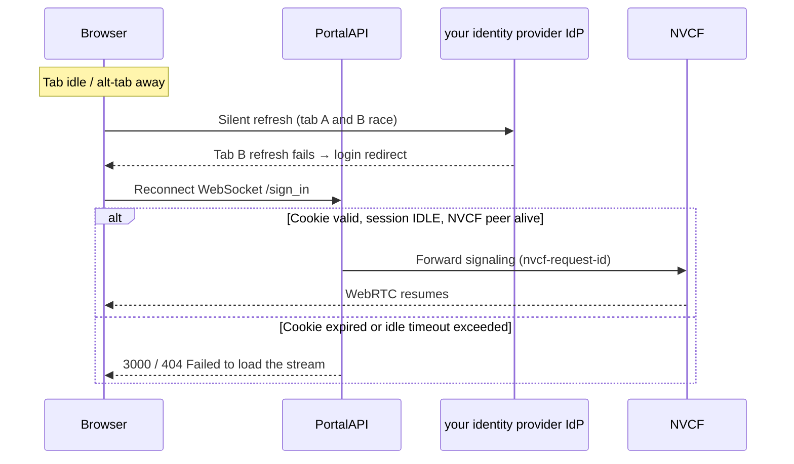

# Stream fails after idle or Reconnect

## Summary

After leaving a streaming tab idle (often while working in another browser tab), the user may be redirected to the NGC login screen. The session list still shows an **IDLE** session, but **Reconnect** and **Reload** both fail with **Failed to load the stream**. Starting a **new** session from the app tile is the reliable recovery path.

The primary root cause in was a **multi-tab OAuth refresh race** on your identity provider (no refresh-token grace period). That was fixed in Portal Sample **1.3.1** (October 2025). Residual failures can still occur when the portal session, `nvcf-request-id` cookie, or NVCF resume window has expired.

## Symptoms

| What the user sees | Notes |
|--------------------|-------|
| Redirect to NGC / your identity provider login after returning to the streaming tab | Often after alt-tabbing away for several minutes |
| Session manager shows status **IDLE** | Session row still present; **Reconnect** button visible |
| **Failed to load the stream** on Reconnect or Reload | Reload does not recover |
| Works again only after **New session** from the app tile | Abandons the stale IDLE row |

Reported on Portal Sample **V1.3.0** with Kit **108.1** (stage.16) on cloud RC environment. Verified fixed on Portal **1.3.1** with Kit 107.3.4 (October 2025).

## Client library (`@nvidia/ov-web-rtc`)

After idle teardown the library may surface **`ClientDisconnectedUserIdle`** (`0xF22009`) or server-side **`ServerDisconnectedUserIdle`** (`0xF22324`) — *The client was disconnected due to user inactivity.* / *Stream disconnected from server, UserIdle.* The portal banner is still the generic **Failed to load the stream** when Reconnect reuses a dead session. See [OV-WEB-RTC-ERROR-CODES.md](../OV-WEB-RTC-ERROR-CODES.md).

## Root cause

Two failure modes overlap; distinguish them before blaming Kit or NVCF.

### 1. Portal auth — multi-tab token refresh race (fixed in 1.3.1)

When multiple portal tabs are open, each tab's OIDC library could attempt a silent token refresh at the same time. your identity provider does **not** implement an Azure-style refresh-token grace period: the first refresh consumes the token, and a second tab reusing the same refresh token fails. Failed refresh redirects the user to login.

**Fix:** Portal Sample 1.3.1 disables `automaticSilentRenew` and coordinates renewal with a cross-tab `navigator.locks` mutex plus `BroadcastChannel` sync. See `web/src/providers/AuthProvider.tsx` and `web/src/util/tokenRenewal.ts`.

Confirmed **not Kit-side** during triage (portal auth layer).

### 2. Stale session / cookie / NVCF resume window

Even with auth fixed, reconnect can fail when:

| Layer | Mechanism |
|-------|-----------|
| **Portal backend** | `nvcf-request-id` cookie missing or expired → WebSocket `/sign_in` closes with code **3000** ("The session has expired.") |
| **Portal backend** | IDLE session past `session_idle_timeout` (default **300 s**, must match NVCF `resumeTimeoutSeconds`) → watcher marks session **EXPIRED** or **FAILED** |
| **Portal frontend** | `HEAD /sessions/{id}/sign_in` returns 404 → client auto-starts a new session (1.3.1+) or shows error (older builds) |
| **Kit / NVCF** | Kit 108 default `resumeTimeoutSeconds` is **30 s** unless overridden; OVC functions should set **300** via `NVDA_KIT_ARGS` (see [STREAMING-REFERENCE.md](../STREAMING-REFERENCE.md)) |

Kit 108 renamed session settings (`omni.services.livestream.nvcf` → `omni.services.livestream.session`). If a function still uses old keys or the default 30 s timeout, NVCF may tear down the peer before the user reconnects within the portal's 300 s idle window.

## Architecture (where it breaks)



## Diagnostic workflow

Follow [STREAMING-REFERENCE.md](../STREAMING-REFERENCE.md) Phase B–C first; this issue is usually portal-side, not a misbuilt container.

### Step 1 — Confirm portal version

| Portal version | Expected behavior |
|----------------|-------------------|
| **&lt; 1.3.1** | Multi-tab auth race can cause login redirect + broken Reconnect |
| **≥ 1.3.1** | Auth race fixed; remaining failures are usually expired session/NVCF resume |

Check deployment image tag or About page if available.

### Step 2 — Run `check-streaming-app`

Use the [`check-streaming-app`](../../skills/check-streaming-app/SKILL.md) skill to confirm the backend is healthy before chasing reconnect UI issues.

Collect from the user (or portal URL):

- `portal_url`
- `app_id` **or** `function_id` + `function_version_id`

Verify in the report:

| Field | Healthy | Suggests this issue is *not* deploy-time |
|-------|---------|-------------------------------------------|
| **Runtime status** | `ACTIVE` or `DEGRADING` | Backend reachable; failure is session/auth scoped |
| **Function ID / version ID** | Match NVCF Overview | Rules out UNKNOWN portal wiring |
| **Min / max instances** | Capacity available | Rules out 408 / timeout on *new* sessions |

If status is `ERROR`, `DEPLOYING`, or `UNKNOWN`, fix NVCF/registration first (`check-nvcf-function`).

### Step 3 — Inspect the failing session row

From the app tile → **Sessions** (or admin session manager):

| Session status | Meaning | Reconnect viable? |
|----------------|---------|-------------------|
| **IDLE**, recent `end_date` | Client disconnected; portal still holds NVCF binding | Yes, if within idle timeout and cookie valid |
| **IDLE**, error text set | Prior WebRTC/signaling failure recorded | Retry may work on 1.3.1+ (error cleared on reconnect) |
| **EXPIRED** / **STOPPED** / **FAILED** | Watcher or user terminated | No — start **New session** |
| **ACTIVE** | Another tab still connected | Reconnect blocked (code **3005**) |

### Step 4 — Browser checks

1. Open DevTools → **Application** → Cookies for the portal domain.
2. Confirm `nvcf-request-id` is present for the session path when attempting Reconnect.
3. Note whether multiple portal tabs were open when the login redirect occurred.
4. After auth failure, re-login and use **New session** rather than Reconnect to an IDLE row created before the redirect.

### Step 5 — NVCF (only if Reconnect fails with healthy ACTIVE app)

If the portal session is IDLE and within timeout but stream still fails:

1. NVCF → function → **Live Tail** for the session's instance.
2. Confirm `resumeTimeoutSeconds=300` (Kit 108+: `--/exts/omni.services.livestream.session/resumeTimeoutSeconds=300`) in function env / `NVDA_KIT_ARGS`.
3. Compare portal `sessionIdleTimeout` (Helm `config.sessionIdleTimeout`, default 300) with the function's resume timeout — they must match.

## Quick recovery (user / support)

1. **Do not rely on Reconnect** after a login redirect or long idle period.
2. From the app tile, open **Sessions** → **New session** (or launch the app again).
3. Close extra portal tabs to reduce auth refresh contention on older portal builds.
4. If stuck in a login loop, clear site cookies for the portal domain and sign in once in a single tab.

## Permanent fixes

| Audience | Action |
|----------|--------|
| **Portal operators** | Deploy Portal Sample **≥ 1.3.1** (includes cross-tab auth mutex and reconnect retries) |
| **NVCF function authors** | Set Kit 108+ `resumeTimeoutSeconds=300` in `NVDA_KIT_ARGS`; align with portal `sessionIdleTimeout` |
| **Kit 108 migrations** | Use new setting paths per [session management migration guide](https://github.com/NVIDIA-Omniverse/kit-livestream) |
| **Developers** | Keep `automaticSilentRenew: false` and use `renewTokenWithLock` for any custom IdP integration |

## Configuration reference

| Setting | Default (this repo) | Must align with |
|---------|---------------------|-----------------|
| `sessionIdleTimeout` | 300 s | NVCF `resumeTimeoutSeconds` / `sessionResumeTimeoutSeconds` |
| `sessionTtl` | 28800 s (8 h) | Max session lifetime |
| `sessionWatchInterval` | 60 s | How often idle sessions are promoted to EXPIRED/FAILED |
| Portal auth lock | `auth-renewal` | 30 s cooldown after successful silent renew |

Helm: `helm/web-streaming-example/values.yaml` → `config.sessionIdleTimeout`.

Example Kit 108 `NVDA_KIT_ARGS` fragment:

```text
--/exts/omni.services.livestream.session/resumeTimeoutSeconds=300
```

## Resolution status

| Field | Value |
|-------|-------|
| Outcome | Addressed in Portal Sample 1.3.1 |
| Fixed in | Portal Sample post-1.3.0 (released as **1.3.1**) |
| Verified | Jemi Lee, Portal 1.3.1, Kit 107.3.4, October 2025 |
| Kit 108.1 | Not the root cause; resume timeout migration still required for long idle windows |

## Further reading

- [STREAMING-REFERENCE.md](../STREAMING-REFERENCE.md)
- [`check-streaming-app` skill](../../skills/check-streaming-app/SKILL.md)
- [NVCF debuggability](https://docs.nvidia.com/cloud-functions/user-guide/latest/cloud-function/debuggability.html)
- Portal Sample CHANGELOG — Version 1.3.1 (cross-tab auth fix, reconnect retries)
