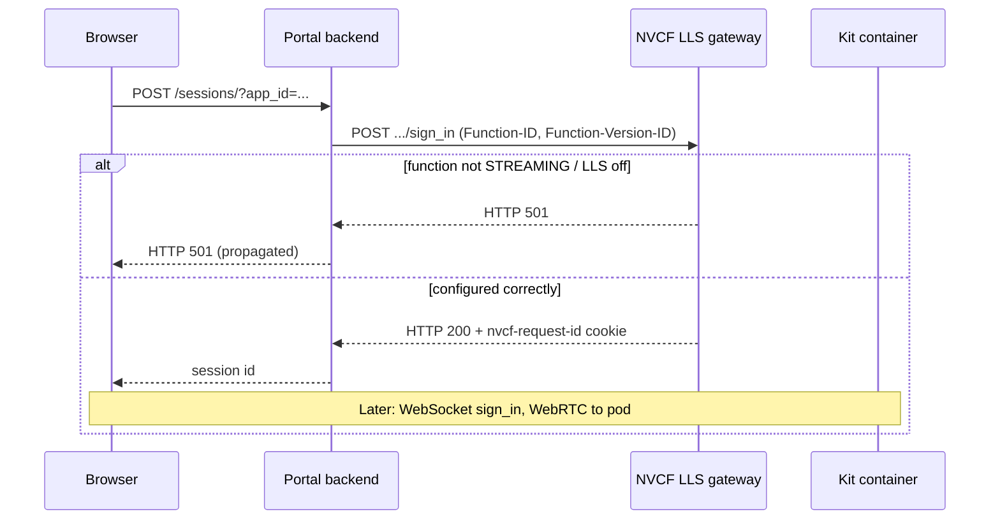

# HTTP 501 starting streaming session

## Summary

The portal backend calls NVCF to allocate a Low Latency Streaming (LLS) session. NVCF responds with **HTTP 501 Not Implemented** when the linked function was not created as a streaming function — typically because **Low Latency Streaming** was not enabled, `functionType` is not `STREAMING`, or inference is not configured for Kit sign-in on port **49100** path **`/sign_in`**.

This failure happens **before** WebRTC or container logs matter: no GPU pod is allocated for the session.

## Client library (`@nvidia/ov-web-rtc`)

This symptom is **not** an `RErrorCode`. The portal backend returns **HTTP 501** on `POST /sessions/` before `AppStreamer.connect` runs. The UI text is:

`Failed to start a streaming session -- HTTP501`

No `Streamer*` enum applies until sign-in succeeds. See [OV-WEB-RTC-ERROR-CODES.md](../OV-WEB-RTC-ERROR-CODES.md) (portal backend table).

## Symptom

Exact portal banner (from [web/src/state/Sessions.ts](../../../web/src/state/Sessions.ts)):

```text
Failed to start a streaming session -- HTTP501.
<optional NVCF response body>
```

User action: clicked an app on the portal home page (or equivalent `POST /sessions/?app_id=...`).

## Where it fails



Portal backend ([backend/app/routers/sessions.py](../../../backend/app/routers/sessions.py)) posts to `settings.nvcf_signaling_endpoint` (default `wss://grpc.nvcf.nvidia.com`, rewritten to HTTPS) at **`/sign_in`**, with headers:

| Header | Purpose |
|--------|---------|
| `Authorization: Bearer <nvcf_api_key>` | your identity provider / NGC API key configured on portal backend |
| `Function-ID` | From published app metadata |
| `Function-Version-ID` | From published app metadata |
| `X-NVCF-ABSORB: true` | Required for streaming session start |

NVCF returns **501** when that function version is not eligible for the LLS sign-in path.

## Root causes

| Cause | How it happens |
|-------|----------------|
| **Low Latency Streaming disabled** | NGC create-function wizard: LLS toggle left off → function created as standard inference, not streaming |
| **`functionType` not `STREAMING`** | API/UI create omitted `"functionType": "STREAMING"` (see [scripts/create_function.sh](../../../scripts/create_function.sh)) |
| **Wrong inference port** | Not **49100** (Kit livestream sign-in listens here by default) |
| **Wrong inference URL** | Not **`/sign_in`** (must match Kit NVCF livestream service) |
| **Wrong `apiBodyFormat`** | Kit streaming expects **`CUSTOM`**, not JSON default |
| **Inference overwritten in NGC UI** | Filling Health after Inference in the wizard can reset port/URL — see [inference-wrong-after-ui-form.md](../nvcf-deployment/inference-wrong-after-ui-form.md) |

Less common but worth ruling out:

- Portal app points at an old **function_version_id** from before you fixed the function (republish or update version IDs).
- Function was created in a different NGC org than the portal backend's API key (wrong function entirely — usually 404/403, not 501).

## Expected NVCF configuration (Kit streaming)

Reference: [NVCF function creation](https://docs.nvidia.com/cloud-functions/user-guide/latest/cloud-function/function-creation.html), [Streaming functions](https://docs.nvidia.com/nvcf/streaming-functions), repo script [scripts/create_function.sh](../../../scripts/create_function.sh).

| Field | Expected value | Notes |
|-------|----------------|-------|
| `functionType` | `STREAMING` | Enables LLS on NVCF side |
| `inferencePort` | `49100` | `STREAMING_SERVER_PORT` in create scripts |
| `inferenceUrl` | `/sign_in` | `STREAMING_START_ENDPOINT` in create scripts |
| `apiBodyFormat` | `CUSTOM` | Required for Kit sign-in payload |
| `health.protocol` | `HTTP` | |
| `health.uri` | `/v1/streaming/ready` | Kit streaming readiness |
| `health.port` | `8011` (Kit ≥107.3.3) or template-specific (`8111` Composer, `8311` Explorer for older Kit) | Wrong health → DEPLOYING stuck, not 501 |
| `health.expectedStatusCode` | `200` | |
| Runtime status | `ACTIVE` | Function must deploy; 501 is config, not capacity |

## Diagnosis

### 1. Resolve function IDs

From portal URL `/app/:appId/sessions/:sessionId` → `appId`, or ask the user for `function_id` / `function_version_id`.

If only `app_id` is known, use portal `GET /api/apps/{app_id}` or the `check-streaming-app` skill to read `function_id` and `function_version_id`.

### 2. Run `check-nvcf-function`

Use the skill with both UUIDs. In the report, verify **Endpoints and ports** and **Function type**:

```text
Function type: STREAMING ← must be STREAMING, not absent or other
Inference port: 49100
Inference URL: /sign_in
API body format: CUSTOM
```

Also note **Control plane** runtime status. A function can be `ACTIVE` yet still return 501 if type/inference are wrong — 501 is not fixed by scaling or cluster changes.

### 3. NGC UI spot-check

[NVCF functions UI](https://nvcf.ngc.nvidia.com/functions) → function → version → Overview:

- Function type shows **Streaming** (or equivalent LLS label).
- Inference: port **49100**, endpoint **`/sign_in`**.
- If created via UI, confirm **Low Latency Streaming** was enabled at creation time.

NVCF generally does not let you flip a standard function into a streaming function in place; expect to **create a new function version or a new function** with correct settings.

## Fix

Change one variable at a time; after recreating, deploy until **ACTIVE**, then update portal registration if IDs changed.

### Option A — NGC UI (new function)

1. [Create function](https://docs.nvidia.com/cloud-functions/user-guide/latest/cloud-function/function-creation.html) with container image already pushed.
2. Enable **Low Latency Streaming** (sets streaming / LLS behavior).
3. **Health first:** protocol HTTP, URI `/v1/streaming/ready`, port per Kit version (often `8011` or `8111`), expected status `200`.
4. **Inference second:** port `49100`, URL `/sign_in`, body format **Custom**.
5. Deploy; wait for **ACTIVE** (~10 min).
6. If the portal app still references old IDs, update `function_id` / `function_version_id` via `publish-streaming-app` or portal API `PUT /api/apps/{app_id}`.

### Option B — API (matches this repo)

Use [scripts/create_function.sh](../../../scripts/create_function.sh) or equivalent POST to `https://api.ngc.nvidia.com/v2/nvcf/functions`:

```json
{
 "name": "my-streaming-app",
 "inferenceUrl": "/sign_in",
 "inferencePort": 49100,
 "health": {
 "protocol": "HTTP",
 "uri": "/v1/streaming/ready",
 "port": 8111,
 "timeout": "PT10S",
 "expectedStatusCode": 200
 },
 "containerImage": "<your-image>",
 "apiBodyFormat": "CUSTOM",
 "functionType": "STREAMING",
 "containerEnvironment": []
}
```

Adjust `health.port` and `containerEnvironment` for your Kit version and Nucleus needs (see [STREAMING-REFERENCE.md](../STREAMING-REFERENCE.md)).

### Verify fix

1. `check-nvcf-function` — `functionType: STREAMING`, inference 49100 `/sign_in`, status **ACTIVE**.
2. Start a **new** portal session (not reconnect).
3. Next failure after 200 on session create is a different layer (408 capacity, No peer info, WebRTC) — use the matching issue doc.

## Distinguish from similar errors

| Symptom | Layer | Typical cause |
|---------|-------|----------------|
| **HTTP501** on session start | NVCF function definition | Not STREAMING / LLS off / wrong inference |
| **HTTP408** on session start | NVCF capacity / cold start | [http-408-creating-session.md](../nvcf-deployment/http-408-creating-session.md) |
| **No peer info found** (after session created) | Container / plugins / ports | [no-peer-info-found.md](no-peer-info-found.md) |
| **Sign-in signaling … 0 retries** | Browser cookies | [streamer-sign-in-failure.md](streamer-sign-in-failure.md) |
| Portal status **UNKNOWN** | Wrong function IDs / org | [portal-status-unknown.md](../portal-registration/portal-status-unknown.md) |

## Quick checks (agent)

1. `check-nvcf-function` — `functionType`, `inferencePort`, `inferenceUrl`, `apiBodyFormat`, runtime **ACTIVE**.
2. Compare against [scripts/create_function.sh](../../../scripts/create_function.sh) defaults.
3. If inference values wrong but type is STREAMING, check [inference-wrong-after-ui-form.md](../nvcf-deployment/inference-wrong-after-ui-form.md).
4. After fix, confirm portal app `function_version_id` matches the corrected NVCF version.

## Further reading

- [NVCF function creation](https://docs.nvidia.com/cloud-functions/user-guide/latest/cloud-function/function-creation.html)
- [NVCF streaming functions](https://docs.nvidia.com/nvcf/streaming-functions)
- [STREAMING-REFERENCE.md — Phase A checklist](../STREAMING-REFERENCE.md)
- [check-nvcf-function skill](../../skills/check-nvcf-function/SKILL.md)
