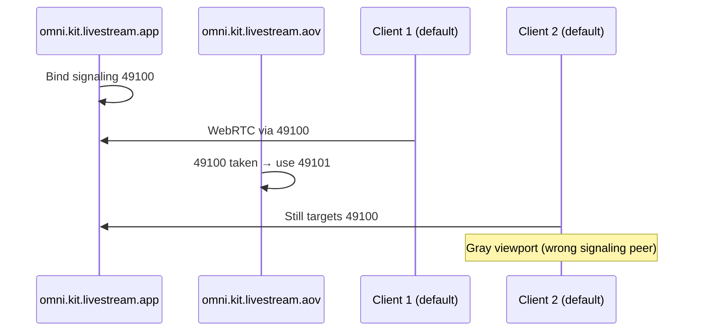

# Second stream gray (Kit 108+)

## Summary

With Kit 108+ you can run more than one WebRTC viewport stream (for example the primary app stream from `omni.kit.livestream.app` plus an AOV/spectator stream from `omni.kit.livestream.aov`). Each stream must use its own WebRTC **signaling port**. The default is **49100**; only one stream can bind it. If a second stream starts without an explicit port, Kit logs a warning and picks the next free port (typically **49101**). Clients that still dial **49100** often show a connected session with a **gray** viewport because signaling/media are attached to the wrong peer.

This is expected multi-stream behavior, not a broken encoder. Fix by aligning Kit settings and client `signalingPort` with the port Kit actually uses, or by upgrading to builds that include the livestream fixes below.

**Applies to:** Kit 108+ local or NVCF runs with multiple livestream extensions enabled; [web-streaming-library](https://www.npmjs.com/package/@nvidia/ov-web-rtc) dev clients; custom apps with two browser viewers. The Omniverse portal’s single-session UI normally exposes one stream per session—this guide matters most when you add a second client or AOV viewer yourself.

## Client library (`@nvidia/ov-web-rtc`)

Gray viewport with an open connection often correlates with wrong **`signalingPort`** / **`mediaPort`** in `DirectConfig`, not a dedicated gray-screen enum. Related streamer codes: **`StreamerNoVideoTrack`** (`0xC0F22211`), **`StreamerNoVideoFramesLossyNetwork`** (`0xC0F2220D`). Configure `signalingPort` to match Kit console output. See [OV-WEB-RTC-ERROR-CODES.md](../OV-WEB-RTC-ERROR-CODES.md).
  - "https://github.com/NVIDIA-Omniverse/kit-livestream"
docs:
  - "https://github.com/NVIDIA-Omniverse/kit-livestream"
---

## Symptoms

| What you see | What it usually means |
|--------------|------------------------|
| First viewer shows Kit UI; second viewer is gray | Second client still on 49100 while AOV moved to 49101+ |
| WebRTC “connected” but no video | Signaling port mismatch (wrong peer) |
| Kit console warning about port 49100 occupied | Automatic port bump; client must follow the logged port |
| Only after enabling `omni.kit.livestream.aov` | Collision between app stream and AOV stream defaults |

**Typical Kit log (second stream):**

```text
[Warning] [omni.kit.livestream.aov.plugin] Cannot start AOV spectator stream server for index 0 with signal port 49100 that is already occupied. Using the next available port 49101 instead, but a unique port should be specified using: /exts/omni.kit.livestream.app/spectatorStream/.../signalPort
```

Callers must pass a different signaling port per view-only connection when more than one stream is active.

---

## Root cause



| Fact | Detail |
|------|--------|
| Default signaling port | 49100 for each stream unless set in settings |
| Multi-stream rule | Only the **primary** app stream gets 49100 when ports are unset; further streams get **last used + 1** |
| Expected multi-stream behavior | Each stream needs a unique port; production configs must set `signalPort` per stream |
| Inference vs signaling | NVCF **inference** stays on 49100 `/sign_in`; extra ports are **WebRTC signaling** only |

**Related:** Resizing the viewport can spawn another AOV stream on a new port —treat dynamic port changes the same way.

---

## Diagnostic workflow

Work through these in order; change one variable at a time.

### 1. Confirm Kit version and extensions

- Kit **108+** with `[nvcf_streaming]` / livestream extensions enabled.
- NVCF History or local log: search `livestream` and verify minimum versions (STREAMING-REFERENCE):

| Extension | Minimum (108.x) |
|-----------|-----------------|
| `omni.kit.livestream.webrtc` | ≥ 8.0.7 |
| `omni.kit.livestream.app` | ≥ 8.0.4 |
| `omni.kit.livestream.aov` | ≥ 8.0.3 (fix for isolated AOV on wrong default port) |
| `omni.services.livestream.session` | ≥ 8.0.2 |

 was verified fixed on `kit-sdk-public@108.0.0-rc.2` with `omni.kit.livestream.aov` 8.0.3 + `omni.kit.livestream.webrtc` 8.0.7 when AOV is enabled without `omni.kit.livestream.app`.

Use `check-nvcf-function` on deployed apps to confirm ACTIVE status and scan logs for extension versions.

### 2. Identify which stream each client should use

| Stream | Extension | Typical port (defaults) |
|--------|-----------|-------------------------|
| Primary app / main viewport | `omni.kit.livestream.app` | 49100 |
| AOV / spectator / second viewport | `omni.kit.livestream.aov` | 49101+ if app already on 49100 |

### 3. Read Kit console at stream start

Note the **exact** port in the warning or startup line. That value is authoritative—not the client default.

### 4. Match the client

- **web-streaming-library dev:** set `signalingPort` in client config (e.g. `main.ts`) to the port from Kit ( repro steps).
- **Custom WebRTC client:** pass the same port in stream/signaling config before connect.
- **Portal single-stream:** usually N/A unless you built a second viewer; portal signaling comes from the session API, not raw 49100.

### 5. Re-test with explicit ports

Assign unique ports in Kit settings first, then point each client at its port—eliminates race on “next available” port.

---

## Fix

### Option A — Explicit `signalPort` per stream (recommended for production)

Set a unique signaling port for each outgoing stream in the kit file or `NVDA_KIT_ARGS`. AOV defaults and examples live in [kit-livestream `omni.kit.livestream.aov` extension.toml](https://github.com/NVIDIA-Omniverse/kit-livestream) (see `signalPort` / spectator stream settings).

Example pattern (paths vary by viewport texture name):

```toml
# Illustrative — use the path Kit prints in the port-collision warning
[settings.exts."omni.kit.livestream.app".spectatorStream."...ViewportTexture_0".LdrColor."0"]
signalPort = 49101
```

For AOV-only testing on **49100**, disable `omni.kit.livestream.app` so the first (and only) viewport stream can own the default port.

### Option B — Client follows Kit console (dev / QA)

1. Start Kit with `--no-window` if headless; enable `omni.kit.livestream.app`, connect first client on **49100**.
2. Enable `omni.kit.livestream.aov`; read the new port from logs (e.g. **49101**).
3. Second client instance: set `signalingPort` to that port before connecting.

 documents the two-browser, two-`npm run dev` workflow; gray video was resolved when `signalingPort` matched Kit.

### Option C — Upgrade Kit / extensions

If AOV alone incorrectly took 49101 while `omni.kit.livestream.app` was disabled, upgrade to **108.0.0-rc.2** or newer with **omni.kit.livestream.aov ≥ 8.0.3** and **omni.kit.livestream.webrtc ≥ 8.0.7**.

---

## Quick checks

1. Kit logs: search `signal port` / `49100` / `49101` immediately after enabling the second extension.
2. Each viewer uses a **different** `signalingPort`; none share 49100 unless only one stream is enabled.
3. NVCF logs (`check-nvcf-function`): livestream extension versions meet 108.x minimums.
4. After viewport resize, re-check logs for a new port .
5. Do not confuse **inference** `49100` `/sign_in` with **WebRTC signaling** ports for extra streams.

---

## Related patterns

| Title / theme | Outcome |
|------|------|
| AOV moves to 49101; client did not auto-connect | Addressed in Kit 108 livestream extensions; document explicit ports / upgrade extensions |
| Second stream gray on Kit 108.1 + web-streaming-library | Closed stale; workaround is correct `signalingPort`; setup works when ports align |
| Resize spawns new AOV stream on new port | Same port-matching discipline |

****Engineering notes:**** Multi-stream production use must assign ports explicitly; automatic port bump is intentional and logged. Enhancement discussed: app returns chosen port to clients so callers need not hard-code .

---

## When this is not the issue

- **No video on the only stream:** see [no-peer-info-found.md](no-peer-info-found.md) (build, NVCF health/inference, plugins).
- **STUN / Kit 108 client errors:** see [stun-unknown-method-kit108.md](stun-unknown-method-kit108.md).
- **Portal timeout / capacity:** see [stream-timeout-try-again-later.md](stream-timeout-try-again-later.md) and STREAMING-REFERENCE

---

## Further reading

- [STREAMING-REFERENCE.md](../STREAMING-REFERENCE.md) — architecture, symptom table, quick triage (“Gray second viewer”)
- [kit-livestream AOV extension config](https://github.com/NVIDIA-Omniverse/kit-livestream)
