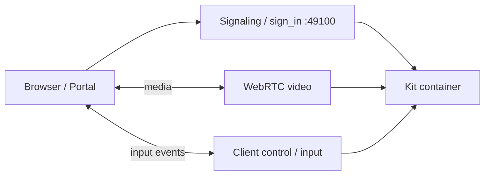

# Stream not interactive

## Summary

The WebRTC video path works: the portal or web viewer shows the Kit viewport, but pointer, keyboard, and touch input do not affect the remote app. Media and input use different livestream/WebRTC paths; a healthy picture does **not** prove the client control channel (CCE) is connected.

This pattern is common on **Kit 107.3.x** when the GPU host, container image, streaming kit file, or browser client stack is misaligned. It can also appear after a bad reconnect when the server-side connection counter is out of sync.


## Client library (`@nvidia/ov-web-rtc`)

Video can work while input fails; the library may report **`StreamInputChannelError`** (`0xC0F22208`), **`StreamCursorChannelError`** (`0xC0F22209`), or **`StreamControlChannelError`** (`0xC0F2220A`) on terminate—not always shown if the portal only displays video. **`StreamerNoVideoPacketsReceivedEver`** (`0xC0F2220C`) usually implies no picture at all. See [OV-WEB-RTC-ERROR-CODES.md](../OV-WEB-RTC-ERROR-CODES.md).

---

## When you see this

| Observation | Notes |
|---------------|--------|
| Viewport renders; scene updates on the server | Video/track negotiation succeeded |
| Mouse clicks, drags, scroll, keyboard have no effect | Input channel or CCE not established |
| No portal red banner (or only generic “connected”) | Differs from **No peer info found** — peer may exist without input |
| Worked on Kit **106.5.x**, fails on **107.3.x** | Treat as version migration (layers, kit file, client branch, driver) |
| Fails in portal **and** web-viewer-sample | Points to Kit/container/host, not portal UI alone |
| Fails for one user/site, works elsewhere | Compare GPU driver, K8s node, client browser |

---

## Architecture (where input breaks)



| Path | Success signal | Failure signal |
|------|----------------|----------------|
| **Signaling** | Session starts; stream visible | Sign-in errors, 501, cookie issues (other docs) |
| **Media (WebRTC video)** | Viewport image | Gray/black frame, **No peer info found** |
| **Input (CCE / control)** | Mouse moves selection in Kit | Viewport frozen to input; log warnings below |

---

## Likely causes (check in this order)

1. **Host GPU driver too old or mismatched for Kit 107.3.x** — Example: A40 on **535.183.06** failed; **535.247.01** worked on a reference host. Update driver on the node running the Kit pod before chasing application code.
2. **Client ↔ Kit version mismatch** — Portal or [web-viewer-sample](https://github.com/NVIDIA-Omniverse/web-viewer-sample) branch must match Kit (e.g. **`git clone -b 1.5.2`** for Kit **107.3.3** per repro).
3. **CCE / connection state desync** — Live Tail shows `NVST_CCE_CONNECTED` / `NVST_CCE_DISCONNECTED` with wrong `m_connectionCount`, or `nvstPushStreamData timeout` (see [Log signatures](#log-signatures)).
4. **Incomplete or wrong streaming kit file** — Missing `[ovc_streaming]` layer output, wrong app path in container, or serializer errors at startup (`Can't read /app/apps/...` — container never fully loads the streaming app).
5. **Stale session** — Prior WebRTC session left server counters wrong; start a **new** portal session (not Reconnect) after any idle or failed connect .
6. **Livestream extension versions** — Less common when video works, but verify `omni.services.livestream.nvcf` / `omni.kit.livestream.webrtc` versions in logs ([STREAMING-REFERENCE.md](../STREAMING-REFERENCE.md)).

---

## Diagnostic workflow

Follow [STREAMING-REFERENCE.md](../STREAMING-REFERENCE.md) Phases A–C. For this symptom, emphasize:

### Phase A — Backend healthy (NVCF / container)

- [ ] NVCF function **ACTIVE**; History log contains **RTX Ready**
- [ ] Health: `GET /v1/streaming/ready` on correct port → **200** (Kit **≥107.3.3**: port **8011** for all templates)
- [ ] Inference: port **49100**, path **`/sign_in`**, **Low Latency Streaming** enabled, `functionType` **STREAMING**
- [ ] Live Tail (session instance): search log signatures in [Log signatures](#log-signatures)
- [ ] On the **GPU node**: driver version meets Kit 107.3.x requirements (compare with a known-good host)

### Phase B — Build matches Kit 107.x

- [ ] Template used **`[ovc_streaming]`** layer (107.x), not 108+ `nvcf_streaming` alone
- [ ] Packaged `*_streaming.kit` / `_ovc.kit` present in image at path Kit actually loads
- [ ] Container starts without `Can't read ... serializer` errors for the app kit file
- [ ] `NVDA_KIT_ARGS` includes `--/app/livestream/nvcf/sessionResumeTimeoutSeconds=300` for Kit 106–107 ([scripts/create_function.sh](../../../scripts/create_function.sh))

### Phase C — Client and session

- [ ] **New** portal session after any prior failure or idle tab
- [ ] web-viewer-sample branch / `omniverse-web-streaming-library` version aligned with Kit (portal bundles its own client; custom frontends must match)
- [ ] `stream.config.json`: `source` **local**, `server` = host IP, `signalingPort` = Kit console port (default **49100**)
- [ ] Reproduce with [web-viewer-sample](https://github.com/NVIDIA-Omniverse/web-viewer-sample) “UI for any streaming app” to isolate portal vs Kit

---

## Using `check-nvcf-function`

Run the skill with `function_id` and `function_version_id` from the portal app or NVCF Overview. Confirm streaming-oriented configuration even when video already works:

| Check | Expected for Kit 107.x streaming |
|-------|----------------------------------|
| Control plane status | **ACTIVE** (not DEPLOYING / ERROR) |
| `functionType` | **STREAMING** |
| Inference | Port **49100**, URL/path **`/sign_in`** |
| Health | URI **`/v1/streaming/ready`**, port **8011** (107.3.3+) or template-specific for older 107.3.2 |
| Container image | Matches the image you built with `ovc_streaming` and current tag |
| `NVDA_KIT_ARGS` | Session resume timeout for 106–107 (see create_function.sh) |

Mismatches here usually cause **failed** streams, not “video only”; still rule them out before blaming input/CCE.

**Logs:** NVCF UI → function → **Logs** → **Live Tail** with the session cluster + instance ID. [NVCF debuggability](https://docs.nvidia.com/cloud-functions/user-guide/latest/cloud-function/debuggability.html).

---

## Log signatures

Search Live Tail / History for these strings when input is dead but video works.

| Log line | Interpretation | Action |
|----------|----------------|--------|
| `onClientEventRaised: NVST_CCE_CONNECTED when m_connectionCount ... != 0` | CCE connect while server thinks a client is already connected | New session; ensure single viewer; restart pod if stuck |
| `onClientEventRaised: NVST_CCE_DISCONNECTED when m_connectionCount ... != 1` | CCE disconnect with unexpected count | Same as above |
| `nvstPushStreamData timeout for eye 0, stream (nil)` | Push stream data failed; control path broken | New session; check driver/CCE; review concurrent connects |
| `main: thread_init: already added for thread` | Often appears with CCE warnings on disconnect | Correlates with bad teardown; avoid rapid open/close |
| `Possible version incompatibility ... carb::cudainterop::CudaInterop` on `omni.kit.livestream.webrtc` startup | Sometimes present while input still works | Lower priority than CCE lines |
| `Can't read /app/apps/...` / `Serializer ... is not available` | Container not loading streaming kit | Fix package path and streaming kit file in image (build issue, not input-only) |

**Contrast:** If logs never show RTX Ready or livestream plugins, fix deploy/build first ([no-peer-info-found.md](no-peer-info-found.md)).

---

## Fixes (one change at a time)

### 1. GPU driver on the streaming host

On bare metal or the Kubernetes node running the Kit pod:

- Compare driver to Kit 107.3.x release notes and a known-good reference host.
- Updating from **535.183.06** resolved GM’s non-interactive stream.

Redeploy or reschedule the pod on an updated node, then start a **new** session.

### 2. Align web-viewer / portal client with Kit

| Kit (examples) | web-viewer-sample branch ( repro) |
|----------------|----------------------------------------|
| 107.3.3 | **1.5.2** |
| 108+ | Use branch/tag documented for that Kit release |

Clone, set `stream.config.json` (`local`, host IP, `signalingPort` **49100**), `npm run dev`, test input before custom portal embeds.

### 3. Reset session and pod state

1. Disconnect all viewers.
2. Start a **new** portal session (do not use Reconnect after errors).
3. If CCE warnings persist across fresh sessions, delete/restart the NVCF instance (or scale pod) to clear `m_connectionCount` desync.

### 4. Rebuild container with correct 107.x streaming stack

```text
./repo.sh template new → Application, USD Composer, Yes to layers
 → select default streaming layer ([ovc_streaming])
./repo.sh build
./repo.sh package --container --name <name>
```

Verify the generated `*_streaming.kit` is referenced in the container entrypoint and that `/app/apps/<app>.kit` exists in the image (no serializer errors on boot).

### 5. NVCF function settings

Match [scripts/create_function.sh](../../../scripts/create_function.sh): STREAMING type, LLS, health **8011** + `/v1/streaming/ready`, inference **49100** + `/sign_in`. Re-run `check-nvcf-function` after changes.

---

## Background

Reports on Kit **107.3.x** often traced non-interactive streams to an **outdated GPU driver** on the node (for example **535.183.06** vs a known-good **535.247.01** on the same workload). After a driver update, video and input worked without application changes.

**Typical repro path:** Kit SDK 107.3.3 → template with USD Composer + streaming layer → build → container → matching **web-viewer-sample** branch (e.g. **1.5.2**) → stream visible but input dead until the host driver was current.

Always verify GPU driver against Kit requirements before deep-diving WebRTC or kit file diffs. Keep CCE log signatures on the checklist when the driver is already current.

---

## Differentiate from related symptoms

| Symptom | Doc |
|---------|-----|
| **No peer info found** — stream does not load | [no-peer-info-found.md](no-peer-info-found.md) |
| **Failed to load** after idle / Reconnect | [failed-stream-after-idle-reconnect.md](failed-stream-after-idle-reconnect.md) |
| Sign-in / signaling / cookies | [streamer-sign-in-failure.md](streamer-sign-in-failure.md) |
| **STUN unknown method** (Kit 108) | [stun-unknown-method-kit108.md](stun-unknown-method-kit108.md) |
| Missing livestream extensions at build | [missing-livestream-extensions.md](../build-package/missing-livestream-extensions.md) |

---

## Quick checks (TL;DR)

1. **Driver** on GPU host — update if behind Kit 107.3.x expectations.
2. **`check-nvcf-function`** — ACTIVE, STREAMING, 49100 `/sign_in`, health `/v1/streaming/ready`.
3. **Live Tail** — `NVST_CCE_*`, `nvstPushStreamData timeout`.
4. **Client branch** — web-viewer-sample (or library) matches Kit (e.g. **1.5.2** for 107.3.3).
5. **New session** + valid streaming kit in container (no serializer errors at startup).

---

## Further reading

- [STREAMING-REFERENCE.md](../STREAMING-REFERENCE.md)
- [NVCF debuggability](https://docs.nvidia.com/cloud-functions/user-guide/latest/cloud-function/debuggability.html)
- [web-viewer-sample](https://github.com/NVIDIA-Omniverse/web-viewer-sample)
- [check-nvcf-function SKILL.md](../../skills/check-nvcf-function/SKILL.md)
