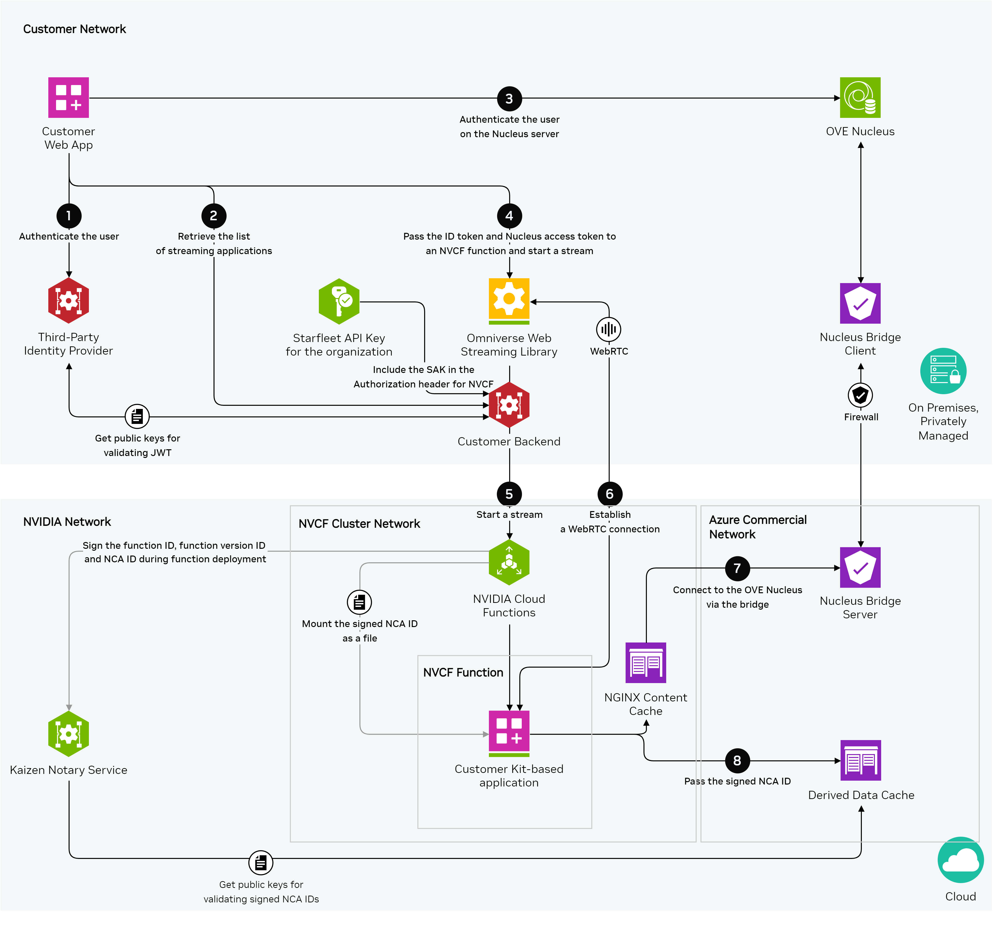

# Omniverse on DGX Cloud Portal Sample

This repository provides the Web Portal Sample for Omniverse on DGX Cloud customers. 
The Web Portal Sample allows developers to create, customize, and provide a front-end interface for launching Kit-based applications on Omniverse on DGX Cloud.  

This repository also provides a sample of the Administrative panel that allows administrators to monitor and control user sessions.

## Governing Terms

The software and materials are governed by the [NVIDIA Software License Agreement](https://www.nvidia.com/en-us/agreements/enterprise-software/nvidia-software-license-agreement/) and the [Product-Specific Terms for NVIDIA Omniverse](https://www.nvidia.com/en-us/agreements/enterprise-software/product-specific-terms-for-omniverse/).

## Contributing

We provide this source code as-is and are currently not accepting outside contributions.